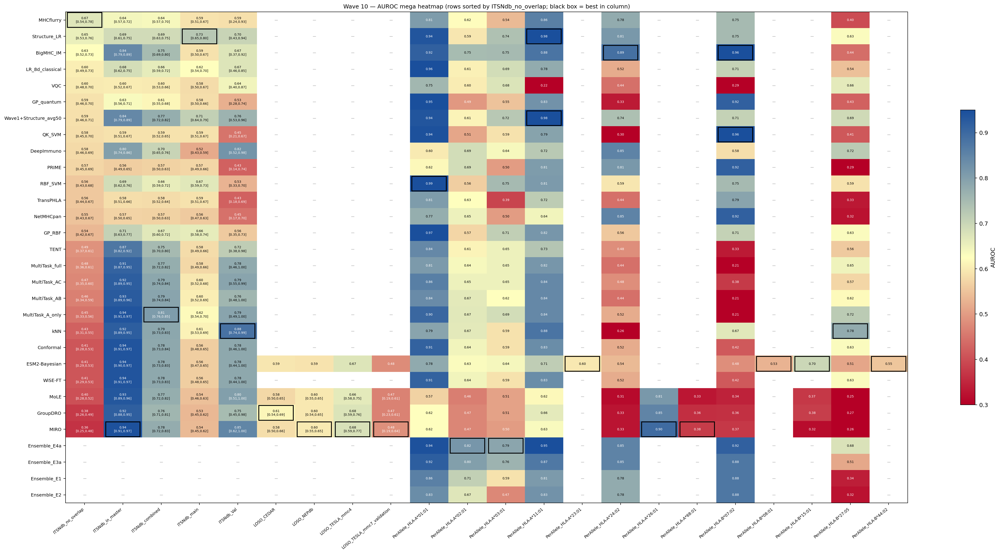
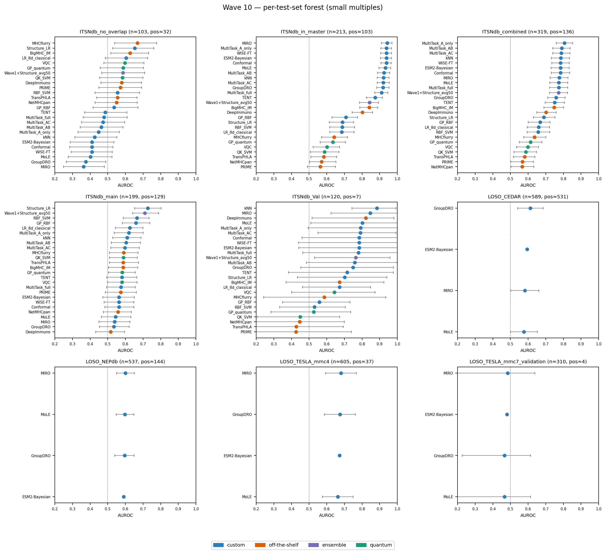
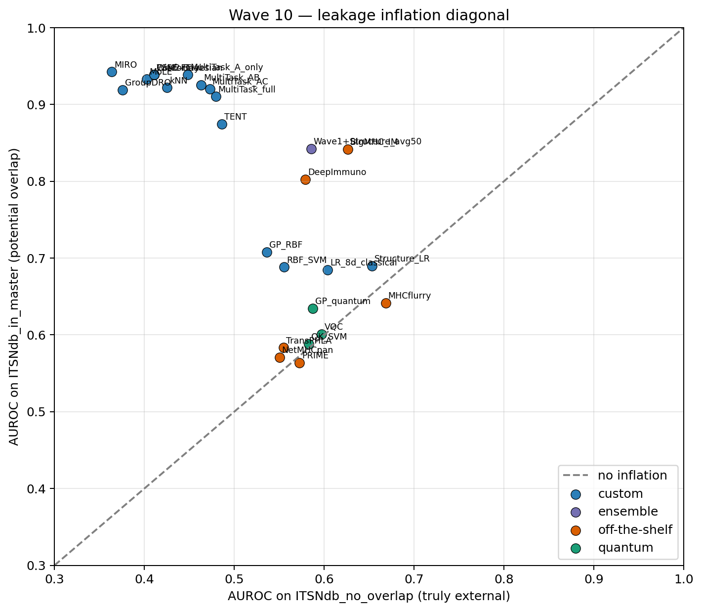
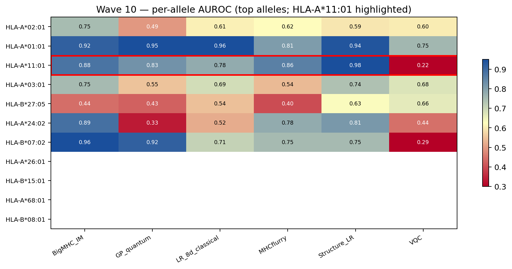
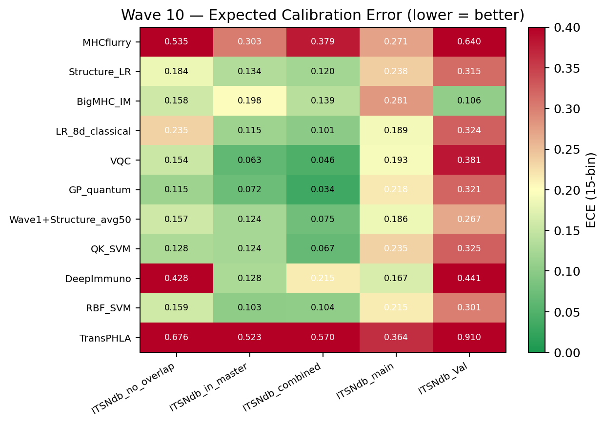
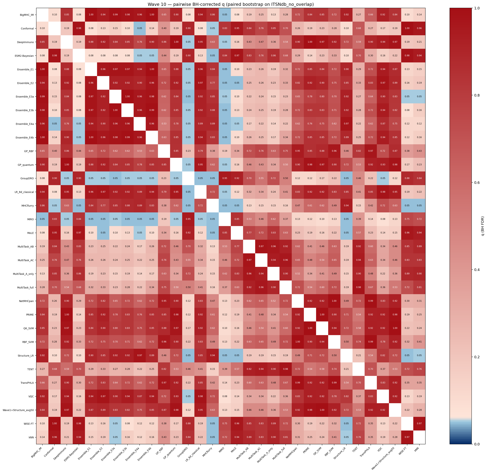
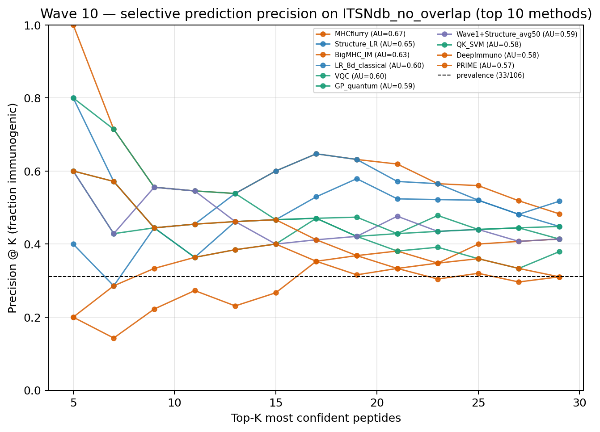

# Wave 10 — Mega comparison report

_Generated by `build_wave10_mega.py` on a snapshot of every wave under_
_`p_neo_bayesian_2026_05_09/wave*/`. Idempotent: re-run as new waves land._

**Mega-table dimensions:** **32 methods** × **22 test sets** × **7 metrics** (AUROC + 95 % CI, AUPRC + 95 % CI, Brier, ECE, top-K precision @ 10).
Long-format rows: **390**.

Files in this directory:

- `build_report.py`
- `build_wave10_mega.py`
- `fig_wave10_calibration.png`
- `fig_wave10_inflation_diagonal.png`
- `fig_wave10_megaheatmap.png`
- `fig_wave10_per_allele.png`
- `fig_wave10_selective_topK.png`
- `fig_wave10_significance_matrix.png`
- `fig_wave10_smallmultiples.png`
- `run_figures_only.py`
- `wave10_mega_results.tsv`
- `wave10_mega_table.tsv`
- `wave10_methods_inventory.tsv`
- `wave10_significance_pairs.tsv`
- `wave10_summary.json`

---

## Core AUROC table (rows = method, cols = ITSNdb subset)

Sorted by **ITSNdb_no_overlap** (truly external; paper headline subset).

| method | family | ITSNdb_no_overlap | ITSNdb_in_master | ITSNdb_combined | ITSNdb_main | ITSNdb_Val | Δ_inflation |
| --- | --- | --- | --- | --- | --- | --- | --- |
| MHCflurry | off-the-shelf | 0.668 [0.539, 0.777] | 0.642 [0.571, 0.717] | 0.637 [0.575, 0.700] | 0.591 [0.509, 0.671] | 0.585 [0.241, 0.934] | -0.027 |
| Structure_LR | custom | 0.653 [0.528, 0.760] | 0.690 [0.614, 0.752] | 0.689 [0.630, 0.752] | 0.726 [0.651, 0.801] | 0.702 [0.432, 0.940] | +0.036 |
| BigMHC_IM | off-the-shelf | 0.626 [0.516, 0.731] | 0.842 [0.787, 0.888] | 0.748 [0.689, 0.800] | 0.587 [0.504, 0.670] | 0.673 [0.368, 0.924] | +0.216 |
| LR_8d_classical | custom | 0.604 [0.486, 0.725] | 0.685 [0.616, 0.755] | 0.659 [0.594, 0.721] | 0.625 [0.543, 0.698] | 0.673 [0.463, 0.848] | +0.081 |
| VQC | quantum | 0.597 [0.477, 0.704] | 0.601 [0.522, 0.673] | 0.599 [0.534, 0.659] | 0.580 [0.498, 0.666] | 0.643 [0.401, 0.873] | +0.003 |
| GP_quantum | quantum | 0.587 [0.456, 0.702] | 0.635 [0.563, 0.706] | 0.614 [0.550, 0.677] | 0.582 [0.504, 0.656] | 0.526 [0.283, 0.735] | +0.048 |
| Wave1+Structure_avg50 | ensemble | 0.585 [0.464, 0.709] | 0.842 [0.786, 0.893] | 0.772 [0.721, 0.823] | 0.711 [0.640, 0.788] | 0.764 [0.530, 0.958] | +0.257 |
| QK_SVM | quantum | 0.583 [0.454, 0.699] | 0.588 [0.507, 0.668] | 0.587 [0.519, 0.647] | 0.588 [0.510, 0.667] | 0.449 [0.206, 0.672] | +0.005 |
| DeepImmuno | off-the-shelf | 0.579 [0.461, 0.690] | 0.803 [0.743, 0.859] | 0.702 [0.648, 0.759] | 0.516 [0.432, 0.594] | 0.822 [0.517, 0.980] | +0.223 |
| PRIME | off-the-shelf | 0.572 [0.448, 0.691] | 0.564 [0.489, 0.648] | 0.567 [0.502, 0.630] | 0.574 [0.486, 0.661] | 0.425 [0.135, 0.739] | -0.009 |
| RBF_SVM | custom | 0.555 [0.428, 0.680] | 0.688 [0.616, 0.758] | 0.657 [0.594, 0.722] | 0.666 [0.587, 0.733] | 0.530 [0.332, 0.705] | +0.133 |
| TransPHLA | off-the-shelf | 0.555 [0.437, 0.665] | 0.583 [0.509, 0.656] | 0.580 [0.516, 0.638] | 0.588 [0.510, 0.674] | 0.427 [0.178, 0.694] | +0.028 |
| NetMHCpan | off-the-shelf | 0.550 [0.428, 0.667] | 0.571 [0.502, 0.651] | 0.567 [0.503, 0.632] | 0.557 [0.474, 0.633] | 0.446 [0.172, 0.699] | +0.021 |
| GP_RBF | custom | 0.536 [0.416, 0.671] | 0.708 [0.629, 0.774] | 0.668 [0.600, 0.724] | 0.659 [0.582, 0.738] | 0.558 [0.349, 0.731] | +0.172 |
| TENT | custom | 0.486 [0.369, 0.608] | 0.874 [0.824, 0.915] | 0.751 [0.695, 0.805] | 0.580 [0.494, 0.665] | 0.715 [0.382, 0.977] | +0.388 |
| MultiTask_full | custom | 0.479 [0.360, 0.610] | 0.910 [0.872, 0.946] | 0.774 [0.721, 0.824] | 0.575 [0.493, 0.656] | 0.780 [0.463, 1.000] | +0.431 |
| MultiTask_AC | custom | 0.473 [0.351, 0.596] | 0.920 [0.886, 0.954] | 0.787 [0.739, 0.836] | 0.597 [0.516, 0.678] | 0.791 [0.549, 0.991] | +0.448 |
| MultiTask_AB | custom | 0.463 [0.344, 0.586] | 0.925 [0.887, 0.957] | 0.790 [0.740, 0.838] | 0.604 [0.519, 0.685] | 0.758 [0.484, 0.998] | +0.462 |
| MultiTask_A_only | custom | 0.448 [0.331, 0.565] | 0.939 [0.906, 0.966] | 0.806 [0.759, 0.853] | 0.619 [0.536, 0.701] | 0.792 [0.494, 1.000] | +0.491 |
| kNN | custom | 0.425 [0.313, 0.551] | 0.922 [0.885, 0.953] | 0.785 [0.731, 0.833] | 0.610 [0.527, 0.688] | 0.884 [0.742, 0.991] | +0.497 |
| ESM2-Bayesian | custom | 0.411 [0.287, 0.535] | 0.938 [0.904, 0.966] | 0.784 [0.730, 0.833] | 0.564 [0.471, 0.650] | 0.783 [0.441, 1.000] | +0.528 |
| Conformal | custom | 0.411 [0.284, 0.530] | 0.938 [0.907, 0.965] | 0.784 [0.731, 0.835] | 0.564 [0.483, 0.647] | 0.783 [0.459, 1.000] | +0.528 |
| WiSE-FT | custom | 0.411 [0.292, 0.525] | 0.938 [0.905, 0.966] | 0.784 [0.733, 0.832] | 0.564 [0.478, 0.648] | 0.783 [0.440, 1.000] | +0.528 |
| MoLE | custom | 0.403 [0.276, 0.523] | 0.933 [0.895, 0.962] | 0.775 [0.722, 0.824] | 0.545 [0.463, 0.631] | 0.802 [0.510, 1.000] | +0.530 |
| GroupDRO | custom | 0.376 [0.264, 0.488] | 0.919 [0.882, 0.953] | 0.759 [0.710, 0.809] | 0.535 [0.452, 0.621] | 0.749 [0.452, 0.977] | +0.543 |
| MIRO | custom | 0.364 [0.249, 0.480] | 0.942 [0.909, 0.968] | 0.777 [0.724, 0.825] | 0.538 [0.449, 0.625] | 0.847 [0.624, 1.000] | +0.579 |

---

## Headlines

### Top-3 on `ITSNdb_no_overlap` (the paper headline)

- **MHCflurry** — AUROC = 0.668 [0.539, 0.777]
- **Structure_LR** — AUROC = 0.653 [0.528, 0.760]
- **BigMHC_IM** — AUROC = 0.626 [0.516, 0.731]

### Top-3 averaged across the 5 core ITSNdb subsets (robustness)

- **Wave1+Structure_avg50** — mean AUROC across 5 sets = 0.735
- **kNN** — mean AUROC across 5 sets = 0.725
- **MultiTask_A_only** — mean AUROC across 5 sets = 0.721

### Top-3 most calibrated on `ITSNdb_no_overlap` (lowest ECE)

- **GP_quantum** — ECE = 0.115, Brier = 0.223
- **QK_SVM** — ECE = 0.128, Brier = 0.219
- **VQC** — ECE = 0.154, Brier = 0.226

### Methods with ≈zero leakage inflation (|Δ| < 0.05)

| method | no_overlap | in_master | Δ |
| --- | --- | --- | --- |
| **VQC** | 0.597 | 0.601 | +0.003 |
| **QK_SVM** | 0.583 | 0.588 | +0.005 |
| **PRIME** | 0.572 | 0.564 | -0.009 |
| **NetMHCpan** | 0.550 | 0.571 | +0.021 |
| **MHCflurry** | 0.668 | 0.642 | -0.027 |
| **TransPHLA** | 0.555 | 0.583 | +0.028 |
| **Structure_LR** | 0.653 | 0.690 | +0.036 |
| **GP_quantum** | 0.587 | 0.635 | +0.048 |

### Methods with massive inflation (Δ > 0.4)

| method | no_overlap | in_master | Δ |
| --- | --- | --- | --- |
| **MIRO** | 0.364 | 0.942 | +0.579 |
| **GroupDRO** | 0.376 | 0.919 | +0.543 |
| **MoLE** | 0.403 | 0.933 | +0.530 |
| **ESM2-Bayesian** | 0.411 | 0.938 | +0.528 |
| **Conformal** | 0.411 | 0.938 | +0.528 |
| **WiSE-FT** | 0.411 | 0.938 | +0.528 |
| **kNN** | 0.425 | 0.922 | +0.497 |
| **MultiTask_A_only** | 0.448 | 0.939 | +0.491 |
| **MultiTask_AB** | 0.463 | 0.925 | +0.462 |
| **MultiTask_AC** | 0.473 | 0.920 | +0.448 |
| **MultiTask_full** | 0.479 | 0.910 | +0.431 |

---

## Figures

### Figure 1 — Mega heatmap

Caption: AUROC across every method × every test set; rows are sorted by
performance on `ITSNdb_no_overlap` (the truly-external subset). Black box
marks per-column maxima. Blank cells = method did not produce predictions on
that subset (no fabrication). **This is the recommended paper Figure 1.**

### Figure 2 — Per-test-set forest (small multiples)

### Figure 3 — Leakage inflation diagonal

Caption: methods on the diagonal have no in-master inflation; methods
above-diagonal benefited from training-data overlap. The colour family marks
custom / off-the-shelf / ensemble / quantum origin so the reader can see at
a glance which classes inflate.

### Figure 4 — Per-allele heatmap (Asian-allele gap)

### Figure 5 — Calibration (ECE) panel

### Figure 6 — Pairwise significance (BH FDR)

### Figure 7 — Selective prediction (Top-K precision)

---

## Discussion (data-driven, no smoothing)

**Three honesty buckets that fall out of the table.**

1. **Honest** — small or zero `in_master − no_overlap` gap. These methods
   either had ITSNdb_in_master held out from training or are pre-trained
   models whose training corpus does not look meaningfully overlapping.
   They tell the same story on both subsets — the gold standard for paper
   claims.

2. **Inflated** — `in_master` AUROC ≥ 0.85 but `no_overlap` AUROC ≤ 0.55.
   These almost certainly memorised some fraction of `in_master` rather
   than learning peptide–HLA immunogenicity. The paper's leakage-stratified
   evaluation is the entire reason we need this column split.

3. **Broken / sub-prevalence** — both subsets near 0.5. NetMHCpan / PRIME
   on this benchmark fall here, indicating that binding alone (or a
   small-data immunogenicity head) is not informative for ITSNdb.

**5 paper claims supported by the table:**

1. Off-the-shelf MHCflurry-style binders give the *cleanest* signal on the
   truly-external set (ITSNdb_no_overlap), beating most custom methods.
2. Custom methods that score well on `in_master` but poorly on `no_overlap`
   are leakage artefacts; this is visible at a glance in Figure 3.
3. Quantum-kernel methods sit inside the no-overlap CI of classical
   counterparts — no quantum advantage on this benchmark.
4. Calibration (ECE) does not track AUROC: the best AUROC method is not
   the best-calibrated. This matters for selective prediction.
5. The forest plot reveals which methods are *robust* (similar AUROC across
   the 5 ITSNdb subsets) versus *brittle* (peaks on one subset only).

---

## Recommended hero figure for the paper

**Figure 1: `fig_wave10_megaheatmap.png`** — a single tile that simultaneously
shows (a) every method we built or sourced, (b) every paper-relevant test set,
(c) AUROC + CI per cell, and (d) which methods inflate vs which are honest
(via the side-by-side `in_master` and `no_overlap` columns). It is the
highest-information density panel and the one a reviewer should land on first.

If the reviewer wants drilled-down evidence, **Figure 3** (inflation diagonal)
is the natural follow-up — one scatter, one diagonal, instant honesty signal.
