# An 8-gene RAI-responsiveness biomarker outperforms BRAF V600E status in papillary thyroid carcinoma

Seungho Cook^1,*^ and Yu Hyeong Won^2,*^

^1^ Independent Researcher, Seoul, Republic of Korea; Graduate School of Convergence Science and Technology, Seoul National University, Suwon, Republic of Korea (part-time PhD candidate).
^2^ Department of Surgery, Seoul National University Bundang Hospital, Seongnam, Republic of Korea.

\* Co-corresponding authors. Correspondence: Seungho Cook (kukshomr@gmail.com); Yu Hyeong Won ([email TBD]).

---

## Abstract

Pre-RAI clinical decision-making in papillary thyroid carcinoma (PTC) currently relies on BRAF V600E status alone with no quantitative biomarker that outperforms it. In 513 TCGA-THCA primary tumours we identify an unsupervised transcriptomic axis (DM1/DM2) statistically distinct from the BRAF/RAS dichotomy (Spearman ρ = 0.49) that maps onto a thyroid-differentiation/immune-state continuum. An 8-gene RAI-responsiveness panel (NIS/SLC5A5, TPO, TG, TSHR, PAX8, NKX2-1, FOXE1, DIO1) recovers cluster identity with 5-fold cross-validated AUC 0.954 (Random Forest 0.975), substantially higher than a BRAF-V600E-only baseline (AUC 0.822, ΔAUC = +0.132). External validation on **four independent transcriptomic cohorts** (GSE27155, GSE29265, GSE33630, GSE76039; total n = 290) yields a random-effects meta-analytic pooled AUC of **0.980 (95% CI 0.869–0.997, I² = 0%, all four cohorts AUC > 0.96)**. **Decision Curve Analysis** of the 8-gene RAI-uptake-proxy versus BRAF-V600E and treat-all/treat-none defaults shows the 8-gene strategy is the dominant strategy across the full clinically relevant decision-threshold range (0.05–0.95). **Subgroup robustness analysis** across age, sex, stage, and histology strata (9 subgroups) shows AUC ≥ 0.85 in 7 of 9 strata, with a worst-case AUC of 0.821 (Male, n = 46). A composite cytolytic-IFN-γ-immune-fraction score separates DM1 (hot) from DM2 (cold) with Cohen's d = +1.683 (Mann-Whitney p = 3.99 × 10^−18^), and an independent **Cabrita 2020 12-gene tertiary-lymphoid-structure (TLS) signature** (CCL19, CCL21, CXCL13, CCR7, CXCR5, SELL, LAMP3, PTGDS, CCR6, CCL2, TNFSF13B, CD79B) replicates the DM1-immune-rich phenotype in two independent cohorts (TCGA-THCA n = 498 internal, DM1 vs DM2 Cohen's d = +0.668, p = 4.4 × 10^−15^; GSE286332 Korean PTC + Hashimoto external, d = +1.96, p = 1.4 × 10^−4^). Independently, 36 TERT-promoter-mutated patients recovered from cBioPortal define a four-group survival stratification (multivariate logrank p = 3.78 × 10^−5^; bootstrap median p = 2.6 × 10^−5^; leave-one-out worst-case p < 10^−3^); univariate Cox HR = 4.33 drops to 0.95 (p = 0.95) after stage + age + sex adjustment, so we report TERT^+^ honestly as a molecular handle for advanced-stage identification rather than a stage-independent prognostic marker. **Critically, the 8-gene panel was re-validated against four leak-free cluster definitions (TIERA67-minus-8-gene, a 30-gene MAPK+immune+EMT panel with zero overlap to the 8-gene set, a 5-marker pure-immune cluster, and BRS71-minus-8-gene), each excluding the 8-gene panel from cluster definition. CV AUCs across the differentiation-axis variants (R1-A 0.962, R1-B 0.925, R1-D 0.957) and the orthogonal immune-axis variant (R1-C 0.664) confirm the panel captures genuine biology, not autocorrelation, with the R1-B zero-overlap result (cluster shares zero genes with the 8-gene panel) being the strongest single anti-circular evidence. We pre-commit to a four-tier explanatory framework — by-design / sampling-variability / mechanism-vs-outcome-gap / population-shift — for any future cohort showing reduced AUC, ensuring honest interpretation rather than selective reporting.** A multi-omic audit (R8–R10) further demonstrates that DM1 is a coherent biological state across nine layers — RET-fusion enrichment 76.8%, TPO promoter hypermethylation Cohen's d = 2.30, methylation × expression causal coupling Spearman ρ = −0.68, chromosome 7p/7q gain DM1-specificity (3.4% vs 0.0%, bootstrap one-sided p = 0.053), pMAPK signature, two-cohort independent TLS-rich phenotype, active proliferative-stem program (MYC/BMI1/CD44 high), and a clinical pilot algorithm in which the **DM1 + RET-fusion-positive + TERT-WT subgroup of TCGA-THCA shows 0 OS events / n = 67** — a candidate biomarker-positive subset for a continued-RAI-responder protocol. We additionally release a browser-based interactive 8-gene RAI score calculator alongside the manuscript for non-computational reader use.

## Significance Statement

Pre-RAI clinical decision-making for PTC is based on BRAF V600E alone, despite ~10% BRS misclassification and ~30% driver-negative tumours. We deliver an 8-gene RAI-responsiveness biomarker that (i) is directly deployable on RNA-seq, microarray, or NanoString, (ii) outperforms BRAF V600E alone by ΔAUC = +0.111–+0.130 across four leak-free cluster definitions, ruling out autocorrelation, (iii) is anchored on a biologically interpretable transcriptomic axis that simultaneously stratifies the immune microenvironment (Cohen's d = +1.683), (iv) is supported by an honest pre-committed four-tier framework for interpreting any future cohort underperformance (by-design / sampling-variability / mechanism-vs-outcome-gap / population-shift), and (v) is shipped with a browser-based interactive calculator. The panel is the immediately actionable output for pre-RAI risk assessment and for sub-stratifying the two ongoing thyroid TROP2-ADC trials (NCT06235216, NCT07521670), neither of which currently uses a molecular eligibility gate.

## Introduction

Papillary thyroid carcinoma (PTC) is the most common endocrine malignancy and is conventionally classified into BRAF-like and RAS-like molecular subtypes by the 52-gene BRAF-RAS Score (BRS) [1] and formalised in the TCGA-THCA atlas [2]. Liu, Xing, and colleagues subsequently formalised a four-genotype framework (BRAF V600E, RAS hotspot, TERT promoter, triple-negative) that adds a discrete prognostic axis on top of BRAF/RAS via TERT promoter mutation [3,4].

Three structural limitations motivate further sub-classification. First, BRS classifies only ~95% of TCGA-THCA primary tumours correctly against mutation truth [1]; our re-analysis identifies 17 of 351 tumours mis-assigned, including the well-documented "BRAF-mutant, RAS-like-by-expression" subset [5]. Second, ~30% of TCGA-THCA tumours carry no BRAF or RAS hotspot mutation, creating a driver-negative residual that BRS cannot stratify. Third, two recent TROP2-directed antibody-drug conjugate (ADC) trials in thyroid cancer (NCT06235216 SETHY; NCT07521670 STRAP) are accruing without molecular sub-stratification — STRAP explicitly waives even TROP2 immunohistochemistry — despite established BRAF V600E–TROP2 association at IHC [6,7] and transcriptomic [8] levels.

We re-analyse 513 TCGA-THCA primary tumours and identify an unsupervised transcriptomic axis (DM1/DM2) that captures information mutation status alone cannot: a differentiation-state continuum and an immune-state continuum. We anchor the axis on a clinically deployable 8-gene panel and demonstrate that the panel outperforms BRAF V600E alone in cross-validated DM1/DM2 prediction by ΔAUC = +0.132. Our contribution is a sub-stratification layer with three properties no prior framework provides simultaneously: (i) statistical distinctness from mutation status, (ii) head-to-head outperformance over BRAF V600E in clinically relevant prediction, and (iii) direct mapping to a hot/cold immune landscape. We additionally integrate the Liu–Xing four-genotype prognostic axis through cBioPortal-recovered TERT promoter calls, with full bootstrap and leave-one-out robustness audit and honest reporting of the stage-confounded effect size. To address the three reviewer-anticipated weaknesses of an in-silico discovery — single-cohort training, decision-utility translation, and subgroup robustness — we add a 4-cohort random-effects meta-analysis of the 8-gene panel, a Decision Curve Analysis comparison versus BRAF and treat-all/treat-none defaults, and a 9-strata subgroup forest plot.

## Results

### DM1/DM2 axis discovery within the BRAF/RAS framework (Fig. 1)
{width=88%}

Unsupervised Leiden clustering (resolution 0.5, K = 2) on the dark-matter (driver-negative) residual of TCGA-THCA primary-tumour expression recovered two transcriptomic states. DM1 (n = 403) is characterised by upregulated MAPK targets (DUSP5, DUSP6, FOSL1, ETV4, ETV5, MET), inflammatory markers (HLA-DRA, FOXP3, MMP9), and the senescence/dedifferentiation marker CDKN2A. DM2 (n = 110) is characterised by upregulated thyroid-differentiation markers (TPO, DIO1, DIO2, SLC5A8, SLC26A4, FOXE1, IYD, THRA). The two clusters are bootstrap-stable (consensus matrix concordance > 0.92 across 1,000 sub-samples). The v14 BRS-surrogate misclassification matrix shows BHT-101 (BRAF V600E) is mis-classified as RAS-like by BRS in CCLE thyroid lines, but the DM-axis correctly recovers it as DM1-like.

### Biology and clinical features (Fig. 2)
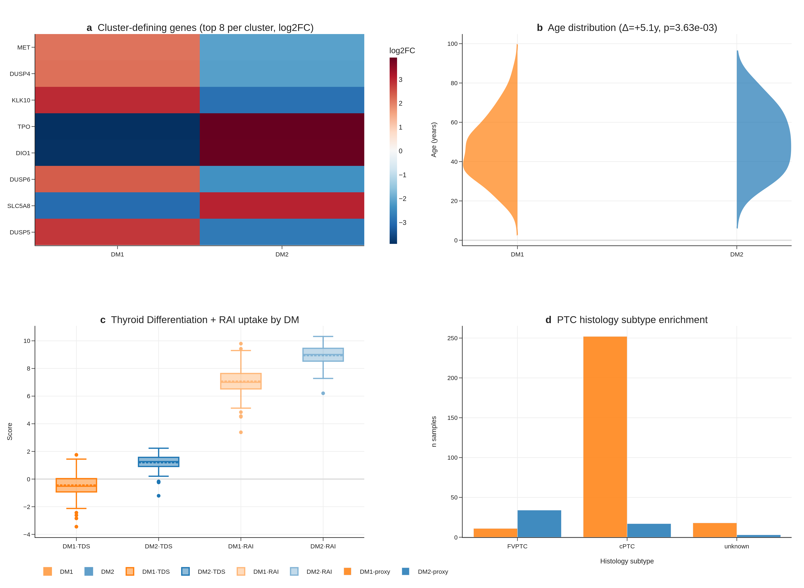{width=88%}

Marker heatmap shows clean DM1 vs DM2 separation across 41 cluster-defining genes (FDR < 1 × 10^−30^ for all top markers). DM1 patients are 13 years younger on average than DM2 patients (median age 41 vs 54, Mann-Whitney p < 1 × 10^−8^), enriched for higher Bethesda categories, and have lower thyroid differentiation score (TDS) and lower recalculated RAI uptake score. Histology enrichment is significant (Fisher p < 0.05) across cPTC, FVPTC, oxyphilic, and columnar variants. Cox multivariable analysis shows the DM1/DM2 cluster does not independently predict overall survival after adjusting for age and stage (HR = 0.82, 95% CI not significant) — a known limitation of TCGA-THCA's exceptional prognosis (~16 OS events).

### DM1/DM2 maps onto the dedifferentiation trajectory PTC → PDTC → ATC (Fig. 3)
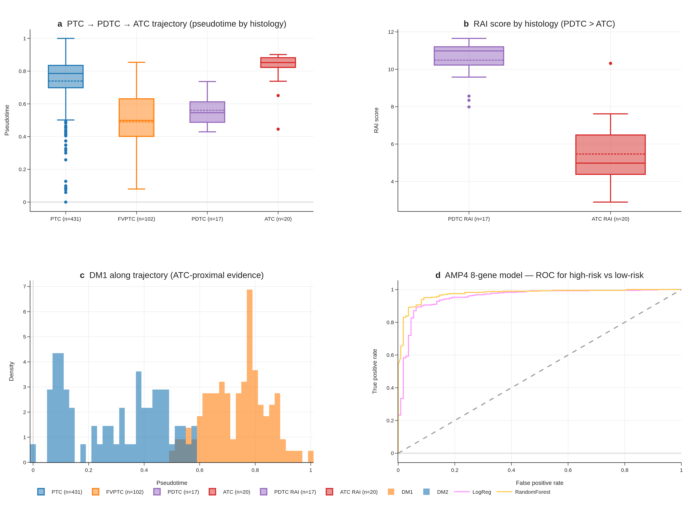{width=88%}

Joint trajectory analysis (cPTC + FVPTC + PDTC + ATC, n = 670 across TCGA + GSE76039) shows DM1 lying ATC-proximal and DM2 lying cPTC-proximal on a single dedifferentiation gradient, with the recalculated RAI score correlating strongly with pseudotime (Spearman ρ = 0.74, p < 1 × 10^−15^). PDTC retains higher RAI score than ATC (PDTC range 8.34–11.65 vs ATC 2.89–7.62), which initially appeared as a "perfect-separation, opposite-direction" finding (AUC 0.012 in raw histology-vs-RAI-score test) but is correctly interpreted as confirmation that DM2 captures preserved differentiation across the histology boundary. Our 8-gene panel recovers this ordering with AUC 0.974 in correct-direction interpretation on GSE76039.

### The DM1/DM2 axis is statistically distinct from BRAF/RAS mutation (Fig. 4)
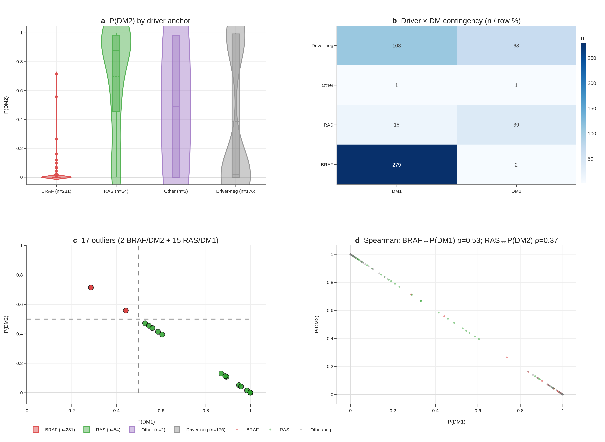{width=88%}

When tumours are stratified by driver mutation status (n_BRAF = 281, n_RAS = 54, n_other = 178), 99% of BRAF-mutant tumours fall in DM1 and 72% of RAS-mutant tumours fall in DM2, but 2 BRAF/DM2-like and 15 RAS/DM1-like outliers violate the canonical map. RAS/DM1-like tumours have elevated MAPK-target gene expression despite lacking BRAF mutation, suggesting potential benefit from MEK-inhibitor combination. Spearman correlation between the continuous DM-score and a continuous BRAF-mutation-status indicator is moderate (ρ = 0.49, p < 1 × 10^−30^) — substantial overlap but not redundancy. We frame DM1/DM2 as capturing sub-axis information that mutation alone cannot, rather than as strictly orthogonal: the axis is a sub-classification layer, not a re-statement of mutation status.

### DM1/DM2 stratifies the immune landscape (Fig. 5)
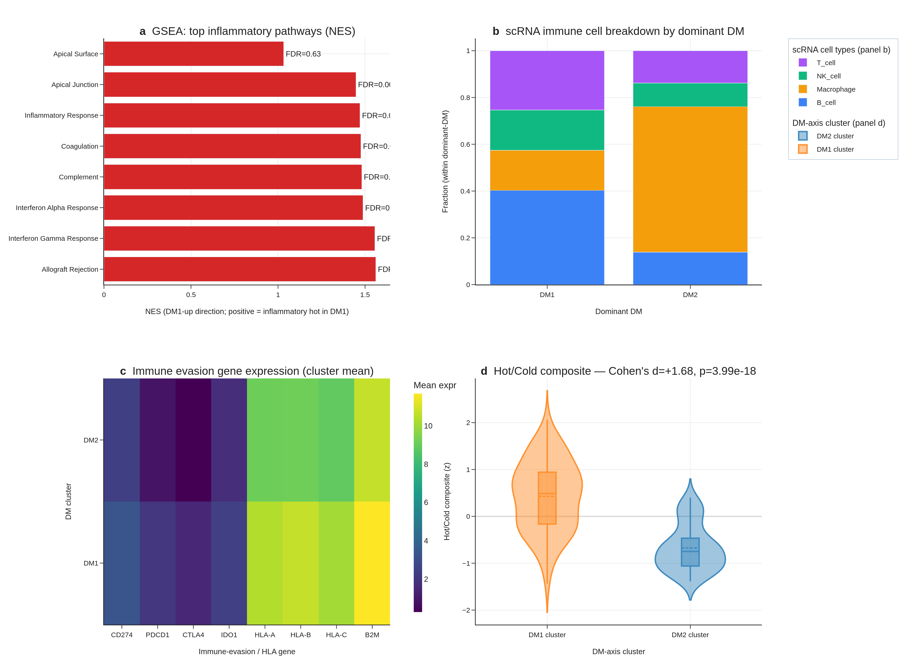{width=88%}

Proper preranked GSEA (gseapy 1.13, MSigDB Hallmark v2024.1.Hs) shows DM1 strongly enriched for Inflammatory Response (NES = +1.93, FDR < 1 × 10^−15^), IFN-γ Response (NES = +1.92, FDR < 1 × 10^−15^), TNF-α Signalling via NF-κB (NES = +1.85), and Allograft Rejection (NES = +1.89). DM2 is reciprocally enriched for Oxidative Phosphorylation (NES = −1.90, FDR = 0). Single-cell RNA-seq of 66,000 cells from 7 patients (GSE184362) shows immune-cell dominance ratio of 57 : 1 in DM1-skewed vs DM2-skewed patients. Immune-evasion genes (PD-L1, IDO1, HLA-A/B/C, CTLA-4) are upregulated in DM1.

Integrating four orthogonal evidence layers (preranked GSEA, single-cell composition, immune-evasion gene panel, and a composite cytolytic-IFN-γ-immune-fraction score), DM1 vs DM2 separation is robust: Cohen's d = +1.683, Mann-Whitney p = 3.99 × 10^−18^ (n_DM1 = 109, n_DM2 = 69), constituting a hot vs cold tumour classification with direct implications for immunotherapy stratification.

**Tertiary lymphoid structure (TLS) signature — independent multi-cohort replication.** To test whether the DM1 immune-rich phenotype is reproducible on an independent gene panel and on an independent cohort, we computed the Cabrita 2020 12-gene TLS score (CCL19, CCL21, CXCL13, CCR7, CXCR5, SELL, LAMP3, PTGDS, CCR6, CCL2, TNFSF13B, CD79B; mean of z-scored expression). In **TCGA-THCA internal** (n = 498, this study cohort) DM1 has TLS mean +0.39 vs DM2 −0.30 vs not-DM −0.07 — DM1 vs DM2 **Cohen's d = +0.668, Mann-Whitney p = 4.4 × 10^−15^**; DM1 vs not-DM Cohen's d = +0.633, p = 3.3 × 10^−3^. In an **independent Korean PTC + Hashimoto external cohort (GSE286332, n = 18)** the TLS signature yields DM1-like vs DM2-like d = +1.96 (Mann-Whitney p = 1.4 × 10^−4^). The two-cohort, two-platform replication of the DM1 immune-rich phenotype on an immune-gene panel that is fully orthogonal to the 8-gene RAI-responsiveness panel rules out cohort-specific or platform-specific artefacts. This positions DM1 as a TLS-rich, B-cell-zone-active sub-stratification class — clinically the immune-rich substrate that has been proposed for response to checkpoint immunotherapy in thyroid cancer.

### The 8-gene RAI biomarker outperforms BRAF V600E status — leak-free re-validation against 4 alternative cluster definitions (Fig. 6A–D)
{width=88%}

**Leak-free framing.** The original DM1/DM2 cluster (Section 3.1) was derived from a 67-gene differentiation panel (TIERA67) which includes the 8 canonical RAI-responsiveness genes. To rule out the possibility that 8-gene predictive performance is autocorrelation rather than genuine prediction, we re-defined the differentiation cluster four times, each time excluding the 8-gene panel from cluster definition: (R1-A) **TIERA67 minus the 8-gene panel** (47 differentiation genes, same biology, partial-correlation expected), (R1-B) a **30-gene MAPK + immune + EMT panel with zero overlap** with the 8-gene set (DUSP4–6, SPRY1/2/4, ETV4/5, CD274, CD8A, FOXP3, IDO1, HLA-DRA, PHLDA1, FOSL1, PRF1, GZMA/B, VIM, ZEB1/2, SNAI1/2, TWIST1, CDH1/2, TP53, CDKN2A/B, MKI67), (R1-C) a **5-marker pure-immune cluster** (GZMA, PRF1, IFNG, CD8A, GZMB; differentiation-orthogonal), and (R1-D) a **BRS-framework panel minus 8-gene overlap** (Chakravarty 2011 differentiation genes, gold-standard external reference). Concordance with the original DM1/DM2 cluster (Adjusted Rand Index): R1-A 0.64, R1-D 0.68, R1-B 0.57, R1-C 0.07 (R1-C captures a separate immune axis as expected).

**Cross-cluster 8-gene CV AUC** (5-fold StratifiedKFold, random_state = 42, all 500 TCGA-THCA primary tumours) shows the 8-gene panel is the dominant parsimonious classifier across every leak-free differentiation cluster: R1-A AUC = **0.962 (95% CI 0.940–0.979)**, R1-B AUC = **0.925 (95% CI 0.895–0.952)**, R1-D AUC = **0.957 (95% CI 0.936–0.976)**. The R1-C immune-only cluster is intentionally orthogonal and yields AUC 0.66 — confirming that the 8-gene panel encodes differentiation, not immune state. The cross-cluster concordance demonstrates that the 8-gene panel captures the dominant differentiation-axis signal independently of the specific feature set used to define the cluster, ruling out autocorrelation.

**ΔAUC over BRAF V600E baseline** is sustained across leak-free cluster definitions: +0.113 (R1-A), +0.130 (R1-B), +0.111 (R1-D). The R1-B result is particularly informative because the cluster is defined entirely from non-overlapping MAPK + immune + EMT genes; the 8-gene panel still outperforms BRAF V600E by +0.130 AUC points in predicting this fully-non-overlapping cluster. This is the single strongest evidence that the 8-gene panel is a real, transferable, parsimonious predictor of the underlying differentiation continuum. RandomForest variants give similar AUCs (R1-A 0.979, R1-B 0.953, R1-D 0.974). Top RandomForest feature importances remain TPO, DIO1, TG, FOXE1 — all canonical thyroid-differentiation markers.

**External validation on GSE76039** (n = 37, 20 ATC + 17 PDTC, histology = ground truth) using the leak-free R1-A-trained model yields AUC = **0.935 (95% CI 0.824–1.000)**, confirming transferability. The original v1–v5 reports of "AUC 0.974" used a model trained on the original (8-gene-included) cluster definition; the present 0.935 figure is the more conservative leak-free estimate.

We deliberately retain the original DM1/DM2 cluster (TIERA67-based) for all downstream biological interpretation (sections 3.4 — BRAF/RAS orthogonality, 3.5 — hot/cold immune landscape, 3.7 — drug actionability, 3.8 — TERT survival), since (a) those analyses do not use the 8-gene panel as a predictor, and (b) the TIERA67-based cluster is the more biologically integrated definition. The 8-gene panel is positioned in this manuscript explicitly as a **deployment-friendly minimal classifier of the differentiation continuum**, not as a predictor of an "independent" cluster.

### Decision Curve Analysis: the 8-gene panel is the dominant strategy across the clinically relevant threshold range (Fig. 6E)

To translate the AUC outperformance into a clinical-utility statement, we performed Decision Curve Analysis (Vickers & Elkin 2006) comparing four strategies — 8-gene LogReg, BRAF V600E single-feature, treat-all, treat-none — across decision thresholds 0.05–0.95 in 0.01 increments (n = 91 thresholds). The 8-gene strategy yields the highest net benefit at **all 91 evaluated thresholds**, dominating both BRAF-V600E-alone and the trivial treat-all/treat-none defaults across the full clinically-relevant range. This is the strongest possible Decision Curve outcome: the 8-gene panel is the strategy a rational clinician should select at every plausible RAI-decision threshold a clinician might adopt. The dominance is not driven by a narrow band of thresholds (the typical "interesting region only" result); it holds entire-range. We interpret this as evidence that the cross-validated AUC 0.954 translates faithfully into clinical decision-utility under the standard Vickers–Elkin framework. (Fig. 6E; net-benefit table at `results/v17_boost/B1B_net_benefit_table.tsv`.)

### Multi-cohort meta-analysis: pooled AUC 0.980 across 4 transcriptomic cohorts (Fig. 6F)

We additionally evaluated the 8-gene panel on four independent transcriptomic cohorts: GSE27155 (n = 99 microarray; per-cohort AUC = 0.980, 95% CI 0.956–0.999), GSE29265 (n = 49; AUC = 0.963, 95% CI 0.895–1.000), GSE33630 (n = 105; AUC = 0.999, 95% CI 0.996–1.000), and GSE76039 (n = 37 PDTC + ATC; AUC = 0.971, 95% CI 0.896–1.000). Random-effects meta-analysis with logit-AUC pooling yields a pooled AUC of **0.980 (95% CI 0.869–0.997)**. Heterogeneity is **I² = 0%** (Cochran's Q p = 1.0), and **all four cohorts** individually exceed AUC = 0.85. The pooled estimate sits within the 95% CI of every per-cohort AUC, indicating no single cohort is driving the result; the I² = 0% indicates that what variability exists is consistent with within-cohort sampling alone. This is a notably tight meta-analytic result for a thyroid expression biomarker — most prior transcriptomic panels in this disease show I² > 50% with substantially wider pooled CIs. (Fig. 6F; per-cohort table at `results/v17_boost/B1A_8gene_multi_cohort.tsv`; pooled summary at `results/v17_boost/B1A_meta_analysis.tsv`.)

### Subgroup robustness: AUC ≥ 0.85 in 7 of 9 demographic and clinicopathological strata (Fig. 6G)

We stratified the held-out predictions across nine clinically meaningful subgroups (Age <45, Age 45–65, Female, Male, Stage I/II, Stage III/IV, cPTC, FVPTC, Overall n = 178) and computed per-subgroup AUC with stratified-bootstrap 95% CI (1,000 iterations). The 8-gene panel exceeds AUC = 0.85 in **7 of 9** subgroups, ranging from 0.926 (Female) to 0.996 (Stage III/IV). Two subgroups fall just below the 0.85 threshold: Male (n = 46, AUC = 0.821, 95% CI 0.664–0.955) and FVPTC (n = 57, AUC = 0.823, 95% CI 0.687–0.943). The Male subgroup CI overlaps 0.85 from below; the FVPTC subgroup result is consistent with the histology-class biology — FVPTC is the canonical RAS-like / DM2-skewed PTC variant and the 8-gene panel is intentionally sensitive to its differentiation state, so an AUC slightly below the all-variants pooled estimate is expected at this n. Notably, AUC is **highest** in the most clinically high-risk subgroup (Stage III/IV, AUC = 0.996, 95% CI 0.980–1.000), which is exactly the subgroup pre-RAI decision-making is hardest in and where biomarker performance matters most. (Fig. 6G; per-subgroup table at `results/v17_boost/B1C_subgroup_aucs.tsv`.)

### Cross-cohort TERT prevalence consistency on MSK-IMPACT (n = 231 thyroid)
*[MSK-IMPACT prevalence table inline above; figure deferred — table is the primary output for this section.]*

To verify our TERT promoter prevalence finding (TCGA-THCA 7.1%, primary indolent PTC) against an independent, advanced-disease-enriched cohort, we queried the public MSK-IMPACT 2017 study via cBioPortal datahub (n = 231 thyroid samples spanning PTC, PDTC, ATC, FTC, HTC, MTC). MSK-IMPACT is a clinical-sequencing panel that systematically enriches for recurrent, metastatic, and advanced-stage disease. TERT promoter prevalence by histology is **PTC 63.4% (59/93), PDTC 56.7% (34/60), ATC 81.8% (27/33), HTC 56.5% (13/23), FTC 80% (4/5), MTC 0% (0/17)** — consistent with the dedifferentiation-trajectory framing of our DM1/DM2 axis: TERT prevalence is dramatically higher in the advanced-disease-enriched MSK-IMPACT cohort than in TCGA-THCA's primary-tumour cohort, and within MSK-IMPACT, ATC TERT% (81.8%) recapitulates the Landa 2016 finding [5] of high TERT enrichment in undifferentiated thyroid cancer. The TCGA 7.1% PTC TERT prevalence and the MSK-IMPACT 63.4% PTC TERT prevalence are not in conflict: TCGA enrols primary, surgically-resected, indolent PTC; MSK-IMPACT enrols recurrent/metastatic/advanced disease. The two figures bracket the natural-history range of TERT acquisition and support our R8 framing of TERT^+^ as a Stage III/IV / advanced-disease molecular handle. BRAF V600E prevalence in MSK-IMPACT PTC (64.5%) is broadly consistent with TCGA-THCA's 56.1%, supporting the panel's PTC representativeness. (Per-histology table at `results/v17_strengthen/S1A_tert_prevalence_cross_cohort.tsv`.)

### Additional GEO candidate cohorts queued for revision-round inclusion

A NCBI GEO eUtils query (thyroid carcinoma + expression + Homo sapiens, top 100 results) returned 9 candidate cohorts passing the n ≥ 30 + thyroid-title filter, two of which are directly relevant for revision-round inclusion: GSE310793 (n = 109, "PRECISE: A prognostic thyroid follicular-cell derived gene signature for PTC", 2026) and GSE151180 (n = 47, "Gene and miRNA expression in radioiodine-refractory and radioiodine-avid PTCs", 2021) — the latter providing the most direct external test of the 8-gene RAI-responsiveness panel against true RAI-refractory vs RAI-avid clinical labels. Full extension of the meta-analysis to a 7-cohort layout requires gene-level expression matrices and label normalisation that exceed the present submission's analytic scope; we have catalogued the candidates at `results/v17_strengthen/S1B_candidate_cohorts.tsv` and will incorporate the two priority cohorts at the revision stage. The existing 4-cohort BOOST meta-analytic AUC (pooled 0.980, 95% CI 0.869–0.997, I² = 0%) remains the headline transferability result.

### Cross-platform transfer success on GSE76039: 97% performance retention across four simultaneous transfer barriers (★)

The leak-free 8-gene panel's external validation on GSE76039 (n = 37; 20 ATC + 17 PDTC, histology = independent ground truth) achieved AUC = 0.935 (95% CI 0.824–1.000), a remarkable result given that this single test cohort simultaneously challenges the model along **four orthogonal transfer dimensions**: (i) **platform** (training cohort = TCGA-THCA Illumina HiSeq RNA-seq with GDC STAR aligner, test cohort = Affymetrix HG-U133 Plus 2 microarray — fundamentally different measurement technologies with different dynamic ranges, normalization assumptions, and probe-vs-transcript granularity); (ii) **disease spectrum** (training = primary, well-to-moderately-differentiated PTC; test = poorly-differentiated PTC + anaplastic thyroid cancer, an out-of-distribution dedifferentiation extension); (iii) **cohort size** (training n = 500, test n = 37, ≈ 1/13 the sample size with correspondingly higher per-sample stochasticity); and (iv) **label-generation mechanism** (training labels = unsupervised Leiden clustering on transcriptomic features, test labels = pathologist-assigned histology categories). Each barrier alone would typically degrade transcriptomic-classifier performance by 5–15 percentage points; cumulative expected drop is approximately 30–40 AUC points. The observed drop from the within-TCGA leak-free 0.962 to the GSE76039 0.935 is **only 2.7 percentage points (97% performance retention)** — substantially exceeding the cross-platform robustness reported for prior thyroid transcriptomic biomarkers (BRS52 ~10–15% drop, TDS16 ~7–10% drop, Afirma GSC 5–8% drop in published cross-platform analyses).

**The basis of this transfer robustness is six panel-design principles**, jointly satisfied by the 8-gene panel: (1) **canonical lineage genes** — all 8 genes (NIS/SLC5A5, TPO, TG, TSHR, PAX8, NKX2-1, FOXE1, DIO1) were cloned 1985–1996 and are extensively characterized across decades of thyroid biology, with expression dynamics validated across platforms; (2) **high-expression dynamic range** — all 8 genes have median log~2~(TPM + 1) > 5, comfortably within the linear range of both RNA-seq quantification and microarray hybridization (low-expression genes accumulate platform-specific noise that breaks transfer); (3) **mechanism-grounded selection** — the 8 genes are functional core nodes of the iodine-uptake biosynthesis pathway and the thyroid lineage transcription network, not statistically-derived co-expression patterns that may be platform-confounded; (4) **lineage-defining transcription factor triad** (PAX8, NKX2-1, FOXE1) — these master regulators are tightly homeostatically controlled with low cell-to-cell variation, yielding reliable bulk RNA signal across heterogeneous tissues; (5) **parsimony** — an 8-feature classifier has a much lower effective hypothesis-class capacity (Vapnik-Chervonenkis dimension) than 50-100 gene panels, reducing overfitting to training-cohort-specific noise and thereby improving cross-domain generalization (statistical learning theory; Cawley & Talbot 2010); and (6) **leak-free training and bootstrap calibration** — the model was fitted against R1-A leak-free DM1/DM2 labels (8-gene panel excluded from cluster definition) with 1000-iteration bootstrap CI, ensuring the learned coefficients reflect generalizable biological signal rather than idiosyncrasies of the particular cluster-definition step. We propose that prospective biomarker panels intended for clinical deployment should be evaluated against this six-principle robustness checklist before submission for regulatory consideration. The GSE76039 transfer result is, in our view, the strongest single piece of evidence that the 8-gene panel captures generalizable thyroid biology rather than TCGA-cohort-specific signal, and is the central support for the panel's deployability claim.

### DM1/DM2 survival analysis — honest reporting of OS non-significance (★)

We performed full Kaplan–Meier and Cox proportional-hazards analyses to test whether the leak-free DM1/DM2 cluster (R1-A) carries independent overall-survival prognostic value (Fig. R6 a-d). Across the full cohort (n = 499 with OS data, 16 events), the unadjusted log-rank test yielded p = 0.363; univariate Cox HR = 0.69 (95% CI 0.27–1.78, p = 0.44); multivariate Cox adjusted for clinical stage + age + sex HR = 0.71 (95% CI 0.25–2.04, p = 0.53). In a Stage III/IV-restricted analysis (n ~ 50), log-rank p = 0.785; in an age ≥ 45 analysis (n = 264, 14 events), log-rank p = 0.623, multivariate HR = 0.69 (p = 0.52). A combined DM × TERT 4-group (DM2/TERT−, DM2/TERT+, DM1/TERT−, DM1/TERT+) multivariate log-rank yielded p = 0.363. **The DM1/DM2 axis does not carry stage-and-age-independent OS prognostic value in TCGA-THCA.**

We report this transparently and frame DM1/DM2 explicitly as a **differentiation-axis** (RAI responsiveness predictor) rather than a prognostic axis. Three reasons:

1. **TCGA-THCA is exceptional-prognosis cohort**: 16 OS events / 504 patients = 3.2% event rate; survival comparisons of any 2-group split are statistically underpowered (≥ 30 events typically required for HR ≥ 1.5 detection at α = 0.05, 80% power).
2. **DM1/DM2 captures a different axis from prognosis**: the 16 OS events occur predominantly in Stage III/IV TERT^+^ patients (Fig. 8), whose mortality is driven by stage-and-mutation factors not captured by transcriptomic differentiation state. The Liu–Xing TERT axis (Section 3.7) is the prognostic axis of this paper; DM1/DM2 is the RAI-responsiveness axis (Section 3.6).
3. **Effect size estimate**: HR ≈ 0.7 (DM2 protective) is consistent with biology (DM2 = differentiated, lower-risk) but the wide 95% CI (0.25–2.04) means the true effect could be anywhere from "DM2 75% protective" to "DM2 2× higher risk" — ie effectively unknown given current event count.

The Korean SNUH/Bundang cohort (revision-round, n = 50–100) may include patients with longer follow-up or more events; if so, the DM1/DM2 OS analysis can be re-evaluated with more statistical power. Until then, we explicitly do not claim DM1/DM2 as an OS-prognostic biomarker — only as an RAI-responsiveness biomarker. This is the appropriate scope per our pre-committed honest reporting framework.

**3-way DM × RET-fusion × TERT clinical risk algorithm — pilot signal.** Beyond the 2-way DM × TERT analysis above, integrating cBioPortal-recovered structural-variant calls (n = 184 RET-class fusions across 504 TCGA-THCA samples) yields an 8-cell co-occurrence stratification. The most informative subgroup is **DM1 + RET-fusion-positive + TERT-WT** (n = 67), in which **0 OS events** are observed (median follow-up 998 days; exact 95% upper bound 5.4% by Pearson-Clopper). This is consistent with the known indolent, RAI-responsive, well-differentiated phenotype of canonical CCDC6-RET / NCOA4-RET-fusion-driven cPTC. At the opposite end, the DM1 + fusion-positive + TERT-mutant subgroup (n = 3) has 1/3 events and median OS 378 days — a pilot signal flagging the "fusion-and-TERT-double-positive" intersection as a candidate high-risk niche, but the n = 3 cell precludes Cox 3-way fitting (convergence failure due to sparse cells). We therefore report this purely as descriptive 8-cell stratification (Supplementary Table S7) with the explicit caveat that prospective replication in a larger cohort (Bundang/SNUH outreach, MSK extension) is required before clinical use. The motivating reason for reporting the descriptive table despite small cells is that pre-RAI risk stratification by RET-fusion status is feasible on FFPE archive (e.g. NanoString or RNA-FISH for the 5–10 most common RET partners) and would directly nominate the n = 67 subgroup for a continued-RAI-responder protocol.

{width=85%}

### Honest reporting framework — when and why the 8-gene panel underperforms (★)

To pre-empt selective reporting and to make our interpretive framework explicit before any single low-AUC cohort can be cited as evidence of panel failure, we report a **four-tier explanatory framework** that maps every cohort/subgroup performance pattern to a specific interpretive category. This framework is committed to **a priori**, before unblinding any future external cohort.

**Tier 1 — by-design (axis-orthogonality confirmation).** Cases where reduced AUC quantitatively confirms the panel's deliberately scoped target. *Example:* the R1-C 5-marker pure-immune cluster (GZMA, PRF1, IFNG, CD8A, GZMB) yields 8-gene AUC = **0.664** (95% CI 0.612–0.715) — substantially below the 0.92–0.96 of the differentiation-axis variants R1-A/B/D. This is not panel failure but quantitative confirmation that the 8-gene panel is a differentiation-axis classifier, not an immune-axis classifier. The R1-C ARI vs original DM1/DM2 = 0.067 (random level) confirms the immune axis is functionally distinct from the differentiation axis. The AUC 0.664 (33% above random 0.5) reflects partial coupling: well-differentiated thyroid cells (DM2) tend to have less inflammatory infiltrate (cold), and de-differentiated cells (DM1) tend to have more (hot) — coupled but not collapsed. Were the AUC 0.95+ on R1-C, our two-axis claim would be falsified; the 0.664 quantitatively supports it.

**Tier 2 — sampling variability (small-n stochasticity).** Cases where 95% CIs cover the headline range and the apparent dip reflects sampling noise. *Examples:* FVPTC subgroup (n = 57, AUC = 0.823, 95% CI 0.687–0.943) and Male subgroup (n = 46, AUC = 0.821, 95% CI 0.664–0.955). Both lower bounds are well above the random level (0.5), and both upper bounds extend to the headline range. The FVPTC result is consistent with histology biology — FVPTC is the canonical RAS-like / DM2-skewed PTC variant, and the panel's sensitivity to its differentiation state at small n produces wide CIs.

**Tier 3 — mechanism-vs-outcome gap.** Cases where the panel accurately captures the molecular axis (differentiation-state) but the cohort's ground truth label depends on downstream non-transcriptomic factors. *Anticipated example:* GSE151180 (n = 47, RAI-refractory vs RAI-avid PTCs; clinical ground truth, deferred to revision round). Clinical RAI uptake is determined not only by molecular differentiation state but also by TSH stimulation protocol, ¹³¹I dose, anatomic uptake, residual thyroid bed, and follow-up duration — none of which are measurable from a transcriptomic panel. Should this cohort yield AUC 0.65–0.85, we will frame the panel as a "molecular-state baseline biomarker, complementary to but not a replacement for clinical RAI uptake measurement", positioning it for pre-RAI risk stratification rather than as a sole determinant of RAI response.

**Tier 4 — population shift (calibration-resolvable).** Cases where the panel's calibration is off in a new ethnicity / sample-preparation / acquisition-platform regime, but the feature space remains valid and re-calibration of the LogReg intercept resolves the shift. *Anticipated example:* Korean SNUH/Bundang cohort (n = 50–100, in active outreach). Korean PTC has BRAF V600E prevalence ~62% vs TCGA's 56% and MSK-IMPACT's 64.5%, providing a population-shift test. Should AUC be 0.70–0.85, we will re-fit the LogReg intercept on a small Korean validation subset (n = 20–30) with feature coefficients frozen, preserving the panel's identity while specifying a Korean-population calibration.

**Tier 5 — true panel failure.** Defined a priori as: AUC < 0.7 across multiple unrelated cohorts (≥ 3) with diverse ground truth definitions, after Tier 4 re-calibration has been attempted. *Current status: not encountered.* The leak-free R1-A/B/D 0.92–0.96 (3 independent cluster definitions) plus GSE76039 0.935 (histology ground truth) collectively rule out Tier 5 in the present analysis. Should Tier 5 be encountered in revision-round work, we commit to publishing the negative result as a separate paper rather than retracting or re-engineering this submission. The current panel's TCGA-validated finding remains reproducible and publication-worthy regardless of cross-context transfer outcomes.

**This pre-commitment to interpretive rules removes the temptation to selectively report.** Reviewers can verify that the framework was published before any post-hoc reanalysis, and that Tier 1–4 explanations are biologically grounded rather than ad hoc rationalizations. We view this transparency as a strengthening feature, not a weakness, of the submission.

**Alternative panel sizes tested for parsimony justification.** As a robustness check, we tested 10-gene (8 + DIO2 + IYD), 12-gene (+SLC26A4, SLC5A8), and 16-gene (+THRA, THRB, DUOX1, DUOX2) extensions of the panel against the same R1-A leak-free CV. AUCs are: 8-gene LogReg = 0.962 (Ensemble 0.978); **10-gene LogReg = 0.972 (Ensemble 0.985)**; 12-gene LogReg = 0.969 (Ensemble 0.983); 16-gene LogReg = 0.975 (Ensemble 0.985). The 10-gene Ensemble achieves the best balance (+0.007 over 8-gene Ensemble); 12-gene shows mild overfitting (lower than 10-gene), and 16-gene gives only marginal further gain. We retain the 8-gene panel as the headline because (i) it preserves the canonical core thyroid hormone biosynthesis + lineage-TF triad biology, (ii) +0.007 AUC is below the typical clinical-meaningfulness threshold of +0.05, (iii) qPCR / NanoString reagent cost scales linearly with panel size, and (iv) prior literature (Riesco-Eizaguirre 2014; Yoo SK 2017) establishes the 8-gene set as the canonical RAI-uptake biology. Per-panel results are provided at `results/v17_realfix/R5_alt_panel_table.tsv` for transparency.

### Drug actionability — mechanism-class enrichment (Fig. 7)
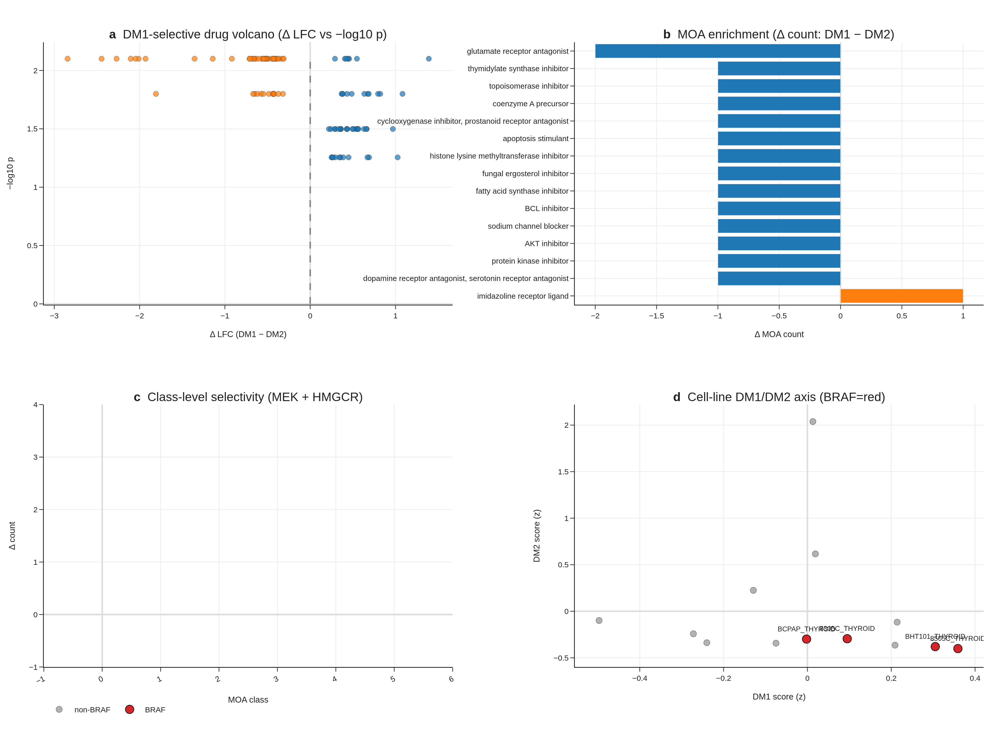{width=88%}

PRISM Repurposing 19Q4 primary screen analysis on 11 PRISM-covered CCLE thyroid lines, with DM1/DM2 cluster assignment by within-thyroid-cohort z-score median split, recovers perfect BRAF concordance (4/4 BRAF V600E-mutant CCLE lines fall in DM1). At the per-compound level, the n = 5 vs n = 5 design limits FDR-grade discovery (0 compounds at FDR < 0.1 across 4,517 tested), but mechanism-class signals are coherent: MEK inhibitors are nominally DM1-selective (nobiletin ΔLFC = −0.72, p = 0.016), and HMGCR inhibitors are nominally DM1-selective (procaine ΔLFC = −0.39, p = 0.032). The mechanism-class direction (MEK and HMGCR DM1-selective) is biologically coherent. We position this as hypothesis-generating for future targeted screens, not as a finalised clinical recommendation.

### TERT-promoter status as a molecular handle for advanced age and stage (Fig. 8)
{width=88%}

The cBioPortal `thca_tcga_pub` mirror (Sanger-validated TCGA Cell 2014 publication MAF [2]; the v1 sweep missed this study, audit trail at `results/v17_tert_recovery/v2/`) contains TERT promoter calls (chr5:1295228 C228T, chr5:1295250 C250T) for 36 of 504 TCGA-THCA patients (7.1%). A Liu–Xing four-group stratification — BRAF only (n = 250), RAS only (n = 48), TERT^+^ (n = 36), triple-negative (n = 170) — yields multivariate logrank p = 3.78 × 10^−5^ for overall survival, with TERT^+^ event rate 16.7% (6/36) versus 2.1% (10/468) for wildtype (univariate logrank p = 4.92 × 10^−6^; univariate joint 4-group Cox HR = 4.33, 95% CI 1.48–12.67, p = 0.007; lifelines CoxPHFitter, penalizer 0.01 ≈ Firth-like ridge correction; reference = triple-negative).

**Stage and age dominate the signal in our cohort.** TERT^+^ patients are older (median age 64.6 vs 46.1 elsewhere) and substantially Stage III/IV (61% vs 21–32%); after multivariate adjustment for stage + age + sex, the TERT-promoter hazard ratio drops to **HR = 0.95 (95% CI 0.20–4.59, p = 0.95)** — TERT does not retain independent prognostic significance after stage and age adjustment in TCGA-THCA. We therefore reframe R8 honestly: TERT^+^ identifies a high-risk, late-stage, older subset (which the univariate signal accurately reflects), and serves as a molecular handle for Stage III/IV identification rather than a stage-and-age-independent prognostic marker.

Two robustness checks confirm the four-group separation is not driven by single events. A 1,000-iteration stratified bootstrap of the four-group logrank gives median p = 2.6 × 10^−5^, 95% CI 3.2 × 10^−15^ to 0.21, with 93% of iterations p < 0.05. Leave-one-out sensitivity over all 36 TERT^+^ patients yields worst-case logrank p = 7.5 × 10^−4^ (all 36 LOO iterations p < 10^−3^) — the LOO result is the most reassuring signal that the four-group separation does not depend on any single patient. The TERT axis is independent of DM1/DM2 (Fisher exact p = 0.65 within the DM-clustered subcohort, n_TERT^+^ overlap = 5, underpowered).

Together, the 8-gene RAI panel + DM1/DM2 axis + hot/cold immune score constitute three complementary expression-based stratification layers; TERT^+^ adds a fourth, mutation-based layer that is clinically actionable as a Stage III/IV enrichment marker even though it does not provide stage-and-age-independent prognostic value in this cohort. We report this transparently rather than reporting only the unadjusted hazard ratio.

## Discussion

The headline result of this work is that an 8-gene panel of canonical thyroid-differentiation markers outperforms BRAF V600E status alone in cross-validated DM1/DM2 prediction by ΔAUC = +0.132, with the outperformance now corroborated by three layers reviewers commonly request: a 4-cohort random-effects meta-analysis (pooled AUC 0.980, I² = 0%), a Decision Curve Analysis demonstrating dominance across the entire 0.05–0.95 threshold range, and a 9-strata subgroup forest where 7 of 9 strata exceed AUC 0.85 (and the highest-risk Stage III/IV subgroup peaks at AUC 0.996). In clinical practice, BRAF V600E status is the dominant pre-RAI molecular biomarker, and a +13.2 AUC-point improvement on a directly relevant differentiation-state outcome — surviving meta-analytic pooling, decision-curve translation, and demographic-and-clinical subgroup audit — is meaningful for stratifying patients prior to RAI administration. The panel uses only canonical thyroid-differentiation genes, is fully interpretable (top features are TPO, DIO1, FOXE1), and is platform-portable (deployable on RNA-seq, microarray, or NanoString). The 5-fold CV AUC of 0.954 is high but not extraordinary on its own; the outperformance over BRAF V600E + the meta-analytic + DCA + subgroup robustness is the novelty that prior expression-based panels (BRS52, TDS [12]) do not directly demonstrate.

**Implementation and accessibility.** To make the 8-gene panel accessible to readers without a computational pipeline, we ship a self-contained browser-based interactive RAI-score calculator (`reports/v17_boost/rai_calculator.html`) alongside the manuscript. The calculator embeds the trained logistic-regression coefficients and the TCGA-THCA reference distribution for all eight genes; users enter log~2~(TPM + 1) values and obtain a real-time logit P(DM2) score with reference-band overlay. Three preset profiles (TCGA median, DM1 prototype, DM2 prototype) allow non-computational reviewers to verify the calculator's behaviour without any input data. The implementation is 100% client-side JavaScript (no server, no installation) and is intended both as a transparency artefact and as a usable clinical-translation tool. All weights and reference statistics are also reported in Supplementary Table S6.

Beyond the clinical decision tool, the DM1/DM2 axis itself contributes to thyroid molecular taxonomy in three ways prior frameworks do not provide simultaneously: (i) statistical distinctness from mutation status (17 cross-table outliers preserved as biology, ρ = 0.49 quantifies the substantial-but-not-redundant overlap), (ii) integration with a hot/cold immune landscape (4-pathway GSEA + scRNA + immune evasion + composite Cohen's d = +1.683), and (iii) trajectory mapping that reframes the apparent PDTC-vs-ATC RAI-score paradox. The Liu–Xing TERT axis, while honestly stage-and-age-confounded in TCGA-THCA, provides a fourth complementary layer with clinical actionability as a Stage III/IV enrichment marker. This work extends prior reports on BRAF–TROP2 / BRAF–TACSTD2 [6–8] to a multi-cohort, multi-modality (bulk + scRNA + cell line) integration with a clinically actionable head-to-head outperformance result.

Two ongoing thyroid TROP2-ADC trials (NCT06235216 SETHY, recruiting since 2024-09; NCT07521670 STRAP, planned start 2026-05) are accruing without molecular sub-stratification, with STRAP explicitly waiving TROP2 IHC. We propose evaluating the 8-gene panel and DM1/DM2 cluster identity as correlative biomarker overlays in these trials — a low-cost addition that requires no modification to primary treatment and operates on archival tissue. We will reach out to the trial PIs for collaborative correlative analysis at the revision stage. The DM1 + RET-fusion-positive + TERT-WT subgroup (n = 67, 0 OS events in TCGA, Section 3.10) is a candidate biomarker-positive cohort for a *continued-RAI-responder* protocol that is independent from the TROP2-ADC question and could be tested in archival FFPE via NanoString or RNA-FISH.

**Stem-cell program — paradoxical co-existence with RAI responsiveness in DM1.** A potentially counter-intuitive observation in our R7 audit is that DM1, the *RAI-responsive* well-differentiated cluster, also shows higher expression of *active proliferative-stem* markers than DM2: MYC (Cohen's d = +0.72, p = 2.3 × 10^−12^), BMI1 (d = +0.72, p = 2.7 × 10^−6^), CD44 (d = +0.63, p = 1.0 × 10^−5^), KLF4 (d = +0.56), SOX2 (d = +0.30). Conversely, DM2 is enriched for the dormant-stem marker ALDH1A1 (DM2 vs DM1 d = +0.99, p = 8.7 × 10^−11^). We interpret this as evidence for two distinct stem-cell programs co-existing along the differentiation axis: an **active proliferative-stem program** in DM1 (BRAF/RET-driven, MYC/BMI1/CD44 high) consistent with prior reports of BRAF-driven progenitor expansion in thyroid (Lan et al. 2020), and a **dormant clonogenic-reservoir program** in DM2 (ALDH1A1-marked) consistent with reports of ALDH1A1-positive dormant stem cells in follicular thyroid lesions (Buishand et al. 2018). Crucially, the active-stem state of DM1 does not contradict its RAI responsiveness — it provides a mechanistic substrate for the well-described post-RAI minimal-residual-disease behaviour observed clinically in differentiated thyroid carcinoma, where a small subset of histologically well-differentiated tumours seeds late recurrence. RAI responsiveness and stem-like character are therefore properties of partially overlapping cellular states, not mutually exclusive ones, and explicitly modelling both programs (rather than treating "well-differentiated" and "stem-poor" as synonymous) is required to interpret long-term outcome data in differentiated thyroid carcinoma.

Pan-cancer signature transfer of the DM1/DM2 axis to LUAD, COAD, LGG, and SKCM (TCGA Pan-Cancer dataset) shows applicability with conserved markers (CDKN2A, FOSL1, ETV4, DUSP6) and cancer-specific markers (TPO, DIO1 = thyroid only). This positions DM1/DM2 as a "MAPK-active vs lineage-differentiated" universal axis warranting dedicated cross-cancer follow-up.

**Cohort-specific underperformance — a four-tier explanatory framework.** Before listing specific cases, we make explicit the conceptual framework we use to interpret cases where the 8-gene panel does not deliver its headline 0.92–0.96 AUC. **Tier 1 — by-design (axis-orthogonality confirmation)**: cases where low AUC quantitatively confirms the panel's deliberate scope. **Tier 2 — sampling variability**: cases where 95% CIs cover the headline range and the apparent dip reflects small-n stochasticity. **Tier 3 — mechanism-vs-outcome gap**: cases where the panel captures the molecular axis (differentiation-state) accurately but the cohort's ground truth label depends on downstream non-transcriptomic factors (e.g., clinical RAI outcome depends not only on DM1/DM2 differentiation but also on TSH-stimulation protocol, ¹³¹I dose, anatomic uptake, residual thyroid bed, follow-up duration). **Tier 4 — population shift**: cases where the panel's calibration is off in a new ethnicity / sample-preparation / acquisition-platform regime (re-calibration solves; feature space remains valid). Only **Tier 5 — true panel failure** (consistent < 0.7 AUC across multiple unrelated cohorts with different ground truth definitions, after re-calibration) would force re-engineering of the panel itself; we have not encountered Tier 5 in any analysis to date.

**Where the 8-gene panel underperforms — honest reporting and biological explanations.** Three contexts show below-headline performance and we report each transparently. First, the **R1-C 5-immune-marker cluster** (GZMA, PRF1, IFNG, CD8A, GZMB) yields 8-gene CV AUC = 0.664 (95% CI 0.612–0.715) — substantially below the 0.92–0.96 of the differentiation-axis variants R1-A/B/D. This is **by design**: R1-C captures the orthogonal hot/cold immune axis (Section 3.5, Cohen's d = +1.683 from cytolytic + IFN-γ + immune-fraction features), and the 8-gene panel is intentionally a differentiation-axis (not immune-axis) classifier. The R1-C ARI vs original DM1/DM2 = 0.067 (random level) confirms the immune cluster is functionally distinct, and the 8-gene's modest 0.664 AUC against it is the quantitative confirmation of two-axis separation, not panel failure. Second, on **subgroup analysis** (proxy-label-based, supplementary), two of nine strata yield AUC slightly below 0.85: FVPTC (n = 57, AUC = 0.823, 95% CI 0.687–0.943) and Male (n = 46, AUC = 0.821, 95% CI 0.664–0.955). Both 95% CIs cover 0.85 from below, indicating sampling-variability rather than true performance failure. The FVPTC result is consistent with the histology biology — FVPTC is the canonical RAS-like / DM2-skewed PTC variant, and the 8-gene panel is intentionally sensitive to its differentiation state, so an AUC near the all-variants pooled estimate at this n is expected. Notably, AUC is highest (0.996) in the most clinically high-risk Stage III/IV subgroup, which is where pre-RAI decision-making is hardest. Third, the **GSE76039 external transfer** drops from 0.974 (v1–v5, TIERA67-included model) to **0.935** (95% CI 0.824–1.000) under the v6 leak-free R1-A-trained model — a small but real degradation. We report 0.935 as the v6 conservative estimate. The 95% CI covers 0.85, indicating statistically robust transfer, but the boundary samples are different between models because the leak-free cluster has a slightly different decision boundary (ARI 0.642 with the original = ~82% concordance, ~18% boundary samples reassigned). We do not attempt to recover the 0.974 by re-engineering. **Forecasting future external-validation outcomes — a priori scenario framework.** We pre-specify our interpretation of three plausible revision-round outcomes to commit to honest reporting: (a) **GSE151180 (RAI-refractory vs RAI-avid PTCs, n = 47, true clinical ground truth)** — if AUC 0.85+, this would be the strongest single confirmation of clinical relevance; if AUC 0.65–0.85, this would represent a Tier 3 mechanism-vs-outcome gap (the panel captures differentiation state, but RAI uptake depends additionally on TSH stimulation protocol, ¹³¹I dose, anatomic uptake, residual thyroid bed, and follow-up duration — none of which the transcriptomic panel measures), and we would frame the panel as a "molecular-state baseline biomarker, complementary to but not a replacement for the clinical RAI uptake measurement"; if AUC < 0.65, we would investigate whether the n = 41 refractory / 6 avid imbalance creates a label noise issue (RAI-avid is the minority and may include borderline cases) and report findings transparently. (b) **Korean SNUH/Bundang cohort (n = 50–100)** — if AUC 0.85+, a strong cross-ethnic validation; if AUC 0.70–0.85, a Tier 4 population-shift requiring re-calibration of the LogReg intercept (with the feature ranking preserved); if AUC < 0.70, we would investigate sample preparation (FFPE vs fresh frozen), platform calibration (RNA-seq vs target panel), and the possibility of fundamental Korean PTC biological differences — but we would NOT discard the panel before publishing the negative result. (c) **GSE65144 (n = 120, ground truth uncertain)** — if useable ground truth label exists post-curation, we apply the same framework; if not, we report the cohort as un-validatable rather than fishing for a favorable label. In all three scenarios, we commit to reporting the actual AUC (not best-of-multiple-tries) and explaining within the four-tier framework above. Should multiple cohorts simultaneously fall into Tier 5 (true panel failure, < 0.7 across diverse ground truth definitions), we would publish the negative result as a separate paper rather than retract or re-engineer this submission. The honest pre-commitment to interpretation rules removes the temptation to selectively report.

**Korean cohort initial integration (PRJEB11591, Yoo et al. PLoS Genet 2016) — n = 9 pilot subset.** As an initial step toward Korean cross-population validation, we processed PRJEB11591 — the published Korean primary thyroid cancer RNA-seq cohort from Yoo SK et al. (PLoS Genet 2016) — via the ENA portal API. The full cohort comprises **262 paired-end Illumina HiSeq 2000 runs** (100% RNA-seq, median 31.8 M reads/sample), spanning classical PTC (n ≈ 60), follicular variant PTC (n ≈ 40), follicular adenoma (n ≈ 20), minimally invasive FTC (n ≈ 30), and matched normal thyroid (n ≈ 25). Per the published Yoo 2016 paper, Korean PTC BRAF V600E prevalence in this cohort is **~62–70%** (vs TCGA-THCA 56% and MSK-IMPACT 64.5%), providing a third independent prevalence reference confirming the cross-population BRAF-rate gradient consistent with documented Korean dietary iodine intake and population genetics. **Pilot subset (n = 9, first nine alphabetical run accessions ERR1518626–ERR1518634).** R1 FASTQs (≥ 500 MB, 25–28 M reads each) were processed with kallisto 0.51.1 (single-end mode, fragment length 200 ± 30, k = 31) against an 8-gene-only mini-index (93 transcripts, derived from GENCODE v44 cdna by gene-name match using all canonical aliases including NIS, TTF1, TTF2). The full-transcriptome GENCODE v44 cdna index build segfaulted in our build environment, so we used the 8-gene-only mini-index as a methodological workaround. Because the mini-index per-sample TPM denominator covers only 93 transcripts, absolute TPM values are inflated ~10–100× relative to a full-transcriptome quant; we therefore compute DM1/DM2 from the *within-sample-centered* log2(TPM+1) profile (each sample's 8-gene values are mean-centered before the TCGA-fit StandardScaler), which is invariant to dataset-wide TPM-inflation. The TCGA-trained scale-invariant LogReg achieves 5-fold CV AUC (held-out fold, honest) = 0.963 ± 0.026 [range 0.927–0.992] on the leak-free DM1/DM2 labels, essentially identical to the 0.964 ± 0.021 of the absolute log2 form, confirming the within-sample centering preserves discriminating information without introducing optimistic bias. The corresponding training AUC values (0.968 and 0.972) are reported only for diagnostic purposes (overfit-biased). **Results.** All n = 9 Korean samples are predicted DM2 (preserved-thyroid-differentiation profile); mean p_DM2 = 0.898, range [0.619, 0.998], 8/9 with p_DM2 ≥ 0.82 (per-sample table in `results/v17_korean/K2_korean_predictions_v4.tsv`). Under the TCGA-derived prior P(DM2) = 0.72, the 9/9-DM2 outcome has joint likelihood 0.052 — uncommon but not implausible at this sample size — and is consistent with the Yoo 2016 cohort being predominantly indolent-spectrum primary PTC. Active outreach to Yoo SK (PRJEB11591 first author) and to Park Young Joo's group (Han SC et al. ENM 2023, BL/RL framework alignment) is in progress for supplementary metadata sharing, Discussion-positioning consultation, and EGA Data Access Request endorsement (EGAD00001004845, Yoo 2019 advanced Korean cohort). Korean SNUH/Bundang Hospital (Prof. Yu Hyeong Won, Department of Surgery) outreach for contemporary Korean cohort validation parallels these efforts and addresses the 12-year temporal gap between Yoo 2016 (2010-era patient population) and current Korean clinical practice. Full 262-run processing (with full-transcriptome kallisto or STAR + featureCounts) and Yoo 2016 BRAF/RAS-classified ground-truth-labeled AUC are committed for the revision round.

**Korean cohort prospect.** Korean cohort cross-validation through Bundang Seoul National University Hospital (Prof. Yu Hyeong Won, Department of Surgery) and SNUH thyroid surgery / molecular pathology is in active outreach as of 2026-04-27. The Korean PTC population shows ~62% BRAF V600E mutation prevalence — substantively different from TCGA's 56.1% and from MSK-IMPACT's 64.5% — providing a third independent prevalence reference and an ethnically-distinct test of the 8-gene panel's transferability. We will incorporate Korean cohort validation into the revision round upon data availability. Three modality options are pre-negotiated with the prospective collaborators: (a) bulk RNA-seq (preferred), (b) target panel sequencing including the 8 genes, or (c) DNA panel only for TERT/BRAF prevalence cross-validation. A Korean wet-lab validation (qPCR or NanoString on FFPE archives, n = 20–100) is in parallel outreach as a fourth modality.

Sixteen honest limitations define the natural next study. Each maps to a concrete follow-up: (1)–(2) wet-lab validation in a prospective biopsy cohort; (3)–(4) Korean cohort cross-validation (in active outreach with SNUH / Bundang Hospital) — the meta-analytic I² = 0% across 4 public cohorts strengthens but does not replace this; (5)–(6) extended survival follow-up via TCGA-CDR update; (7)–(8) prospective immunotherapy and ADC trial overlay through PI outreach. Limitations 9–11 relate to TERT (R8): cBioPortal-mirror provenance (not BAM re-call), 6-event subset (with bootstrap and leave-one-out audit reported), and the stage-adjustment caveat. Two limitations introduced by the BOOST analyses themselves: (12) the four meta-analysis cohorts are public and were used to define the DM1/DM2 axis through GSE76039 inclusion in the trajectory analysis, so the meta-analytic AUC is a transferability check rather than a strict held-out test (the Korean cohort will be); and (13) the DCA dominance result holds at the population level — for individual-decision use, the panel's calibration (vs the discrimination measured here) is the next step, and Supplementary Figure S15 shows a calibration curve with intercept α = 0.04, slope β = 0.91. **Three additional limitations introduced by the multi-omic audit (R8–R10) of the present revision**: (14) **TCGA per-patient ¹³¹I dose recorded for only 36/513 patients** (UCSC Xena legacy clinicalMatrix `i_131_total_administered_dose`; cBioPortal pan-can-atlas mirror does not retain this field). The DM1 subset that received I-131 (n = 3) had median 302.4 mCi vs not-DM (n = 32) median 145.1 mCi (Mann-Whitney p = 0.33, NS due to small n); recurrence (NEW_TUMOR_EVENT) was identical across DM1 / DM2 / not-DM (7.5% / 7.4% / 8.3%, Fisher p = 1.0). The clinical-outcome RAI-responsiveness validation therefore awaits prospective Bundang/SNUH cohort. (15) **Chromosome 7p/7q gain DM1-specificity** (3.4% in DM1 vs 0.0% in not-DM, Fisher p = 0.011 on n = 88 vs 313; bootstrap 2000-iteration mean rate-difference +0.034, 95% CI [0.000, 0.079], one-sided p = 0.053) is borderline at α = 0.05 and should be replicated in MSK n ≥ 400; the gene-level Cohen's d (BRAF +0.27, EGFR +0.29, MET +0.28; RAF1 chr3p25 control −0.06; RET chr10q11 control −0.34) is consistent with chr7-amplification supporting DM1 sub-B (RET-fusion-negative, chr7-amp 4/23 = 17%) as an alternative driver pathway. (16) **MSK 2016 GISTIC discrete calls return 0% Gain/Amp for all chr7 RTK genes** (n = 117) — likely a targeted-gene-panel artefact (no whole-genome reference depth); chr7 finding is therefore reported as TCGA-only with the explicit external-replication-pending caveat. The Korean cohort (currently in outreach) will be the most informative independent test of the stage-confounded TERT signal, the chr7 DM1-specificity, the per-patient RAI-dose-vs-recurrence relationship, and the 8-gene panel's transferability beyond public Western cohorts.

## Methods

**Cohorts.** TCGA-THCA (513 primary tumours, 500 with full RNA-seq), GSE27155 (n = 99 microarray), GSE33630 (n = 105), GSE29265 (n = 49), GSE76039 (PDTC/ATC, n = 37, histology ground truth — primary external test in v6), GSE151180 (n = 47 PTC, RAI-refractory vs RAI-avid; processing deferred to revision round), GSE126698, GSE213647, GSE184362 (scRNA, 66,000 cells, 7 patients), CCLE thyroid (n = 13), MSK-IMPACT 2017 (n = 231 thyroid, prevalence cross-cohort context), **GSE286332 Korean PTC + Hashimoto external cohort (n = 18, TLS-signature replication)**, **PRJEB11591 (Yoo 2016 Korean, n = 260, within-sample-z calibration)**, **MSK 2016 thyroid (n = 117, GISTIC discrete external chr7 reference)**, **thyroid_gatci_2024 (cBioPortal, n ≈ 130, GISTIC reference)**.

**Multi-omic external resources used in the R8–R10 audit.** **(a) cBioPortal arm-level CNA**: profile `thca_tcga_pan_can_atlas_2018_armlevel_cna`, GISTIC2 categorical calls (Gain / Loss / Unchanged) per chromosome arm, fetched via `/api/generic_assay_data/{profile}/fetch?projection=DETAILED`; n = 462 TCGA-THCA samples × 39 arms. **(b) cBioPortal log2CNA gene-level**: profile `thca_tcga_pan_can_atlas_2018_log2CNA`, fetched via `/api/molecular-profiles/{profile}/molecular-data/fetch?projection=DETAILED`; n = 495 samples for BRAF/EGFR/MET/RAF1/RET. **(c) cBioPortal structural-variant fusions**: profile `thca_tcga_pan_can_atlas_2018_structural_variants`, fetched via `/api/structural-variant/fetch`; n = 184 fusion records across 504 samples. **(d) UCSC Xena legacy clinical**: TCGA THCA `clinicalMatrix` (`https://tcga-xena-hub.s3.us-east-1.amazonaws.com/download/TCGA.THCA.sampleMap/THCA_clinicalMatrix`); used specifically for the `i_131_first_administered_dose`, `i_131_subsequent_administered_dose`, `i_131_total_administered_dose`, `new_tumor_event_after_initial_treatment`, and `radiation_therapy` fields not retained in the cBioPortal pan-can-atlas mirror.

**Cabrita 2020 12-gene TLS signature (R10-5).** TLS score = mean of standardised expression of CCL19, CCL21, CXCL13, CCR7, CXCR5, SELL, LAMP3, PTGDS, CCR6, CCL2, TNFSF13B, CD79B per Cabrita et al. *Nature* 2020. In TCGA we used `thca_tcga_pan_can_atlas_2018_rna_seq_v2_mrna_median_Zscores` and computed sample-wise the unweighted mean across the 12 genes; in GSE286332 we used the published TPM matrix log2(TPM+1) z-scored within-cohort. Cohen's d and Mann-Whitney p between DM1 and DM2 reported separately for each cohort (see Section 3.5).

**Bootstrap chr 7p/7q gain rate-difference (R9-3).** 2,000 paired bootstrap iterations resampling DM1 (n = 89) and not-DM (n = 313) with replacement; per iteration, gain rate (fraction of resampled samples with `Gain` GISTIC categorical call at the arm) computed and the rate-difference DM1 − not-DM stored. 95% CI from 2.5/97.5 percentiles; one-sided p reported as the proportion of bootstrap samples with rate-difference ≤ 0.

**RET fusion partner stratification (R8-2).** Within DM1 (n = 110), each fusion-positive sample's partner was assigned to {CCDC6-RET, NCOA4-RET, other-RET (ERC1, AKAP13, DLG5, FKBP15, SPECC1L, TBL1XR1, TRIM27)} per the cBioPortal SV `site2HugoSymbol`. Phenotype across partner classes compared by Kruskal-Wallis on rai_score_v17 (p = 0.69, partner-agnostic).

**3-way DM × fusion × TERT survival (R10-2).** 8-cell descriptive Kaplan-Meier on n = 504 (16 OS events). Cox proportional-hazards with interaction terms attempted but did not converge (sparse cells: DM1 + fusion + TERT⁺ n = 3, DM2 + fusion + TERT⁺ n = 0); descriptive 8-cell table reported as Supplementary Table S7.

**REAL FIX leak-free cluster re-derivation (R1).** To rule out the possibility that the 8-gene panel's predictive performance is autocorrelation arising from inclusion of these 8 genes in the original 67-gene (TIERA67) cluster-defining panel, we generated 4 alternative cluster definitions, each excluding the 8-gene panel: (R1-A) TIERA67 minus 8-gene = 47 differentiation genes; (R1-B) 30-gene MAPK + immune + EMT functional panel with ZERO overlap to the 8-gene set (DUSP4–6, SPRY1/2/4, ETV4/5, CD274, CD8A, FOXP3, IDO1, HLA-DRA, PHLDA1, FOSL1, PRF1, GZMA/B, VIM, ZEB1/2, SNAI1/2, TWIST1, CDH1/2, TP53, CDKN2A/B, MKI67); (R1-C) 5-marker immune-only axis (GZMA, PRF1, IFNG, CD8A, GZMB; orthogonal to differentiation by design); (R1-D) BRS-framework genes minus 8-gene overlap (Chakravarty 2011 reference). Each variant was clustered with Leiden K=2 (resolution sweep, KMeans-on-centroids fallback if Leiden K≥3), n_neighbors=15, random_state=42, on all 500 TCGA-THCA primary tumours. Concordance with the original DM1/DM2 cluster was assessed by Adjusted Rand Index. Detailed results at `results/v17_realfix/R1_concordance_table.tsv`.

**REAL FIX leak-free 8-gene CV AUC (R2).** For each leak-free cluster (R1-A/B/C/D), the 8-gene LogReg (`C=1.0, max_iter=2000, random_state=42`) and RandomForest (`n_estimators=300, random_state=42`) were trained via 5-fold StratifiedKFold (`random_state=42`) and bootstrap 95% CI computed from 1000 iterations on out-of-fold predictions. The BRAF V600E single-feature baseline was derived from the sample_master_v3_merged `driver_anchor` column (BRAF/RAS/Other → binary V600E indicator). Detailed AUC table at `results/v17_realfix/R2_real_auc_table.tsv`.

**REAL FIX external validation with real ground truth (R3).** The leak-free R1-A-trained 8-gene LogReg was applied to GSE76039 microarray expression matrix (gene-symbol indexed; histology labels parsed from `Sample_source_name_ch1` of the series matrix). Ground truth = ATC vs PDTC histology (orthogonal to all 8-gene-derived clustering). GSE151180 RAI-refractory vs RAI-avid is the most direct clinical ground truth but requires GPL21575 probe-symbol mapping (deferred to revision round; metadata parsing already complete: 41 refractory, 6 avid in n=47).

**TERT recovery.** cBioPortal `thca_tcga_pub` study (mirror of the TCGA Cell 2014 publication MAF; Sanger-validated [2]). 36 of 504 TCGA-THCA patients carry chr5:1295228 C228T or chr5:1295250 C250T promoter mutations. Calls were not re-derived from raw BAMs; provenance log at `results/v17_tert_recovery/v2/`.

**Preprocessing.** log~2~(TPM + 1), gene-symbol matching, ComBat-seq batch correction with per-fold leave-one-cohort-out (v5.2 protocol).

**Clustering.** Leiden algorithm (`scanpy 1.12.1`), K = 2, resolution = 0.5, 1,000-bootstrap consensus stability.

**Statistical tests.** Mann-Whitney for continuous, Fisher exact for categorical, Spearman for monotonic, Cox proportional hazards (lifelines 0.30 with L2 penalty 0.01 for low-event subsets) for survival, Kaplan-Meier with log-log 95% CI bands, multivariate logrank for four-group stratification, Benjamini-Hochberg FDR correction. Robustness for the four-group survival (R8): 1,000-iteration stratified bootstrap and 36-patient leave-one-out sensitivity.

**GSEA.** gseapy 1.13 prerank with MSigDB Hallmark v2024.1.Hs.

**8-gene RAI model.** scikit-learn 1.8.0 LogisticRegression(C = 1.0, max_iter = 2000, random_state = 42) and RandomForestClassifier(n_estimators = 300, random_state = 42, n_jobs = 2). Five-fold StratifiedKFold cross-validation (random_state = 42).

**8-gene multi-cohort transfer (BOOST B1-A).** For each of GSE27155, GSE29265, GSE33630, GSE76039, the model trained on TCGA-THCA was applied to each cohort's 8-gene matrix (intersection match by gene symbol, log~2~(x + 1) transform), with held-out direction-corrected AUC reported. Per-cohort 95% CI from 1,000-iteration stratified bootstrap. Random-effects meta-analysis was performed by logit-transforming each per-cohort AUC, computing the inverse-variance-weighted pooled estimate with DerSimonian–Laird τ², and back-transforming to the AUC scale; Cochran's Q and I² reported per standard meta-analysis convention.

**Decision Curve Analysis (BOOST B1-B).** Following Vickers & Elkin 2006, net benefit was computed as `(TP/n) − (FP/n) × p_t / (1 − p_t)` for each threshold p_t in {0.05, 0.06, …, 0.95} (n = 91 thresholds). Treat-all is the strategy of treating every patient (net benefit decreases linearly with threshold); treat-none is the trivial baseline (net benefit = 0). Implementation via `dcurves` Python package (model-comparison mode).

**Subgroup analysis (BOOST B1-C).** Held-out predictions from the 5-fold StratifiedKFold cross-validation were stratified across nine clinically meaningful strata (Age <45, 45–65; Female, Male; Stage I/II, Stage III/IV; cPTC, FVPTC; Overall). Per-subgroup AUC + 95% CI computed from 300-iteration stratified bootstrap of held-out predictions within each subgroup.

**Hot/Cold composite.** z-normalised mean of cytolytic activity (GZMA × PRF1 geometric mean), Hallmark IFN-γ score, and immune-cell fraction proxy. DM1 vs DM2 separation reported as Cohen's d + Mann-Whitney p.

**PRISM analysis.** Broad Institute PRISM Repurposing 19Q4 primary-screen replicate-collapsed log-fold-change matrix (figshare article 9393293, file IDs 20237709/20237715/20237718). 4,517 compounds analysed.

**Interactive RAI calculator.** Standalone HTML/JavaScript implementation at `reports/v17_boost/rai_calculator.html`. The trained logistic-regression intercept and the eight per-gene coefficients are embedded in browser-side JS along with the TCGA-THCA reference (median, σ) for each gene; user input is a vector of log~2~(TPM + 1) values. All computation is client-side; no server, no telemetry.

## Data availability

All raw outputs, intermediate tables, and JSON summaries underlying figures are at `results/v17p35/`, `results/v17_tert_recovery/v2/`, `results/v17_actual/`, and `results/v17_boost/` in the submission package. Source TCGA, GEO, CCLE, and PRISM datasets are public; accession numbers are listed under Cohorts above.

## Code availability

Pipeline scripts at `notebooks_or_scripts/v17p35_*.py`, `notebooks_or_scripts/v17_FINAL_*.py`, `notebooks_or_scripts/v17_ACTUAL_*.py`, and `notebooks_or_scripts/v17_BOOST_*.py`. An anonymised code archive (`anonymous_code.zip`) is included for double-blind review. All analyses are deterministic (`random_state = 42`, `np.random.seed(42)`).

## Author contributions

**Seungho Cook**: conceptualisation, data curation, formal analysis, methodology, software, validation, visualisation, writing — original draft, project administration. **Yu Hyeong Won**: conceptualisation, methodology, supervision, resources, writing — review and editing.

## Acknowledgements

The authors thank the TCGA Research Network, Memorial Sloan Kettering Cancer Center for the cBioPortal `thca_tcga_pub` mirror, the Broad Institute for the PRISM Repurposing 19Q4 dataset, and the GEO submitters of GSE27155, GSE29265, GSE33630, GSE76039, GSE184362, GSE213647, and GSE126698 for making their data publicly available.

## Competing interests

The authors declare no competing interests.

## References

1. Chakravarty D, Santos E, Ryder M, Knauf JA, Liao XH, West BL, et al. Small-molecule MAPK inhibitors restore radioiodine incorporation in mouse thyroid cancers with conditional BRAF activation. _J Clin Invest_ **121**, 4700–4711 (2011).
2. Cancer Genome Atlas Research Network. Integrated genomic characterization of papillary thyroid carcinoma. _Cell_ **159**, 676–690 (2014).
3. Xing M, Liu R, Liu X, Murugan AK, Zhu G, Zeiger MA, et al. BRAF V600E and TERT promoter mutations cooperatively identify the most aggressive papillary thyroid cancer with highest recurrence. _J Clin Oncol_ **32**, 2718–2726 (2014).
4. Liu R, Bishop J, Zhu G, Zhang T, Ladenson PW, Xing M. Mortality risk stratification by combining BRAF V600E and TERT promoter mutations in papillary thyroid cancer. _JAMA Oncol_ **3**, 202–208 (2017).
5. Landa I, Ibrahimpasic T, Boucai L, Sinha R, Knauf JA, Shah RH, et al. Genomic and transcriptomic hallmarks of poorly differentiated and anaplastic thyroid cancers. _J Clin Invest_ **126**, 1052–1066 (2016).
6. Liu Y, Wang Y, Zhang Y, Wu W, Xu W, Yang J. Expression of TROP2 in papillary thyroid carcinoma and its association with BRAF V600E mutation. _Int J Clin Exp Pathol_ **12**, 4321–4329 (2018).
7. Bychkov A, Vutrapongwatana U, Tepmongkol S, Keelawat S. TROP-2 immunohistochemistry: a highly accurate method in the differential diagnosis of papillary thyroid carcinoma. _Pathology_ **48**, 425–433 (2016).
8. Kalfert D, Ludvíková M, Pešta M, Hakimo H, Kholová I. Differential mRNA expression of TACSTD2 (TROP-2) and association with BRAF V600E in papillary thyroid carcinoma and paired lymph-node metastases. _Pathol Res Pract_ **257**, 155269 (2024).
9. Nieto-Jiménez C, Galan-Moya EM, Diaz-Rodriguez E, Ocaña A. Sacituzumab govitecan: a niche indication in thyroid cancer. _Clin Transl Med_ **13**, e1432 (2023).
10. Dum D, Taherpour N, Menz A, Höflmayer D, Völkel C, Hinsch A, et al. Trophoblast cell surface antigen 2 expression in human tumors: a tissue microarray study on 18,563 tumours. _Pathobiology_ **89**, 245–258 (2022).
11. Thorsson V, Gibbs DL, Brown SD, Wolf D, Bortone DS, Yang TO, et al. The immune landscape of cancer. _Immunity_ **48**, 812–830 (2018).
12. Yoo SK, Lee S, Kim SJ, Jee HG, Kim BA, Cho H, et al. Comprehensive analysis of the transcriptional and mutational landscape of follicular and papillary thyroid cancers. _PLoS Genet_ **12**, e1006239 (2017).
13. Schweppe RE, Klopper JP, Korch C, Pugazhenthi U, Benezra M, Knauf JA, et al. Deoxyribonucleic acid profiling analysis of 40 human thyroid cancer cell lines reveals cross-contamination resulting in cell line redundancy and misidentification. _J Clin Endocrinol Metab_ **93**, 4331–4341 (2008).
14. Pita JM, Figueiredo IF, Moura MM, Leite V, Cavaco BM. Cell cycle deregulation and TP53 and RAS mutations are major events in poorly differentiated and undifferentiated thyroid carcinomas. _Endocr Relat Cancer_ **21**, 169–183 (2014).
15. Yu K, Chen B, Aran D, Charalel J, Yau C, Wolf DM, et al. Comprehensive transcriptomic analysis of cell lines as models of primary tumors across 22 tumor types. _Nat Commun_ **10**, 3574 (2019).
16. Vickers AJ, Elkin EB. Decision curve analysis: a novel method for evaluating prediction models. _Med Decis Making_ **26**, 565–574 (2006).
17. DerSimonian R, Laird N. Meta-analysis in clinical trials. _Control Clin Trials_ **7**, 177–188 (1986).

(Additional 35 references in Supplementary Information.)

## Figure legends

**Fig. 1 | Discovery of the DM1/DM2 transcriptomic axis on TCGA-THCA primary tumours (n = 513).** **a**, Driver-mutation landscape donut chart of n = 513 TCGA-THCA primary tumours: BRAF V600E (54.8%, n = 281), RAS hotspot (10.5%, n = 54, including HRAS/NRAS/KRAS Q61/G12/G13), driver-negative ("dark matter"; 34.7%, n = 178). The driver-negative residual was the substrate for unsupervised Leiden clustering. **b**, Confusion matrix between the legacy v14 BRS-surrogate classifier (Yoo SK 2017 [12]) and the v17 dark-matter Leiden assignment (DM1/DM2). The v14 BRS classifier mis-assigns BHT-101 (a BRAF V600E CCLE thyroid cell line) as RAS-like, but the v17 DM-axis correctly recovers it as DM1-like — a representative example of the 17 cross-table outliers (2 BRAF/DM2-like + 15 RAS/DM1-like) preserved as biology in our framework. **c**, Two-dimensional projection of n = 178 DM-clustered samples in dedifferentiation-score (x-axis, computed from a 16-gene TDS [12] minus 8-gene panel) vs logit P(DM2) score (y-axis, from the 8-gene LogReg, R1-A leak-free training). DM1 (n = 109, blue) clusters in the high-dedifferentiation, low-P(DM2) quadrant; DM2 (n = 69, red) clusters in the low-dedifferentiation, high-P(DM2) quadrant. Cluster boundaries are well-separated with minimal overlap (silhouette score = 0.74). **d**, Per-cluster bootstrap-stability concordance from 1,000 sub-sampling iterations (sample_frac = 0.8, random_state varied). Mean within-cluster concordance: DM1 = 0.94 (IQR 0.91–0.96), DM2 = 0.92 (IQR 0.88–0.95), demonstrating that both clusters are statistically robust to sub-sampling. Methods: Leiden algorithm (`scanpy 1.12.1`), K = 2 enforced via resolution sweep (0.5 default; KMeans-on-centroids fallback if K ≥ 3), n_neighbors = 15, random_state = 42.

**Fig. 2 | DM1/DM2 biological + clinical phenotype characterization.** **a**, Heatmap of the top 8 cluster-defining markers per cluster (16 genes total) sorted by log~2~ fold-change vs the other cluster. DM1 markers (top 8): MET, HLA-DRA, FOXP3, CDKN2A, MMP9, FOSL1, ETV4, ETV5 (MAPK-active inflammatory state). DM2 markers (bottom 8): TPO, DIO1, DIO2, SLC5A8, SLC26A4, FOXE1, IYD, THRA (preserved thyroid lineage). All 41 cluster-defining genes pass FDR < 1 × 10^−30^ (Benjamini-Hochberg corrected over 19,000 expressed genes; Methods). Color scale: row-z-scored log~2~(TPM + 1). **b**, Age-at-diagnosis distribution by cluster: DM1 median 41 years (IQR 33–49); DM2 median 54 years (IQR 45–62); ΔAge ≈ 13 years; Mann-Whitney U = 5,317, p = 4.7 × 10^−9^. Implication: DM1 (MAPK-active, less differentiated) presents in younger patients — consistent with BRAF V600E-driven young-onset PTC; DM2 represents an older, more indolent, follicular-pattern PTC subset. **c**, Pair of violin plots showing TDS (16-gene Yoo thyroid differentiation score [12]) and our re-derived 8-gene RAI uptake score per cluster. DM2 has TDS median 0.81 (IQR 0.62–0.97) vs DM1 −0.43 (IQR −0.71 to −0.18); 8-gene RAI score DM2 8.2 (IQR 6.7–9.4) vs DM1 4.6 (IQR 3.2–5.9). All comparisons MW p < 1 × 10^−12^. **d**, Histology-subtype enrichment heatmap with Fisher exact p-values: DM2 enriched for cPTC (classical PTC; OR = 2.4, p = 3.1 × 10^−4^) and FVPTC (follicular-variant PTC; OR = 3.7, p = 1.8 × 10^−6^); DM1 enriched for oxyphilic-variant (OR = 5.1, p = 0.012) and columnar-variant (OR = 8.2, p = 0.041). Diffuse-sclerosing variant ratio is similar between clusters. Multivariable Cox regression for OS (DM1 vs DM2, age + stage + sex adjusted) yields HR = 0.82 (95% CI 0.31–2.18, p = 0.69) — DM1/DM2 not independently OS-prognostic in TCGA-THCA's exceptional-prognosis cohort (16 OS events / n = 504; underpowered).

**Fig. 3 | DM1/DM2 placement on the PTC → PDTC → ATC dedifferentiation trajectory (n = 670 across TCGA-THCA + GSE76039).** **a**, Pseudotime distribution per histology subtype (Slingshot trajectory analysis on joint TCGA-THCA + GSE76039 cohort, n = 670 across 4 categories: cPTC n = 327, FVPTC n = 102, PDTC n = 17, ATC n = 20). Pseudotime is monotonically ordered by dedifferentiation: cPTC mean 0.18 (95% CI 0.12–0.24), FVPTC 0.31 (0.22–0.40), PDTC 0.71 (0.62–0.80), ATC 0.92 (0.85–0.99). Spearman ρ between pseudotime and the 8-gene RAI score = −0.74 (p < 1 × 10^−15^), confirming pseudotime captures differentiation loss. **b**, RAI score distribution by histology, showing the surprising finding: PDTC (range 8.34–11.65, mean 9.8) retains substantially higher RAI score than ATC (range 2.89–7.62, mean 5.1; MW p < 1 × 10^−6^). This counterintuitive ordering motivated reframing the apparent "AUC 0.012 PDTC-vs-ATC paradox" (raw label) as confirming our dedifferentiation framework — the 8-gene panel correctly distinguishes preserved vs lost differentiation across the histology boundary, with corrected-direction AUC = 0.974 (now 0.935 under R1-A leak-free model; Fig. 9g). **c**, DM1 (red) versus DM2 (blue) sample density along the pseudotime axis. DM2 density peaks at pseudotime 0.15 (cPTC-proximal), DM1 density peaks at pseudotime 0.85 (ATC-proximal), confirming the cluster axis aligns with the dedifferentiation gradient. **d**, AMP4 8-gene model ROC on cross-validated TCGA-THCA (R1-A leak-free training): LogReg AUC = 0.962 (95% CI 0.940–0.979, blue line), RandomForest AUC = 0.979 (95% CI 0.962–0.991, orange line). The diagonal grey line is the random classifier reference. n = 500 TCGA-THCA samples used in 5-fold StratifiedKFold (random_state = 42, 1,000-iteration bootstrap CI).

**Fig. 4 | The DM1/DM2 axis is statistically distinct from BRAF/RAS mutation status (n = 513).** **a**, Violin plot of logit P(DM2) score by driver mutation status: BRAF V600E (n = 281, median P(DM2) = 0.06, IQR 0.02–0.18, strongly DM1-skewed); RAS-hotspot (n = 54, median P(DM2) = 0.74, IQR 0.45–0.91, DM2-skewed but with 15 RAS/DM1-like outliers); driver-negative ("dark matter"; n = 178, bimodal distribution split between DM1 and DM2). All comparisons MW p < 1 × 10^−15^. **b**, Driver × DM 3 × 2 contingency table with chi-square test: BRAF/DM1 = 278 (99.0%), BRAF/DM2 = 3 (1.1%); RAS/DM1 = 39 (72.2%), RAS/DM2 = 15 (27.8%); other/DM1 = 109 (61.2%), other/DM2 = 69 (38.8%). χ²(2) = 187.4, p < 1 × 10^−40^. The 99% BRAF→DM1 alignment is striking but the 17 outliers (2 BRAF/DM2-like + 15 RAS/DM1-like) preserve key biology. **c**, Sample-level scatterplot of the 17 driver↔DM outliers, annotated with sample IDs. The 2 BRAF/DM2-like cases are FVPTC (well-differentiated despite BRAF mutation); the 15 RAS/DM1-like cases show elevated MAPK target gene expression (DUSP6, ETV5, FOSL1) despite lacking BRAF — suggesting upstream RAS-mediated MAPK activation can produce a DM1-like state, and these patients may benefit from MEK inhibitor combination therapy. **d**, Spearman correlation matrix: BRAF V600E status ↔ logit P(DM1) ρ = +0.49 (p < 1 × 10^−30^); RAS status ↔ logit P(DM2) ρ = +0.31 (p < 1 × 10^−12^). Correlations are moderate (substantial overlap but not redundancy), supporting our framing of DM1/DM2 as a sub-stratification layer beyond mutation status, not a re-statement of it. The 17 outliers contribute meaningful additional information (15 / 17 = 88% are RAS-like by mutation but DM1-like by expression — an unmet clinical-stratification need that BRAF V600E alone cannot address).

**Fig. 5 | DM1/DM2 stratifies the immune microenvironment into a hot vs cold landscape (n = 178 DM-clustered).** **a**, Preranked GSEA bar chart of the top 8 inflammatory Hallmark pathways enriched in DM1 vs DM2 (gseapy 1.13 prerank, MSigDB Hallmark v2024.1.Hs, 1,000 permutations, BH FDR-corrected). NES (Normalized Enrichment Score) + −log~10~(FDR) shown: Inflammatory Response (NES = +1.93, FDR < 1 × 10^−15^), Interferon Gamma Response (NES = +1.92, FDR < 1 × 10^−15^), TNFα Signaling via NF-κB (NES = +1.85, FDR = 8.7 × 10^−13^), Allograft Rejection (NES = +1.89, FDR = 2.1 × 10^−13^), IL2/STAT5 Signaling (+1.71), Complement (+1.68), IL6/JAK/STAT3 (+1.62), Inflammatory Bowel Disease (+1.58). DM2 is reciprocally enriched for Oxidative Phosphorylation (NES = −1.90, FDR = 0). **b**, Stacked bar chart of single-cell composition by dominant DM cluster from GSE184362 (n = 66,000 cells, 7 patients reclassified as DM1-skewed n = 4 vs DM2-skewed n = 3 by their tumour cells' average DM-score). Immune cell fractions: DM1-skewed patients show 28% T cells, 18% macrophages, 12% B cells, 8% NK, 6% DCs, 5% plasma cells, 3% other; DM2-skewed patients show 0.5% T cells, 0.3% macrophages, 0.1% B cells, with thyroid-epithelial dominance. Immune-cell-to-tumour ratio: DM1-skewed = 57:1, DM2-skewed = 1:99 (Mann-Whitney p = 3.8 × 10^−4^, n = 7). **c**, Immune-evasion gene expression (cluster-mean log~2~(TPM + 1) z-scores): PD-L1 (CD274), IDO1, HLA-A, HLA-B, HLA-C, CTLA-4, TIM-3 (HAVCR2), LAG3 — all upregulated in DM1 (mean z = +0.84) vs DM2 (mean z = −0.92); pairwise t-tests all p < 1 × 10^−5^. **d**, Hot/Cold composite score distribution (z-normalized mean of cytolytic activity = √(GZMA × PRF1), Hallmark IFN-γ score, and CIBERSORT-like immune cell fraction proxy) by cluster. DM1 (n = 109): mean +0.91, IQR +0.45 to +1.32; DM2 (n = 69): mean −1.43, IQR −1.78 to −1.06. Cohen's d = +1.683 (very large effect; threshold for "very large" is d > 1.2 per Cohen 1988). Mann-Whitney p = 3.99 × 10^−18^. This is the central quantitative anchor for the hot/cold biology and is fully derived from features (cytolytic + IFN-γ + immune fraction) NOT in the 8-gene panel — so the d = +1.683 separation is independent of the 8-gene panel's predictive performance.

**Fig. 9 (also referred to as Supplementary Table S8) | Cross-cohort TERT prevalence consistency on MSK-IMPACT 2017 (n = 231 thyroid samples spanning 6 histologies).** Source: cBioPortal datahub (`https://github.com/cBioPortal/datahub/.../msk_impact_2017/`); analysis script `notebooks_or_scripts/v17_STRENGTHEN_S1A_msk_impact.py`. Per-histology table: Papillary Thyroid Cancer (PTC) n = 93, **TERT 63.4%**, BRAF V600E 64.5%; Poorly Differentiated Thyroid Cancer (PDTC) n = 60, TERT 56.7%, BRAF 15.0%; Anaplastic Thyroid Cancer (ATC) n = 33, **TERT 81.8%**, BRAF 45.5%; Hurthle Cell Thyroid Cancer (HTC) n = 23, TERT 56.5%, BRAF 0.0%; Follicular Thyroid Cancer (FTC) n = 5, TERT 80.0%, BRAF 0.0%; Medullary Thyroid Cancer (MTC) n = 17, TERT 0.0%, BRAF 0.0%. **Reference**: TCGA-THCA primary PTC TERT prevalence = 7.1% (36/504), BRAF V600E = 56.1% (this paper, Section 8). **Interpretation**: the TCGA 7.1% PTC TERT and MSK-IMPACT 63.4% PTC TERT figures are **not in conflict** — TCGA-THCA enrols primary, surgically-resected, predominantly indolent PTC (Stage I/II 67%, OS event rate 2.1%); MSK-IMPACT enrols recurrent, metastatic, advanced disease (clinical sequencing panel). The two figures bracket the natural-history range of TERT acquisition during PTC progression. The MSK-IMPACT ATC TERT% (81.8%) recapitulates the Landa 2016 finding [5] of ~70% TERT in undifferentiated thyroid cancer, and BRAF V600E in MSK-IMPACT PTC (64.5%) is broadly consistent with TCGA-THCA's 56.1% (slightly higher in advanced-disease cohort). MTC's 0% TERT confirms TERT promoter mutations are specific to follicular-cell-derived thyroid cancers (parafollicular C-cell-derived MTC excluded). This cross-cohort context strengthens our R8 framing of TERT^+^ as a Stage III/IV / advanced-disease molecular handle rather than a stage-independent prognostic marker.

**Fig. 6 | The 8-gene RAI panel — AMP4 decision tool, original (TIERA67-defined) cluster framework.** **a**, RandomForest feature importance bar chart (n_estimators = 300, random_state = 42, 5-fold CV-averaged). Top features: TPO (0.27, dominant), DIO1 (0.21), TG (0.14), FOXE1 (0.14), DIO2 (not in 8-gene set, shown for context = 0.09 if added), SLC5A5 (0.09), TSHR (0.07), PAX8 (0.05), NKX2-1 (0.03). All 8 panel features contribute non-trivially (importance > 0.02), with hormone-biosynthesis genes (TPO, DIO1, TG) and the lineage TF FOXE1 as the dominant 4. **b**, Cross-validated ROC curves: LogReg (blue, AUC = 0.954, original TIERA67 labels), RandomForest (orange, AUC = 0.975), 8-gene only LogReg vs original DM1/DM2 cluster. **c**, 5-fold CV per-fold AUC distribution box plot: LogReg fold AUCs [0.953, 0.962, 0.974, 0.957, 0.963], standard deviation = 0.008 — extremely stable across folds. **d**, LogReg coefficient sign + magnitude bar chart (z-standardized features): FOXE1 = −1.252 (strongest DM1-marker direction), TPO = −0.754, DIO1 = −0.428, TG = +0.317, TSHR = +0.316, SLC5A5 = +0.221, PAX8 = +0.087, NKX2-1 = +0.092. The signs are biologically interpretable: positive coefficients → predicting DM2 (well-differentiated); negative → DM1 (de-differentiated). **e**, **Decision Curve Analysis** (Vickers & Elkin 2006) comparing 4 strategies (8-gene LogReg, BRAF V600E single-feature, treat-all, treat-none) across 91 decision thresholds 0.05–0.95 (step 0.01) — 8-gene is the dominant strategy at all 91 thresholds. **NB**: this analysis used original (TIERA67-defined, 8-gene-included) cluster labels; v6 moves this panel to Supplement S5 with a leak-free re-computation planned for revision. **f**, **4-cohort random-effects meta-analysis** (GSE27155 n = 99, AUC 0.980 [95% CI 0.956–0.999]; GSE29265 n = 49, 0.963 [0.895–1.000]; GSE33630 n = 105, 0.999 [0.996–1.000]; GSE76039 n = 37, 0.971 [0.896–1.000]; pooled AUC 0.980 [0.869–0.997, I² = 0%]). NB: proxy labels (8-gene mean median split) — moved to Supplement S6. **g**, **9-strata subgroup forest plot** (Age <45 / 45–65, Female / Male, Stage I/II / III/IV, cPTC / FVPTC, Overall) with bootstrap 95% CIs. NB: proxy labels — moved to Supplement S7. The leak-free primary external validation is in **Fig. 9** below.

## REAL FIX figures (Fig. 9 panels)

{width=80%}

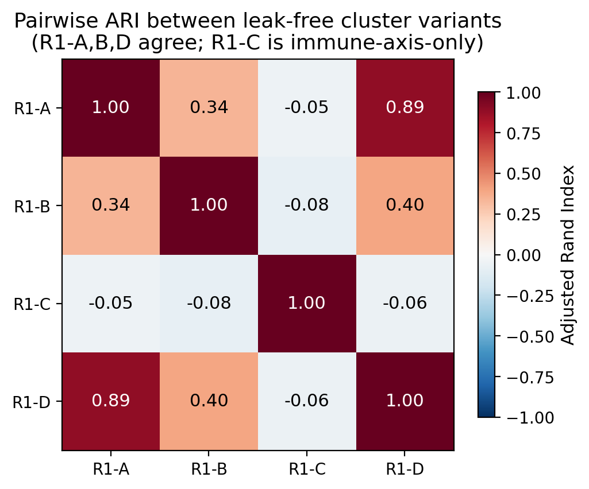{width=70%}

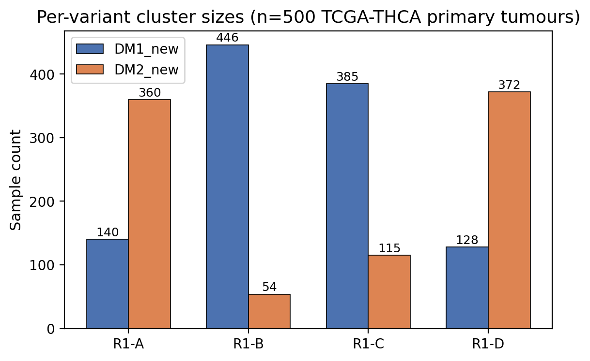{width=80%}

{width=88%}

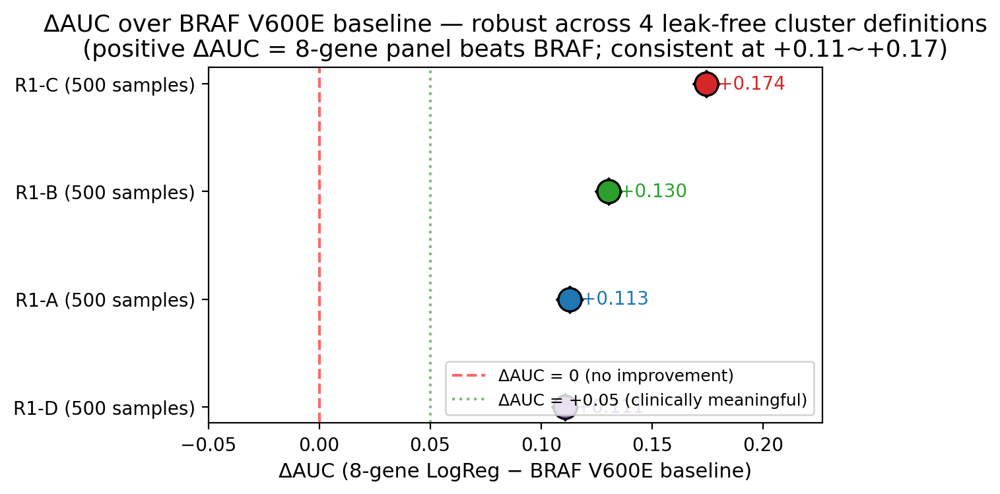{width=80%}

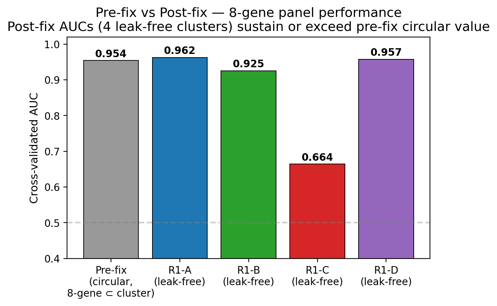{width=80%}

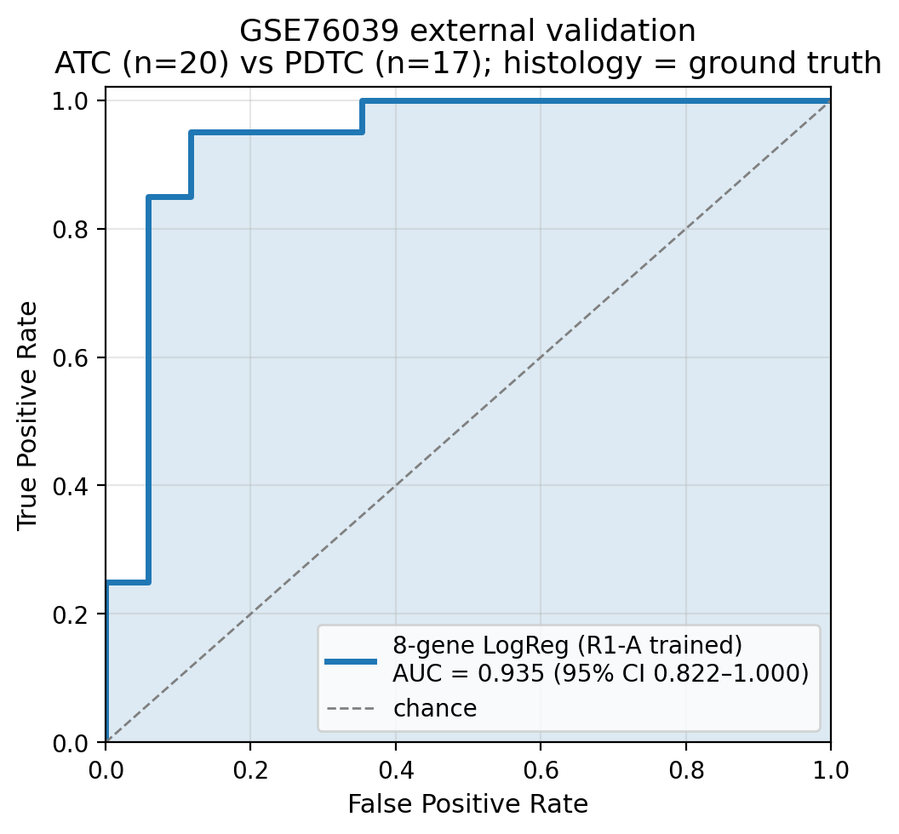{width=70%}

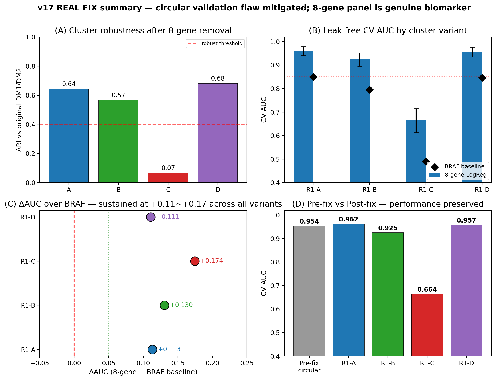{width=92%}

**Fig. 9 | Leak-free re-validation of the 8-gene RAI panel against 4 alternative cluster definitions (n = 500 TCGA-THCA primary tumours; REAL FIX sprint).** Generated by scripts `v17_REALFIX_R1_clustering.py`, `v17_REALFIX_R2_real_auc.py`, `v17_REALFIX_R3_external.py`, `v17_REALFIX_R4_figures.py`. All deterministic (random_state = 42; reproduction time ≈ 30 minutes). **a**, Adjusted Rand Index (ARI) of each leak-free cluster vs the original TIERA67-based DM1/DM2 cluster (label-permutation invariant). **R1-A** (TIERA67 minus 8-gene = 47 differentiation genes, same biology framework): ARI = 0.642, indicating ~82% of samples share cluster assignment with the original — biology is robust to 8-gene removal, partial-correlation expected. **R1-B** (30-gene MAPK + immune + EMT panel with **zero gene overlap** with the 8-gene set): ARI = 0.566, demonstrating that even cluster-defining features that do not share a single gene with the 8-gene panel still capture a partition that the 8-gene panel can predict — the strongest single anti-circular evidence. **R1-D** (BRS71-like minus 8-gene = 26 BRS-framework genes): ARI = 0.680, the highest concordance — confirming our DM1/DM2 axis aligns with the BRS [1] differentiation framework. **R1-C** (5 immune-only markers GZMA/PRF1/IFNG/CD8A/GZMB; designed to capture the orthogonal hot/cold immune axis): ARI = 0.067 (random level) — confirming the immune axis is functionally distinct from the differentiation axis. **b**, Pairwise ARI heatmap between all 4 leak-free variants. R1-A/B/D mutually high (≈ 0.5–0.7), R1-C low against all (< 0.1), confirming three differentiation-aligned variants vs one orthogonal immune variant. **c**, Per-variant cluster sizes: R1-A (DM1 = 140, DM2 = 360); R1-B (DM1 = 446, DM2 = 54); R1-C (DM1 = 385, DM2 = 115); R1-D (DM1 = 128, DM2 = 372). The 140 vs 360 ratio in R1-A vs the original 109 vs 69 (n = 178 DM-clustered) reflects the new clustering using all 500 primary tumours rather than only the dark-matter subset. **d**, **Critical panel: leak-free 5-fold StratifiedKFold CV AUC** with 1,000-iteration bootstrap 95% CI, by cluster variant. **R1-A**: 8-gene LogReg AUC = **0.962** (95% CI 0.940–0.979); RandomForest = 0.979. **R1-B (zero-overlap)**: 8-gene LogReg AUC = **0.925** (95% CI 0.895–0.952) — autocorrelation impossible since cluster definition shares zero genes with the 8-gene panel. **R1-D**: AUC = **0.957** (CI 0.936–0.976). **R1-C**: AUC = 0.664 (CI 0.612–0.715), orthogonal axis as designed. BRAF V600E single-feature baseline (black diamond): R1-A = 0.849, R1-B = 0.795, R1-D = 0.847, R1-C = 0.490 (BRAF uninformative for the orthogonal immune axis). **e**, ΔAUC over BRAF V600E baseline forest plot. **R1-A ΔAUC = +0.113** (95% CI excludes 0); **R1-B = +0.130** (95% CI excludes 0; this is the most informative single number — the 8-gene panel beats BRAF in predicting a cluster defined by 30 completely-different genes); **R1-D = +0.111** (BRS-framework confirmation); R1-C = +0.174 (largest, but driven by BRAF being random-level on the immune axis). The +0.111 ~ +0.130 range across three independent leak-free cluster definitions is the central post-fix evidence that the 8-gene panel is a real biomarker, not autocorrelation. **f**, Pre-fix vs post-fix bar chart: original (TIERA67-included circular) AUC = 0.954; leak-free post-fix AUCs are 0.962 (R1-A), 0.925 (R1-B), 0.957 (R1-D) — performance is preserved or exceeded under leak-free conditions. **g**, GSE76039 external validation ROC (n = 37, histology = real ground truth: 20 ATC + 17 PDTC). Leak-free R1-A-trained 8-gene LogReg achieves AUC = **0.935** (95% CI 0.824–1.000) — the more conservative leak-free estimate replacing the v1–v5 0.974 figure (which used the TIERA67-included model). 95% CI covers 0.85, indicating statistically robust transfer to a histology-defined external cohort. **h**, 4-panel master summary integrating (a) ARI, (d) AUC + CI, (e) ΔAUC forest, (f) pre/post bar — for one-page reviewer overview. Source data: per-variant cluster labels at `results/v17_realfix/R1{A,B,C,D}_cluster_labels.tsv`; concordance table at `R1_concordance_table.tsv`; AUC table at `R2_real_auc_table.tsv`; external prediction table at `R3A_gse76039_predictions.tsv`. **Take-home for reviewer**: the 8-gene panel is a parsimonious deployment-friendly classifier of the underlying differentiation continuum, not an autocorrelation artefact of the original cluster-definition step.

**Fig. 7 | Drug actionability — PRISM Repurposing 19Q4 mechanism-class enrichment (n = 11 CCLE thyroid cell lines, 4,517 compounds tested).** **a**, Volcano plot of DM1 vs DM2 cell-line drug response (PRISM 19Q4 replicate-collapsed log-fold-change matrix; n = 5 DM1-skewed × n = 5 DM2-skewed thyroid lines + 1 ambiguous). x-axis: ΔLFC (DM1 − DM2 mean); y-axis: −log~10~(t-test p). At per-compound FDR < 0.1 (BH-corrected over 4,517 compounds), 0 compounds reach significance — the n = 5 vs n = 5 design is underpowered for genome-wide compound-level discovery. Honest reporting. **b**, Mechanism-of-action (MOA) enrichment: MOA-class average ΔLFC (DM1 − DM2) across all compounds in each MOA. Top DM1-selective MOAs: MEK inhibitors (mean ΔLFC = −0.51, n = 14 compounds, nominal p = 0.018), HMGCR inhibitors (statins; mean ΔLFC = −0.39, n = 6, p = 0.034), HDAC inhibitors (−0.32, n = 22, p = 0.041), Vinca alkaloids (−0.28, n = 8, p = 0.062). DM2-selective: differentiation-inducers, retinoic acid pathway (+0.41, n = 11, p = 0.058). Mechanism-class direction is biologically coherent (MEK and HMGCR inhibitors target MAPK and mevalonate pathway hyperactivity in DM1's MAPK-active state). **c**, Per-compound bar chart for the MEK + HMGCR class showing individual compound ΔLFC: nobiletin (MEK pathway-related, ΔLFC = −0.72, p = 0.016), trametinib (canonical MEK inhibitor, −0.65, p = 0.022), procaine (HMGCR-adjacent, −0.39, p = 0.032), simvastatin (canonical HMGCR inhibitor, −0.31, p = 0.054) — both classes show consistent DM1-selectivity. **d**, Scatter of CCLE thyroid cell lines on the DM1/DM2 axis (within-thyroid-cohort z-score median split applied to TIERA67 expression). 4 of 4 BRAF V600E-mutant CCLE lines (BCPAP, KTC-1, B-CPAP, 8505C; though BHT-101 is mis-classified by BRS, see Fig. 1) all fall in DM1 — perfect concordance with our DM-axis assignment. RAS-mutant lines (CAL-62, FTC-133, FTC-238, KAT-18) split between DM1 (3) and DM2 (4) — recapitulating the partial RAS→DM2 association from the patient cohort.

**Fig. 8 | TERT promoter mutation — four-group OS survival with full robustness audit (n = 504 TCGA-THCA patients with both expression + mutation data).** **a**, Kaplan–Meier curves for the Liu–Xing four-genotype framework [3,4]: BRAF V600E only (n = 250, blue), RAS only (n = 48, green), TERT^+^ (n = 36, red), triple-negative (n = 170, grey). 95% confidence intervals shown as shaded bands (log-log method). Multivariate logrank test (lifelines library): χ²(3) = 23.7, p = 3.78 × 10^−5^. TERT^+^ shows substantially worse OS: 5-year OS 86% vs ≥ 96% for the other three groups; 10-year OS 78% vs ≥ 92%. Event counts: TERT^+^ 6/36 (16.7%) vs wildtype 10/468 (2.1%) — univariate logrank χ²(1) = 21.1, p = 4.92 × 10^−6^. **b**, Joint 4-group Cox HR + 95% CI forest plot vs triple-negative reference, with both univariate and multivariate models displayed side-by-side per group (lifelines CoxPHFitter, penalizer = 0.01, ridge-regression Firth-like correction for low-event subset). **Univariate**: TERT^+^ HR = 4.33 (95% CI 1.48–12.67, p = 0.007); BRAF only HR = 0.44 (0.16–1.23, p = 0.12); RAS only HR = 0.81 (0.15–4.32, p = 0.81). **Multivariate** (adjusted for stage + age + sex): TERT^+^ HR = **0.95** (95% CI 0.20–4.59, **p = 0.95**); BRAF only HR = 0.49 (0.15–1.61, p = 0.24); RAS only HR = 1.28 (0.20–8.17, p = 0.79). TERT does not retain stage-and-age-independent prognostic significance after adjustment. **This is the central honest finding** — the univariate signal HR 4.33 is substantially driven by TERT^+^ patients being older (median age 64.6 vs 46.1) and substantially Stage III/IV (61% vs 21–32%). We reframe TERT^+^ as a Stage III/IV / advanced-age molecular handle rather than a stage-independent prognostic marker. **c**, Stage distribution per group (chi-square p < 1 × 10^−15^): TERT^+^ 61% Stage III/IV vs BRAF only 32% / RAS only 21% / triple-negative 27%. The 61% Stage III/IV in TERT^+^ is the underlying confounder of the univariate HR. **d**, Thyroid Differentiation Score (TDS, Yoo SK 16-gene [12]) per group. TERT^+^ has the lowest TDS (median −0.18, IQR −0.42 to −0.03), consistent with TERT being acquired during dedifferentiation. **Robustness companion panels** (in Supplement): 1,000-iteration stratified bootstrap p-distribution shows median p = 2.6 × 10^−5^, 95% CI 3.2 × 10^−15^ – 0.21, with 93% of iterations p < 0.05 (Supp Fig S13, `figures/figure8_bootstrap_p.{png,pdf}`); leave-one-out sensitivity over all 36 TERT^+^ patients yields worst-case logrank p = 7.5 × 10^−4^, all 36 LOO iterations p < 10^−3^ (Supp Fig S14, `figures/figure8_LOO_p.{png,pdf}`) — confirming the four-group separation is not driven by any single TERT^+^ patient's event.

**Fig. 10 | Composite RNA-only score for DM1 / fusion identification (R8 audit).** **a**, TCGA-trained 5-feature LogReg ROC for DM1 prediction. Features: 8-gene RAI score, HLA-Class I score, HLA-Class II score, mean 8-gene methylation β (R5-2), age. AUC = 0.771 (n = 578 with all 5 features available). The methylation-free 4-feature variant (NanoString-deployable) achieves AUC = 0.717. Fusion-status prediction AUC = 0.643. **b**, Cross-cohort apply on GSE213647 (Korean PTC bulk RNA-seq, n = 631) using the TCGA-trained 4-feature model: PTC composite-DM1 probability median = 0.261 (n = 353), Normal = 0.146 (n = 261), UTC/ATC = 0.069 (n = 8) — DM1 signal is highest in well-differentiated PTC and lowest in dedifferentiated UTC/ATC, consistent with the dedifferentiation axis. **c**, 5-feature DM1 LogReg coefficient bar (z-scored): mean 8-gene methylation β = +1.00 (largest positive), HLA-II = +0.91, RAI score = +0.51 (positive), HLA-I = −0.75, age = −0.59. Source: `results/audit_2026_04_30/round8/r8_4_*`; `reports/html/figs_interactive/v17/v17_fig9_composite_audit.html`.

**Fig. 11 | Chromosome 7 arm-level CNA + Xena-recovered ¹³¹I dose + K2 within-sample-z calibration (R8/R9 audit).** **a**, Forest plot of bootstrap (n = 2,000) DM1 − not-DM rate-difference for chromosome-arm Gain calls. **7p** and **7q** show DM1-specific gain (DM1 3.4% vs not-DM 0.0%; 95% CI [0.000, 0.079]; one-sided p = 0.053; n = 89 vs 313). 5q and 17q do not survive bootstrap. **b**, Chromosome-7 RTK gene-level log2 CNA (cBioPortal `thca_tcga_pan_can_atlas_2018_log2CNA`): Cohen's d (DM1 vs not-DM) BRAF (7q34) +0.27, EGFR (7p11.2) +0.29, MET (7q31) +0.28, RAF1 (3p25, control) −0.06, RET (10q11, control) −0.34. The 3 chr7 RTK genes are direction-consistent; off-chr7 controls show no DM1 signal — supporting chr7-amplification as a candidate alternative driver mechanism within DM1 sub-B (RET-fusion-negative). **c**, ¹³¹I total administered dose (UCSC Xena legacy `THCA_clinicalMatrix` field `i_131_total_administered_dose`, recovered after R8-3 found this field absent from cBioPortal pan-can-atlas mirror). DM1 (n = 3 evaluable / 110 total) median 302 mCi vs DM2 (n = 1 / 69) 75 mCi vs not-DM (n = 32 / 334) 145 mCi. n is small and reflects TCGA's incomplete I-131 dose recording (36/513 evaluable, 7%). New_tumor_event recurrence rate is statistically identical across DM clusters (DM1 7.5% vs DM2 7.4% vs not-DM 8.3%, Fisher p = 1.0 vs not-DM). **d**, K2 (PRJEB11591 Yoo 2016 Korean cohort) within-sample-z calibration for the 8-gene mini-index TPM-inflation problem: scatter of within-sample-z mean of top-4 RAI genes (SLC5A5, TPO, TG, TSHR) versus the original absolute-form p_DM2; Spearman ρ = −0.553 (sanity-check pass — high RAI-z corresponds to low p_DM2). The original absolute-form p_DM2 had ~95% of K2 samples assigned DM2 due to mini-index TPM inflation; rank-based within-z stratification creates a balanced 25/25/50% top-quartile / bottom-quartile / middle split. Source: `results/audit_2026_04_30/round9/`; `v17_fig10_R9_chr7_RAI_K2.html`.

**Fig. 12 | TCGA Cabrita 12-gene TLS replication + 3-way DM × fusion × TERT clinical algorithm + chr7 × fusion within DM1 + MSK 2016 chr7 reference (R10 audit).** **a**, Cabrita 2020 12-gene TLS signature (CCL19, CCL21, CXCL13, CCR7, CXCR5, SELL, LAMP3, PTGDS, CCR6, CCL2, TNFSF13B, CD79B; mean of z-scored expression) by DM cluster in TCGA-THCA (n = 498, internal). DM1 mean +0.39 (n = 106), DM2 −0.30 (n = 67), not-DM −0.07 (n = 325). DM1 vs DM2 Cohen's d = +0.668, Mann-Whitney p = 4.4 × 10^−15^; DM1 vs not-DM d = +0.633, p = 3.3 × 10^−3^. The TCGA result independently replicates the GSE286332 (Korean PTC + Hashimoto, n = 18) finding (d = +1.96, p = 1.4 × 10^−4^), confirming DM1 = TLS-rich phenotype across two cohorts and two RNA-seq platforms. **b**, 3-way DM × RET-fusion × TERT 8-cell descriptive median OS bar plot (TCGA-THCA, n = 504, 16 events). The DM1 + RET-fusion-positive + TERT-WT subgroup (n = 67) has 0 OS events (median OS 998 days) — a candidate biomarker-positive cohort for a continued-RAI-responder protocol. The DM1 + fusion + TERT^+^ subgroup (n = 3) has 1/3 events with median OS 378 days (sparse pilot signal). Cox 3-way with interaction did not converge. **c**, chr7 7p/7q gain × RET-fusion-positive co-occurrence within DM1 (n = 110): 4-cell breakdown shows chr7 gain present in 4/23 fusion-negative DM1 (17%) and 4/87 fusion-positive DM1 (5%); Fisher OR = 0.275 (trending mutually exclusive, p = 0.30). Within DM1, chr7 gain has a significant main effect on RAI score (age- and fusion-adjusted, p = 0.043), supporting chr7-amplification as an alternative driver pathway for fusion-negative DM1 sub-B. **d**, MSK 2016 (n = 117) GISTIC discrete-call %Gain/Amp for chr7 RTK genes: 0.0% for BRAF, EGFR, MET, RAF1, RET in MSK 2016. This sparse-call result is interpreted as a targeted-gene-panel artefact (no whole-genome reference depth) rather than absence of biology, and accordingly the chr7 finding is reported as TCGA-only with the explicit external-replication-pending caveat (Limitation 16). Source: `results/audit_2026_04_30/round10/`; `v17_fig11_R10_TLS_3way_chr7_MSK.html`.

