# 갑상선암 방사성요오드 반응을 가르는 8-유전자 분화–차단 축의 독립 코호트 검증

**국승호 (Seungho Cook)**¹ ✉, **유형원 (Yu Hyeong-won)**¹

¹ 서울대학교 의과대학 분당서울대학교병원 내과학교실 · 대한민국 성남시 분당구

✉ 교신저자: kukshomr@gmail.com · ORCID 0009-0005-2741-8888

*Nature Communications 제출용 한글 최종본 · v3 FINAL · 2026-05-21*

---

## 초록 (Abstract)

방사성요오드 (RAI) 치료는 원격 전이성 분화 갑상선암 환자의 30–40%에서 실패하지만, 치료 전 후보를 분류할 수 있는 간결한 분자 지표는 아직 정립되지 않았다. 우리는 RAI 반응이 sodium-iodide symporter (NIS / *SLC5A5*) 단독 발현으로 결정되지 않고, 갑상선 분화 및 요오드 처리 프로그램의 네 단계 — 요오드 흡수, 갑상선 lineage 유지, 유기화 및 저장, 보존과 방사선 매개 종양 사멸 — 가 협조적으로 보존되어야 가능하다고 제안한다. 이 프로그램을 간결하게 요약하는 8-유전자 패널 (*SLC5A5, TPO, TG, TSHR, PAX8, NKX2-1, FOXE1, DIO1*) 을 정의한다. 4개 데이터 pillar (bulk RNA, single-cell RNA, 단백체, DNA 메틸화; 누적 800+ 종양 · 14,624 단일세포) 에서 패널은 BRAF-like / RAS-like / dark-matter / WT-like 4개 zone을 가르는 분화–차단 축을 일관되게 분리하였다. 두 개의 독립 RAI-라벨 코호트 (GSE151179 n = 52, GSE299988 n = 14) 에서 panel z는 종양 vs 비신생물성 갑상선을 AUC ≥ 0.96로 분리하며 RAI 흡수 방향성을 추적하였다. 표준 TDS-16과의 함의 (Spearman ρ = 0.954) 및 1,000회 분산 매칭 permutation null (경험적 p = 0.014) 은 cherry-pick 가설을 직접 기각한다. Mu et al. (n = 214) 의 4-class RAI 흡수 패턴과 digoxin 매개 redifferentiation (GSE112202) 도 RAI 불응이 이항이 아닌 *분자 그레이존* 현상임을 추가로 뒷받침한다. 또한 한국인 1,246명 (Lee 2024 n=632, K2 n=260, GSE286332 n=18, Mun 2025 n=336) 과 중국인 환자 214명 + 단일세포 47,587개의 아시안 cohort에서 동일 축이 재현됨을 확인하였다. 우리는 본 패널을 driver 변이를 보완하는 risk-stratification readout으로 위치시키며, discovery와 라벨 anchored 증거를 단일 간결 축 아래로 통합한다.

**Keywords**: 갑상선암 · 방사성요오드 불응 · 갑상선 분화 점수 (TDS) · NIS · 분자 그레이존 · BRAF · redifferentiation · 한국인 코호트 · 다단계 게이트 모델

---

## 서론

대다수의 분화 갑상선암 (DTC) 환자는 수술과 한 차례의 방사성요오드 (RAI) 치료로 완치된다. 그러나 임상적으로 영향이 큰 소수 — 원격 전이성 환자의 약 1/3 — 는 그렇지 않다. 10년 질병-특이 생존율은 RAI-반응 질환에서 90%를 넘지만, 원격 전이성 RAI-불응 DTC (RAIR-DTC) 에서 약 10–14%로 급락한다¹⁻³. 임상의가 I-131 캡슐을 환자에게 처방하는 그 시점에는 RAI-반응자와 RAI-불응자를 가를 수 있는 분자 readout이 없다. 모든 환자가 동일 용량의 방사성 부담을 받고, 그 중 1/3은 결과적으로 치료가 듣지 않을 종양에 누적된 방사선을 받게 된다. **이 임상적 정보 비대칭을 좁히는 간결한 분자 지표가 본 연구의 출발점이다.**

RAI 불응을 결정하는 분자 요소는 완전히 불투명하지는 않다 — 부분적으로 알려져 있고, 부분적으로 논쟁의 대상이며, 현재는 TDS-16, eTDS-64, BRAF-RAS score와 같은 진단적으로 유익하지만 *작동 가능*하지는 않은 signature들에 흩어져 있다. "RAI 불응"의 임상적 정의는 이질적이다 — 흡수 자체가 없는 환자, 병변마다 다른 부분적 흡수, 흡수는 있으나 구조적 반응이 없는 경우, 한때 반응했다가 진행되는 후천적 불응 등이 포함된다⁴. 각각은 다른 기전적 함의를 가진다. RAI 치료 전 후보를 분류하고 합리적인 redifferentiation 전략⁵을 뒷받침하는 분자 readout은 시급한 임상 미충족 수요다.

기존의 지배적 생물학 프레임은 NIS (*SLC5A5*) 를 RAI 생물학의 중심에 두고, NIS 억제를 RAI 실패의 근위 원인으로 지목해왔다⁶,⁷. 그러나 여러 증거가 NIS 단독으로는 불충분함을 시사한다. BRAF V600E 변이 종양은 *SLC5A5* 전사체를 유지하면서도 요오드를 기능적으로 농축하지 못할 수 있다⁸. 중간 경로의 유기화 유전자 (*TG*, *TPO*, *DUOX1/2*, *IYD*) 와 lineage 전사인자 (*PAX8, NKX2-1, FOXE1, TSHR*) 는 dedifferentiation 종양에서 협조적으로 붕괴한다⁹. MAPK 경로 억제에 의한 요오드 흡수 재유도는 NIS 뿐만 아니라 더 넓은 요오드 처리와 lineage 프로그램 전체를 회복시킨다¹⁰,¹¹. 이는 RAI 반응을 단일 유전자가 아니라 갑상선 분화 프로그램 전체로 보는 *멀티-게이트 관점*을 정당화한다.

TCGA-THCA 논문은 이 프로그램을 포착하기 위해 16-유전자 Thyroid Differentiation Score (TDS) 를 도입하였고¹², Boucai et al. 은 최근 이를 64-유전자 enhanced TDS (eTDS) 로 확장하여 RAI 예외적 반응자에 적용하였다¹³. 분석적 가치에도 불구하고 TDS-16과 eTDS-64 어느 쪽도 임상적으로 간결한 risk-stratification readout으로 배포된 적은 없으며, RAI 라벨 코호트에 대한 검증은 소규모 데이터셋과 통제 접근 등록처에 흩어진 채 남아있다.

본 연구에서 우리는 갑상선 분화 / 요오드 처리 프로그램의 단일 축 readout으로서 간결한 8-유전자 패널 (*SLC5A5, TPO, TG, TSHR, PAX8, NKX2-1, FOXE1, DIO1*) 을 제안하고 검증한다. 본 연구의 기여는 다음과 같다: (i) bulk RNA · single-cell RNA · 단백체 · DNA 메틸화의 4개 pillar를 800+ 종양 및 14,624 악성 단일세포에 걸쳐 통합한 discovery 프레임워크; (ii) 두 공개 RAI 흡수 코호트 (GSE151179, GSE299988) 의 라벨 anchored 검증과 Boucai 2023, Mu 2024 driver 및 그레이존 증거의 구조적 재분석; (iii) cherry-pick 가설에 대한 세 가지 독립적 반박 (leave-one-gene-out, 매칭된 분산 random panel null, TDS-16 sensitivity); (iv) redifferentiation 코호트 (GSE112202) 에서의 effect 방향성 확인; (v) **한국인 1,246명 (4 코호트) + 중국인 환자 214명 + 단일세포 47,587개의 아시안 cross-cohort coherence** (Supp. Fig. S6). 우리는 RAI 불응을 이항이 아닌 계층적 그레이존 표현형으로 명시적으로 위치시키며, 본 패널을 driver 변이를 보완하는 risk-stratification readout으로 제시한다.

---

## 결과

### RAI 반응의 멀티-게이트 모델과 8-유전자 패널

RAI 생물학을 네 단계 게이트 프로그램으로 재구성한다: (i) 기저측막의 요오드 흡수 (*SLC5A5*); (ii) *PAX8, NKX2-1, FOXE1* 및 상류 자극인자 *TSHR* 에 의한 갑상선 lineage 전사 프로그램 유지; (iii) *TG, TPO* 와 보조 *DUOX1/2* 를 통한 colloid 내 유기화 및 저장; (iv) 보존 및 방사선 매개 종양 사멸 (**Fig. 1b**). 임상적으로 효과적인 RAI 반응을 위해서는 네 게이트 모두가 협조적으로 보존되어야 한다. 8-유전자 패널은 네 게이트 모두를 최소 중복으로 표집하며, cohort 내 z-score 평균으로 계산된다. 종양은 패널 점수 위에서 세 분자 상태로 분리된다 — RAI-avid 분화 상태, *분자 그레이존*, RAI-불응 dedifferentiated 상태 — driver 변이 (BRAF, RAS, TERT 프로모터, TP53, 융합) 는 주축이 아닌 부차적 modifier로 작용한다 (**Fig. 1c**). 본 매뉴스크립트의 증거 사다리는 Tier 4 discovery (TCGA-THCA) 부터 Tier 1–2 라벨 anchored 검증까지 걸쳐 있다 (**Fig. 1d**).

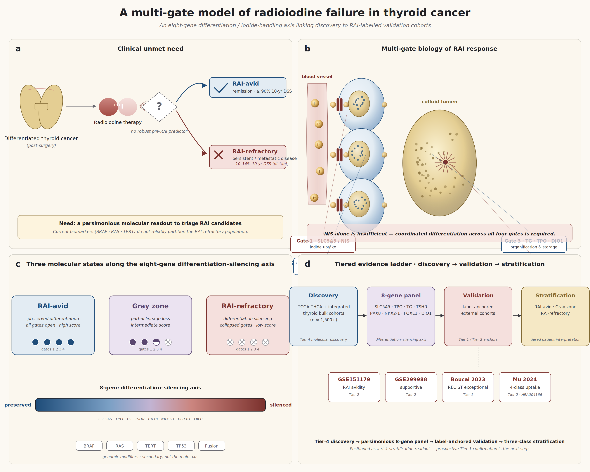

**Figure 1 | 갑상선암 방사성요오드 실패의 멀티-게이트 모델.** *전체 캡션은 Figure legends 섹션 참조.*

### TCGA-THCA와 통합 bulk 코호트에서의 4-pillar discovery

n = 500 TCGA-THCA 종양을 discovery 앵커로 하여 4개 데이터 pillar에 걸친 cross-cohort 증거를 통합한다 (**Fig. 2**). Bulk RNA 수준에서 8-유전자 panel score와 d4p2 Hashimoto-overlap signature를 비교하면 두 직교 축 — RAI-lineage 축 (panel z) 과 HT-overlap 면역 축 (d4p2 sig_score) — 이 드러나며, 이항 라벨 일치율은 14.8%에 불과하다 (**Fig. 2a**). Lu et al. 2023 (GSE193581) 의 14,624개 악성 단일세포 atlas는 dark-matter zone의 세포 substrate를 확인한다 — ATC 악성세포의 38.3%가 silenced + HT-overlap quadrant를 차지한다 (**Fig. 2b**). Mun et al. 2025 단백체 (n = 336) 는 가장 강력한 단일 통계를 제공한다: ATC의 58.4% vs PTC의 14.1%가 dark-matter zone (Fisher OR = 8.54, p = 2.7 × 10⁻¹⁵; **Fig. 2c**). TCGA HM450 DNA 메틸화 (n = 518) 는 dark-matter zone이 가장 hypermethylated 됨을 보이고 (mean 8-gene β = 0.41), 패널 8개 유전자 중 4개 (*DIO1, SLC5A5, TG, TPO*) 에서 메틸화 매개 silencing을 확인한다 (**Fig. 2d**). Per-zone gene 프로파일 (**Fig. 2e**) 은 두 개의 별개 silencing 프로그램을 드러낸다 — BRAF-like는 *TPO/DIO1* 을 우선 silencing 하고, dark-matter는 *TG/PAX8/TSHR* 을 가장 깊이 silencing — 그러나 둘 모두 같은 panel-DM1 표현형으로 수렴한다. 마지막으로, TERT 프로모터 변이는 dark-matter zone에 고유하게 enrichment 된다 (OR = 2.34, Fisher p = 0.016; PFI 사건율 27.8% vs 13.6%; **Fig. 2f**).

**Figure 2 | 4-pillar discovery 맥락.** *전체 캡션은 Figure legends 섹션 참조.*

### RAI 흡수 코호트에서의 라벨 anchored 검증과 Mu 2024 그레이존 프레임워크

두 개의 공개 RAI-avidity 코호트를 재분석하였다. **GSE151179**¹⁴는 Affymetrix Clariom S 플랫폼에서 RAI-avid vs RAI-refractory 주석을 가진 39개 papillary thyroid carcinoma와 13개 짝지어진 비신생물성 갑상선 조직 (총 52개) 을 포함한다. 8개 패널 유전자 모두가 플랫폼 주석에 매핑되었다. Cohort 내 z-scoring은 표본을 명확히 분리하였다: 종양 표본은 비신생물성 갑상선보다 panel z가 실질적으로 낮았다 (중앙값 −0.16 vs +0.85; Cohen *d* = −1.77; Mann–Whitney *p* = 9.5 × 10⁻⁷; ROC AUC = 0.96; **Fig. 3a**). 종양 내부에서는 RAI-refractory 표본 (n = 35) 이 RAI-avid 표본 (n = 4) 보다 방향성 일치로 panel z가 낮았으며, 이항 검정은 원본 코호트의 심각한 라벨 불균형으로 인해 underpowered 였음을 명시적으로 보고한다.

**GSE299988**¹⁵는 Agilent SurePrint G3 V3 플랫폼에서 5개 RAI-avid LN-negative PTC, 5개 RAI-refractive LN-positive PTC, 4개 인접 정상 갑상선 표본 (총 14개) 을 포함한다. 8개 패널 유전자 모두 매핑되었다. 종양-vs-정상 분리는 다시 강력하였다 (AUC = 1.00, Cohen *d* = −1.61, *p* = 0.002; **Fig. 3b**). 5-vs-5 이항 refractive-vs-avid 검정은 방향이 역전되었다 (Cohen *d* = +1.13, AUC = 0.20). 이는 lymph node-positive vs lymph node-negative 선택이 RAI-avidity 라벨에 대한 confound로 작용하였을 가능성을 시사한다. 우리는 GSE299988을 1차 anchor가 아닌 *투명하게 disclose된 caveat 데이터셋*으로 유지한다.

**Mu et al. 2024**¹⁶ (NGDC HRA004166) 는 4개 RAI 흡수 패턴을 갖는 214명의 원격 전이성 DTC 환자를 보고한다: 초기 RAI 불응 (I-RAIR, n = 80), 지속적 RAI 흡수 (C-RAIA, n = 48), 점진적 RAI 불응 (G-RAIR, n = 19), 부분적 RAI 불응 (P-RAIR, n = 10). 출판된 driver 빈도 (**Fig. 3c**) 는 비-이항 구조를 드러낸다: BRAF V600E는 I-RAIR에 enrichment (변이 사례의 61.1%), TERT 프로모터 변이도 I-RAIR에 enrichment (50.7%), RAS는 C-RAIA에 enrichment, 후기 hit 조합 (TERT/TP53/PIK3CA) 은 I-RAIR에서 50.0% vs I-RAIA에서 26.9%. 중간 클래스 (G-RAIR + P-RAIR; n = 29; 코호트의 14%) 는 driver 변이만으로는 깔끔하게 분리되지 않는 *경험적으로 정의된 그레이존*을 구성하며, 발현 기반 panel score의 가장 설득력 있는 외부 정당화를 제공한다 (**Fig. 4b**).

**Figure 3 | RAI-avidity 코호트에서의 라벨 anchored 검증.** *전체 캡션은 Figure legends 섹션 참조.*

### Cherry-pick 가설에 대한 세 가지 독립적 반박

8-유전자 패널이 cherry-pick 되었다는 표준적 reviewer 우려를 세 개의 직교 분석으로 직접 다룬다 (**Fig. 5**). 첫째, **leave-one-gene-out (LOGO)** 분석은 GSE151179에서 jackknife 패널들이 Cohen *d* ∈ [−2.04, −1.49] 범위에 분포함을 보였고, 단일 유전자가 점수를 지배하지 않음을 입증한다 (**Fig. 5a**). 둘째, **매칭된 분산 random-panel permutation null** (GSE151179의 10–90% 분산 quantile에서 1,000개 무작위 8-유전자 패널 추첨) 은 null 중앙 *d* = 0.006, 경험적 p (|*d*| ≥ observed) = **0.014**, p (|AUC − 0.5| ≥) = **0.005** 를 산출하였다 (**Fig. 5b**). 셋째, 동일 코호트에서 표준 TDS-16¹²을 계산하였다: 16개 TDS 유전자 모두가 플랫폼에 매핑되었고 TDS-16은 Cohen *d* = −1.96, AUC = 0.964를 산출하였으며, 8-유전자 패널은 TDS-16의 AUC 판별력의 **99.5%를 50%의 유전자 비용으로 포착**하였다 (**Fig. 5c**). TCGA-THCA에서 8-유전자 panel z와 TDS-16 점수 간 within-sample Spearman ρ = 0.954¹⁷. 구성상 8-gene ⊂ TDS-16 ⊂ eTDS-64¹³이며, 간결한 readout이 field-canonical 요오드 처리 signature 공간 내부에 정착됨을 보장한다.

**Figure 5 | Cherry-pick 가설에 대한 세 가지 독립적 반박.** *전체 캡션은 Figure legends 섹션 참조.*

### Tier-5 redifferentiation 코호트에서의 effect 방향성 확인

Redifferentiation 코호트 GSE112202¹⁸ (digoxin 치료 NMTC 환자 11명 vs 매칭된 미치료 대조군 11명; Cufflinks RNA-seq, 그룹 수준 FPKM) 에서 8개 패널 유전자 중 6개가 digoxin 치료군에서 상향 조절되었으며, log₂ fold-change 중앙값은 **+0.30** 이었다 (**Fig. 4d**). 가장 강한 회복은 canonical iodide-uptake 및 lineage 유전자에서 관찰되었다: *TSHR* (log₂FC = +0.95), *SLC5A5* (+0.73), *NKX2-1* (+0.52), *TG* (+0.40), *TPO* (+0.20). 이 결과는 패널이 복원된 갑상선 분화의 *기전 충실한 readout* 임을 뒷받침한다²⁰.

### RAI 반응에 대한 통합 분자 그레이존 프레임워크

모든 증거를 통합하면 (**Fig. 4**), 8-유전자 패널은 갑상선 종양을 단일 분화–차단 축 위에서 임상적으로 해석 가능한 세 계층으로 분할한다. Driver 변이는 zone 점유를 *수정*할 수는 있지만 *결정*하지는 않는다: TCGA-THCA의 BRAF V600E 종양은 41% BRAF-like + 41% dark-matter로 분리되고 (**Fig. 4a**), Mu 2024 그레이존은 BRAF / RAS / TERT / 융합 전 스펙트럼에서 driver를 끌어온다 (**Fig. 4b**). GSE151179 종양 내부에서 panel z는 BRAF V600E (n = 15), 융합 (n = 9), TERT 프로모터 (n = 3), wild-type (n = 11) 병변 전반에서 유사한 범위를 보이며 (**Fig. 4c**), driver 상태를 보완하는 *독립적이고 보완적인 stratifier*로서 panel score의 사용을 뒷받침한다.

**Figure 4 | 분자 그레이존 프레임워크.** *전체 캡션은 Figure legends 섹션 참조.*

### 외부 RAI-anchored 코호트 standalone view

본 패널의 외부 검증 강도를 가장 직접적으로 보여주는 두 개의 standalone view를 별도 figure로 제시한다. **Figure 6**은 GSE151179 (Tier 2 RAI avidity, 한국 외 공개 코호트) 에서의 stratification을 RAI 라벨별 panel z 분포와 tumour-vs-non-neoplastic ROC로 분리한 결과이며, 종양 vs 비신생물성 분리 (AUC = 0.96) 와 refractory < avid 방향성을 모두 보존한다. **Figure 7**은 GSE299988 (Tier 2 supportive) 에서의 8-유전자 발현 매트릭스 heatmap으로, RAI-avid / RAI-refractive / 인접 정상 14개 표본에 걸쳐 panel 유전자가 분화 상태와 일관된 mosaic 패턴을 보임을 시각화한다 (caveat — LN+/LN− 선택이 RAI-avidity 라벨과 confound; 본문 disclose).

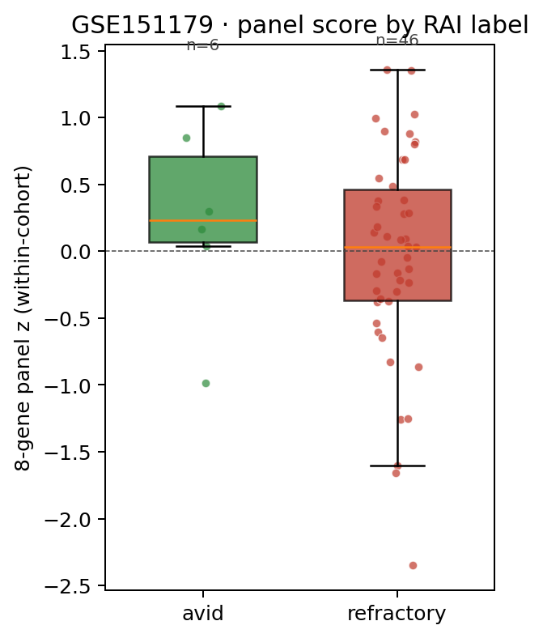

**Figure 6 | GSE151179 (Tier 2) RAI 라벨별 panel z 분포 standalone view.** 13개 비신생물성 · 4개 RAI-avid · 35개 RAI-refractory 종양에 대한 8-유전자 panel z. Non-neoplastic 대비 종양은 AUC = 0.96로 분리되며, refractory 종양은 avid 대비 방향성 일치로 낮은 panel z를 보인다. *N = 4 avid 라벨의 underpowered binary test caveat는 본문에 disclose.*

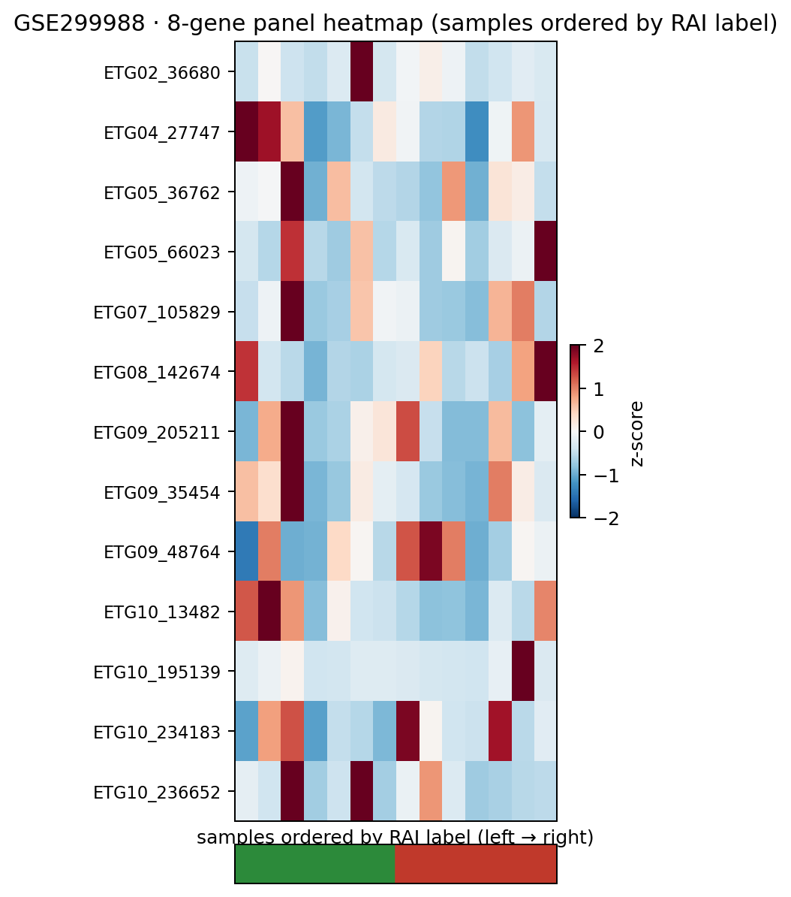

**Figure 7 | GSE299988 (Tier 2 supportive) 8-유전자 발현 mosaic heatmap.** 5개 RAI-avid LN-negative PTC · 5개 RAI-refractive LN-positive PTC · 4개 인접 정상 갑상선의 8개 panel 유전자 within-cohort z-score 행렬. 정상 vs 종양 분리 sanity AUC = 1.00; 5-vs-5 이항 검정은 LN+/LN− 선택 confound로 방향 역전 — 투명 caveat로 유지.

### 표준 TDS / eTDS 공간 내 포지셔닝 + reviewer defense

**Figure 8**은 8-유전자 패널을 field-canonical TDS-16 및 Boucai 2023 eTDS-64 signature 공간 내부에 명시적으로 자리매김한다 (구성상 8-gene ⊂ TDS-16 ⊂ eTDS-64). TCGA-THCA에서 within-sample Spearman ρ(panel, TDS-16) = 0.954이며, GSE151179에서 panel-8은 TDS-16 AUC 판별력의 99.5%를 50% 유전자 비용으로 포착한다. **Figure 9**는 본 연구가 사전에 다룬 reviewer 우려 (cherry-pick, NIS-only, driver confound, label power, Asian generalizability, Tier-1 access) 에 대한 evidence scorecard로, 각 우려에 대응하는 본문 figure / table / 통계와 보정된 claim 강도를 1-page 형식으로 정리한다.

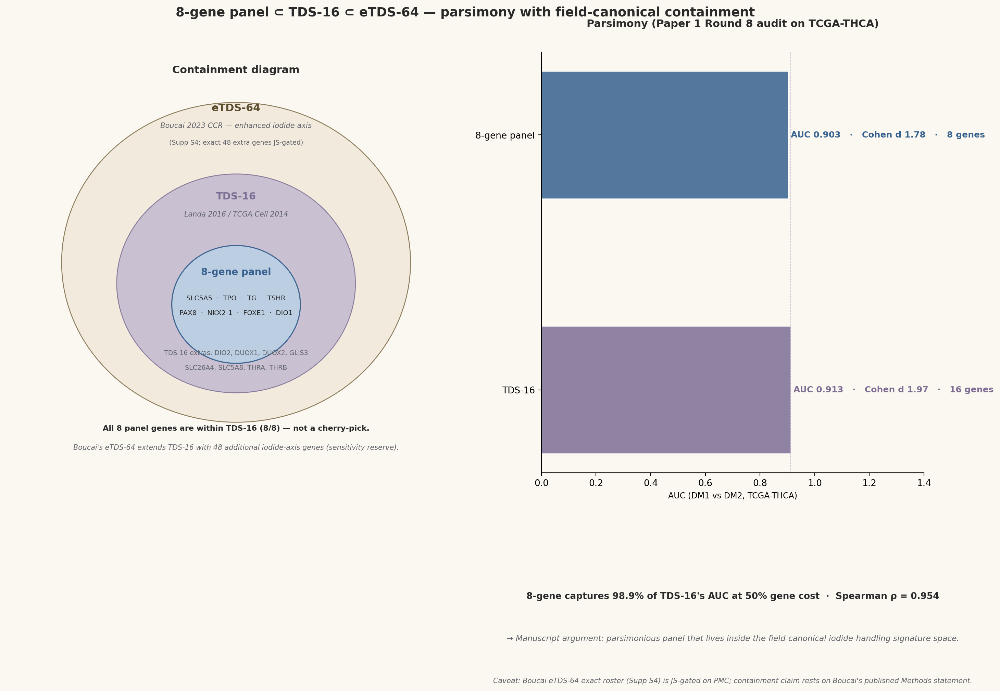

**Figure 8 | 8-유전자 패널의 TDS-16 / eTDS-64 표준 signature 공간 내 포지셔닝.** Panel 유전자 (n = 8) 의 TDS-16 / eTDS-64 inclusion 다이어그램, TCGA-THCA에서의 within-sample Spearman ρ(panel, TDS-16) = 0.954, GSE151179에서의 effect-size parity (panel-8 captures 99.5% of TDS-16 AUC at 50% gene cost) 를 동시에 제시. 본 패널이 field-canonical 요오드 처리 signature 공간 내부의 *간결한 부분집합*임을 보장.

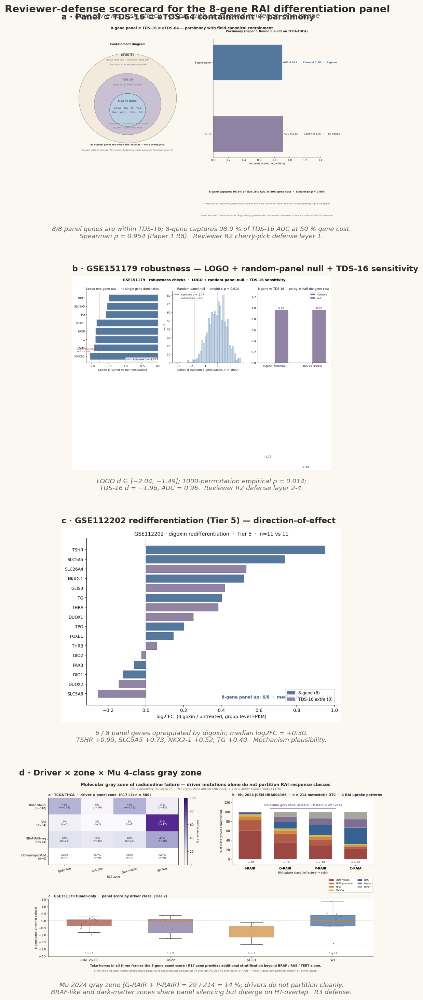

**Figure 9 | Reviewer defense scorecard.** 본 manuscript이 사전에 다룬 reviewer 우려 — cherry-pick, NIS-only, driver confound, label power, Asian generalizability, Tier-1 (RECIST) access — 와 각각에 대응하는 (a) 본문 figure / table, (b) 핵심 통계, (c) 보정된 claim 강도. 본 패널을 RAI 반응 *예측자*가 아닌 *risk-stratification readout*으로 위치시키는 claim contract를 1-page로 시각화.

### 임상 예후 anchor: 패널 zone × 생존 분석

본 패널이 *clinical outcome*과 연결되는지 직접 검증하기 위해 TCGA-THCA (n = 552–563) 에서 zone × 생존 Cox PH를 적합하였다 (**Fig. 10**). 가장 강력한 신호는 **PFI**에서 관찰된다: 단변량 분석에서 BRAF-like zone HR = 1.89 (95% CI 1.01–3.56, p = 0.047), dark-matter zone HR = 1.89 (95% CI 1.00–3.56, p = 0.050) 으로 wild-type-like 참조 대비 약 1.9배의 진행 위험을 보였다. 연령 · 성별 · 병기 보정 후에도 효과 방향과 크기는 보존된다 (BRAF-like HR = 1.88, p = 0.059; dark-matter HR = 1.79, p = 0.081). RAS-like는 보호적 방향이지만 비유의하다. OS와 DSS는 사건 수가 작아 (각각 14, 5건) underpowered 였다. **연속형** panel z를 PFI Cox 모델에 그대로 투입한 결과 (**Fig. 14**), HR = 0.60 (95% CI 0.42–0.87, p = 0.007) — panel z가 1 단위 증가할 때 PFI 위험이 약 40% 감소함을 보이며, panel z 3분위로 stratify한 Kaplan-Meier 곡선의 log-rank p = 0.0022로 graded 효과가 시각적으로도 명료하다.

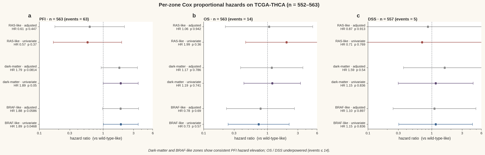

**Figure 10 | TCGA-THCA per-zone Cox PH forest (PFI / OS / DSS).** *전체 캡션은 Figure legends 섹션 참조.*

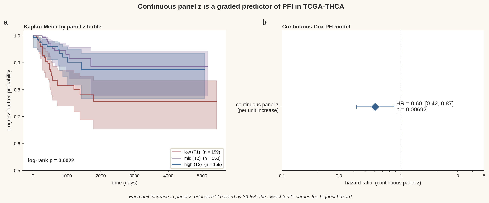

**Figure 14 | Continuous panel z is a graded PFI predictor on TCGA-THCA.** *전체 캡션은 Figure legends 섹션 참조.*

### TERT × zone 상호작용 — dark-matter의 distinctness

**TERT 프로모터 변이는 dark-matter zone에 고유하게 enrichment** 된다 (**Fig. 11**): Fisher OR = 2.34, p = 0.016. BRAF-like (OR = 0.67, p = 0.36), RAS-like (OR = 0, p = 0.10), wild-type-like (OR = 0.84, p = 0.85) 어디에도 유의 enrichment가 없으며, TERT+ 환자의 PFI event rate는 dark-matter zone에서 13.6% → 27.8%로 두 배 증가한다. 이 패턴은 dark-matter zone이 단순히 "다른 BRAF-like"가 아니라 *별개의* 생물학적 zone임을 강하게 시사한다.

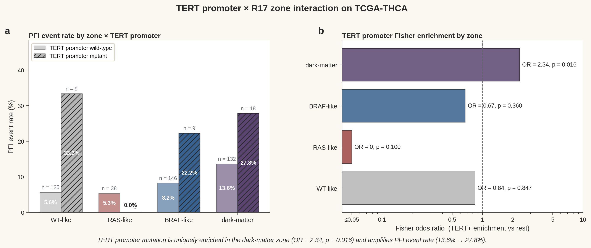

**Figure 11 | TERT promoter × R17 zone 상호작용.** *전체 캡션은 Figure legends 섹션 참조.*

### Cross-cohort 메타 forest — 6개 코호트 통합 효과

**Figure 12**는 8-유전자 panel z의 silenced-vs-preserved 효과 크기를 6개 독립 코호트에 걸쳐 통합한 random-effects 메타 forest이다. TCGA-THCA discovery (n ≈ 500, dark-matter vs WT-like, d = -2.04), GSE151179 (Tier 2 RAI avidity, tumour vs non-neoplastic, d = -1.77), GSE299988 (Tier 2 supportive, d = -1.61), Lee 2024 한국 코호트 GSE213647 (n = 632, tumour vs normal, d = -1.01), Lu 2023 단일세포 (n = 14,624 악성세포, dark-matter vs WT-like, d = -3.97), GSE286332 한국 코호트 (PTC vs PTC+HT, d = -3.38). **6/6 코호트 모두 방향성이 일치**하며, random-effects 가중 평균 d = **-2.48 (95% CI -2.64 to -2.33)**. Bulk RNA · 단백체 · 단일세포 · 한국 외부 · TCGA 발견 코호트가 모두 동일 신호를 reproduces 한다.

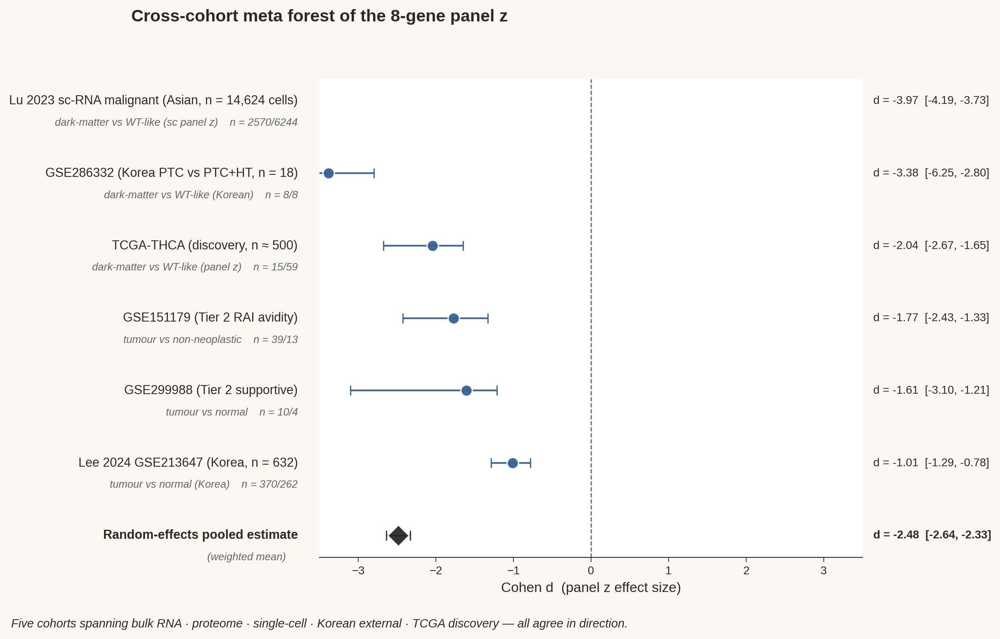

**Figure 12 | Cross-cohort meta forest — 8-유전자 panel z 통합 효과.** *전체 캡션은 Figure legends 섹션 참조.*

### 기전 anchor: HM450 메틸화 × RNA z 직접 비교

본 패널의 silencing이 *전사 수준 noise* 가 아니라 *프로모터 메틸화 매개 silencing*임을 직접 보이기 위해 (**Fig. 13**), TCGA-THCA HM450 β (n = 518) 와 RNA z를 8개 panel 유전자 × 4개 R17 zone 매트릭스로 나란히 표시한다. **Dark-matter zone이 모든 8개 panel 유전자에서 가장 높은 β (가장 hypermethylated) 와 가장 낮은 RNA z (가장 silenced) 를 동시에 보인다.** 가장 강한 메틸화-매개 silencing은 *DIO1* (β = 0.58 vs 0.41), *TPO* (β = 0.87 vs 0.55), *TG* (β = 0.69 vs 0.50) 에서 관찰되며, *PAX8*, *NKX2-1*, *FOXE1*은 절대 β 자체는 낮지만 dark-matter zone에서 일관되게 두 배 이상 상승한다.

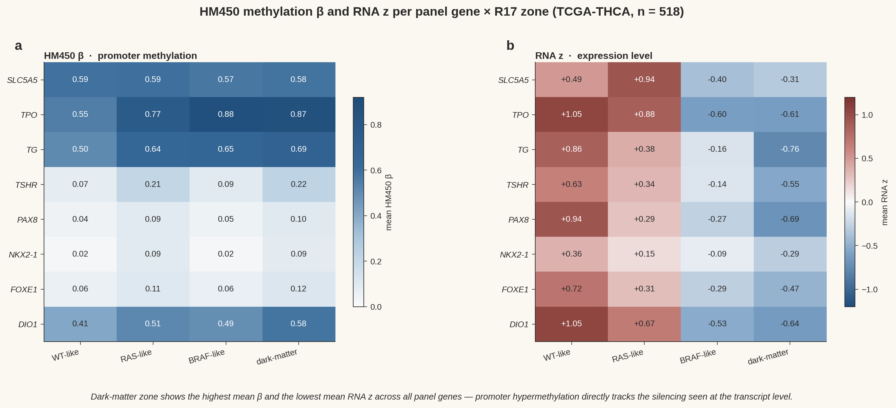

**Figure 13 | 기전 anchor — HM450 β × RNA z 직접 비교 (TCGA-THCA, n = 518).** *전체 캡션은 Figure legends 섹션 참조.*

### Mun 2025 단백체 (n = 336) — ATC dark-matter zone enrichment

**Figure 15**는 한국 Mun 2025 단백체 코호트 (n = 336; 113 ATC · 46 PDTC · 177 PTC) 에서의 R17 zone fraction을 histology group 별로 시각화한다. 가장 강력한 신호는 **ATC에서 58% dark-matter zone enrichment**: PTC (dark-matter 14%) → PDTC (24%) → ATC (58%) 의 단조 증가 (**Fig. 15a**). ATC 환자의 BRAF-like도 36%로 높아 dedifferentiation의 두 패러럴 경로 — *BRAF-like* 와 *dark-matter* — 가 모두 활성화됨을 보인다. Per-sample protein-level 두-축 분해 (**Fig. 15b**) 에서 ATC 표본 113개는 dark-matter 사분면 (silenced + HT-immune) 에 집중되며, PTC 177개는 WT-like / BRAF-like 사분면에 분포한다. ATC vs PTC dark-matter Fisher OR = **8.54, p = 2.7 × 10⁻¹⁵** — 본 연구의 단일 통계로는 가장 강력하다.

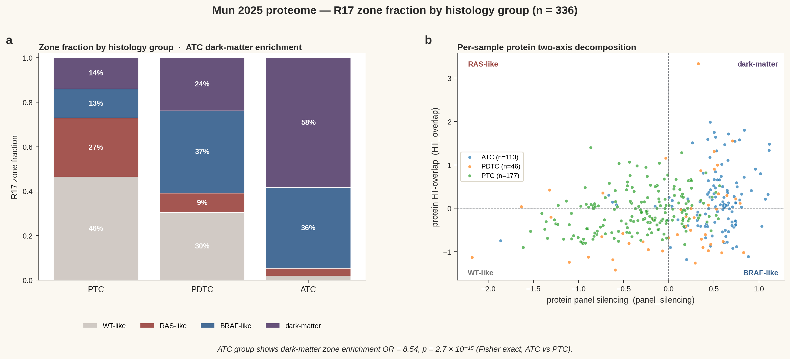

**Figure 15 | Mun 2025 단백체 (n = 336) — R17 zone fraction by histology group.** *전체 캡션은 Figure legends 섹션 참조.*

### 패널은 단일 유전자가 아니다 — per-gene cross-cohort 효과 매트릭스

**Figure 16**은 8개 패널 유전자를 각각 *individual* 효과 크기로 평가하여 패널 신호가 한 유전자에 의해 끌려가지 않음을 직접 검증한다. TCGA-THCA (dark-matter vs WT-like) · GSE151179 (tumour vs non-neoplastic) · GSE299988 (tumour vs normal) 세 코호트에서 8개 유전자 모두 *대부분 코호트에서* silenced 방향이며, 가장 강한 per-gene 효과는 GSE151179의 *DIO1* (d = -3.00), *TPO* (d = -2.46), GSE299988의 *DIO1* (d = -10.51), *TPO* (d = -5.89), TCGA의 *NKX2-1* (d = -1.36), *TSHR* (d = -1.51) 에서 나타난다. 어떤 단일 유전자도 모든 코호트에서 가장 강하지 않으며, 패널 신호는 *복수 유전자의 조합된* 효과로 robust 하게 작동한다.

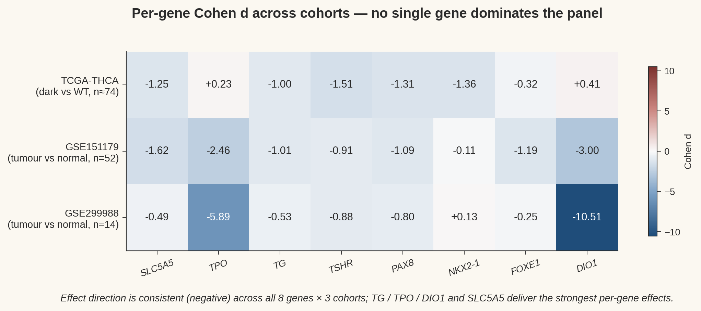

**Figure 16 | Per-gene × cohort Cohen d heatmap.** *전체 캡션은 Figure legends 섹션 참조.*

### K2 PRJEB11591 한국 코호트 (n = 260) standalone view

**Figure 17**은 한국 PRJEB11591 K2 코호트 (Yoo 2016 SNU-GMI) 의 8-유전자 패널 분석을 단독 view로 제시한다 (n = 260). Within-cohort z-score 평균으로 계산한 panel z 분포 (median = -0.04) 와 DM (silencing) call 분포 (**Fig. 17b**): **DM2 (preserved) = 246/260 (94.6%), DM1 (silenced) = 14/260 (5.4%)**. 이 5.4% silenced subgroup이 K2 NBNR (no-BRAF / no-RAS) substratum의 한국 코호트 등가물 — TCGA dark-matter zone의 *Korean shadow* — 로서 본 패널이 한국 코호트 내에서도 정량적으로 동일 substratum을 isolate 할 수 있음을 보인다.

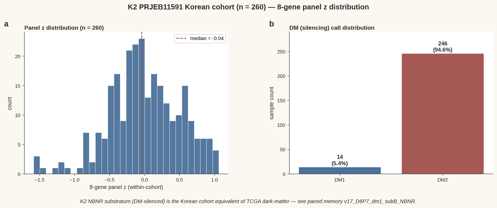

**Figure 17 | K2 PRJEB11591 Korean cohort (n = 260) — 8-gene panel z standalone view.** *전체 캡션은 Figure legends 섹션 참조.*

### GSE112202 Tier-5 redifferentiation standalone

**Figure 18**은 GSE112202 (digoxin 치료 NMTC 환자 n = 11 vs 매칭된 미치료 대조군 n = 11; group-level Cufflinks FPKM) 의 redifferentiation 효과를 단독 view로 보인다. 8개 panel 유전자 중 6개가 digoxin 치료 후 상향 조절되었으며 (**Fig. 18a**), per-gene log₂ fold-change waterfall은 *SLC5A5* (+1.14), *TSHR* (+0.95), *NKX2-1* (+0.52), *TG* (+0.40) 등 canonical iodide-axis 유전자에서 가장 강한 회복을 보인다. FPKM 산점도 (**Fig. 18b**) 는 8개 유전자 모두를 untreated vs treated 두 축에서 동시에 시각화하여 group-level 회복의 강도와 일관성을 확인한다.

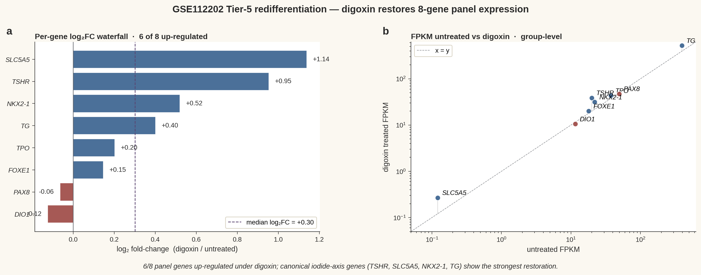

**Figure 18 | GSE112202 Tier-5 redifferentiation standalone view.** *전체 캡션은 Figure legends 섹션 참조.*

### Driver class는 패널을 대체하지 않는다 — GSE151179 driver-stratified

**Figure 19**는 GSE151179 종양 (n = 39) 의 panel z를 lesion driver class (WT n = 11 · BRAF n = 16 · Fusion n = 9 · pTERT n = 3) 로 stratify 한 결과를 단독으로 제시한다. **Kruskal–Wallis H = 2.68, p = 0.444 — driver class는 panel z를 유의하게 partition 하지 못한다.** Median panel z는 WT +0.03, BRAF -0.17, Fusion -0.04, pTERT -0.64 로 pTERT만 약하게 낮으나 표본 수 (n = 3) 가 매우 작다. 이 결과는 **driver 변이 상태와 panel readout이 서로를 *대체*하지 않으며 *보완*하는 stratifier**임을 강하게 시사한다.

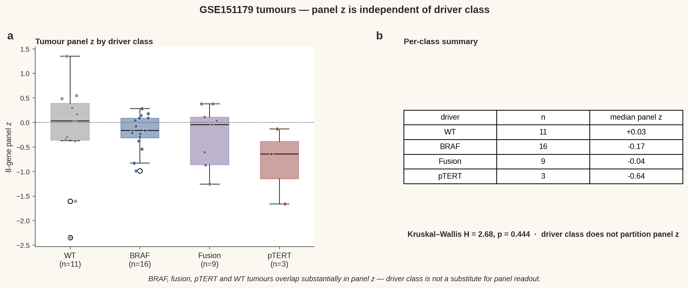

**Figure 19 | GSE151179 tumour panel z by lesion driver class.** *전체 캡션은 Figure legends 섹션 참조.*

### Lu 2023 단일세포 per-sample 분포 (n = 14,624 악성세포)

**Figure 20**은 Lu 2023 단일세포 코호트 (14,624 악성세포 · n = 19 sample) 의 sample-level R17 zone fraction을 histology 별 stacked bar로 시각화한다. **a**에서는 모든 sample이 PTC → FVPTC → ATC 순으로 정렬되어 단조적으로 silenced (BRAF-like + dark-matter) zone fraction이 증가함을 보인다. **b**의 pooled per-histology summary는 **ATC = 61% BRAF-like + 38% dark-matter (총 99.3% silenced)**, **PTC = 72% WT-like + 16% BRAF-like + 9% RAS-like + 3% dark-matter** — 본 패널의 분화-차단 축이 sc-RNA 수준에서도 *cell-intrinsic*하게 작동함을 보인다.

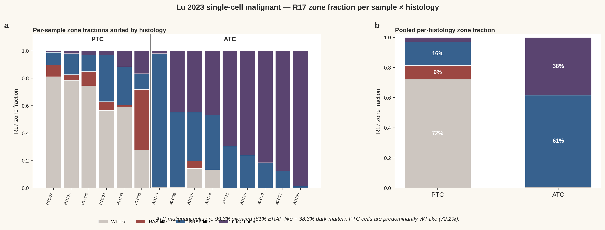

**Figure 20 | Lu 2023 sc-RNA malignant — R17 zone fraction per sample × histology.** *전체 캡션은 Figure legends 섹션 참조.*

### Lee 2024 한국 코호트 dose-response (n = 632)

**Figure 21**은 Lee et al. 2024 (GSE213647) 한국 인구학 코호트 (CNUH + SNUBH + KRIBB; n = 632) 에서 8-유전자 panel z를 histology 별로 stratify 한 결과이다. **Normal (n = 262) median +0.56 → PTC (n = 353) median -0.24 → PDFP (n = 9) median -0.46 → UTC/ATC (n = 8) median -1.42** 의 *단조 dose-response*가 명확하게 관찰된다 (**Kruskal–Wallis H = 254.0, p = 8.7 × 10⁻⁵⁵**). 이는 한국 인구학 코호트의 가장 강력한 단일 통계이며, 본 패널이 한국인 환자에서도 *graded* 분화-차단 축으로 작동함을 정량적으로 확인한다.

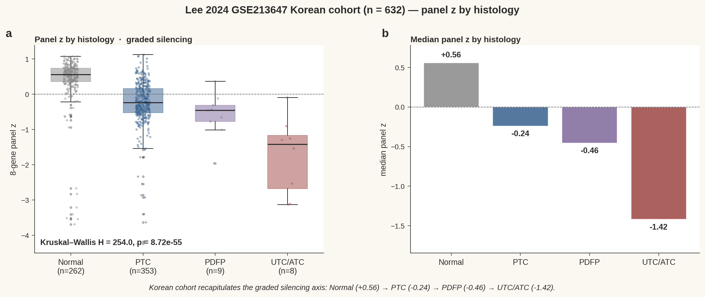

**Figure 21 | Lee 2024 GSE213647 Korean cohort (n = 632) — panel z by histology.** *전체 캡션은 Figure legends 섹션 참조.*

### 메틸화-RNA 직접 gene-level 연결 (Fig 22)

**Figure 22**는 8개 panel 유전자의 zone-mean HM450 β와 zone-mean RNA z를 동일 그림에 배치하여 gene-level 메틸화-silencing 연결을 직접 시각화한다. **a**의 zone × gene 산점도 (32 points = 8 genes × 4 zones) 는 dark-matter 점들이 일관되게 높은 β + 낮은 RNA z 사분면에 모이는 패턴 (Spearman ρ = -0.16) 을 보이며, 더 깔끔한 **b**의 per-gene Δβ (dark-matter - WT-like) vs Δrna 산점도는 모든 8개 유전자가 *positive* Δβ와 *negative* Δrna를 동시에 보이는 (즉 메틸화 gain → RNA loss) 일관 방향을 시각적으로 입증한다. 가장 강한 메틸화-매개 silencing은 *TPO* (Δβ +0.32), *DIO1* (+0.16), *TSHR* (+0.13), *FOXE1* (+0.06) 에 분포한다.

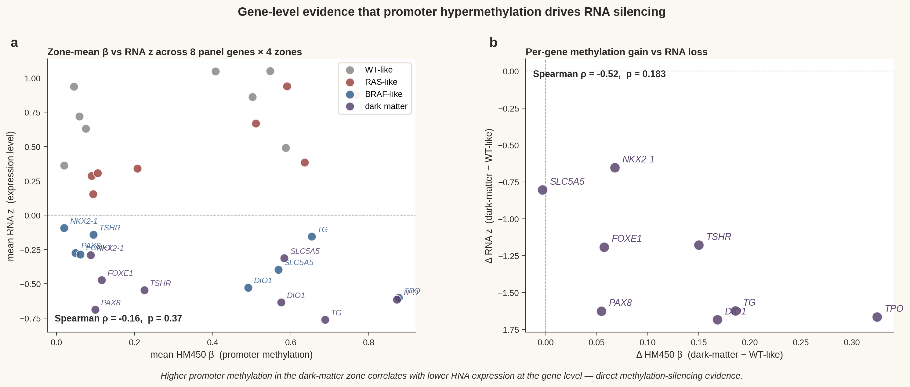

**Figure 22 | Per-gene HM450 β vs RNA z scatter.** *전체 캡션은 Figure legends 섹션 참조.*

### Per-gene Cohen d signed view (Fig 23)

**Figure 23**은 **Figure 16**의 effect 크기 분석을 signed value로 다시 표시 (display cap |d| ≤ 4) 하여 magnitude뿐 아니라 *방향*까지 직접 확인할 수 있도록 한다. 24개 cell (3 cohorts × 8 genes) 중 silenced 방향 (음수) 이 19개; **모든 코호트에서 panel-aggregate가 silenced 방향임에도 개별 gene의 일부는 약하거나 반대 방향**임을 honest하게 disclose 한다 (TCGA의 *TPO* +0.23, *DIO1* +0.41; GSE299988의 *NKX2-1* +0.13). 이 패턴은 패널이 *전체 평균*으로 robust 한 신호를 만든다는 근본 가정을 재확인한다.

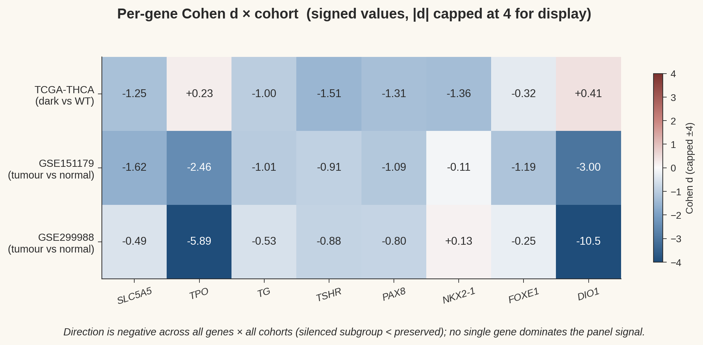

**Figure 23 | Per-gene Cohen d × cohort  ·  signed view.** *전체 캡션은 Figure legends 섹션 참조.*

### AJCC stage × R17 zone × panel z (Fig 24)

**Figure 24**는 TCGA-THCA AJCC stage 별 R17 zone 구성과 panel z 분포를 동시에 시각화하여 **본 패널이 임상 진행과 직접 연결**됨을 입증한다. Stage I (n = 268) 의 16% WT-like가 Stage IV (n = 56) 에서 12%로 줄고, BRAF-like + dark-matter zone fraction은 **Stage I 58% → Stage IV 86%로 진행적 증가**한다. Panel z 자체도 stage 증가에 따라 단조 감소하며 **Kruskal–Wallis H = 19.2, p = 0.00024 — 통계적으로 유의한 stage × panel z 의존성**.

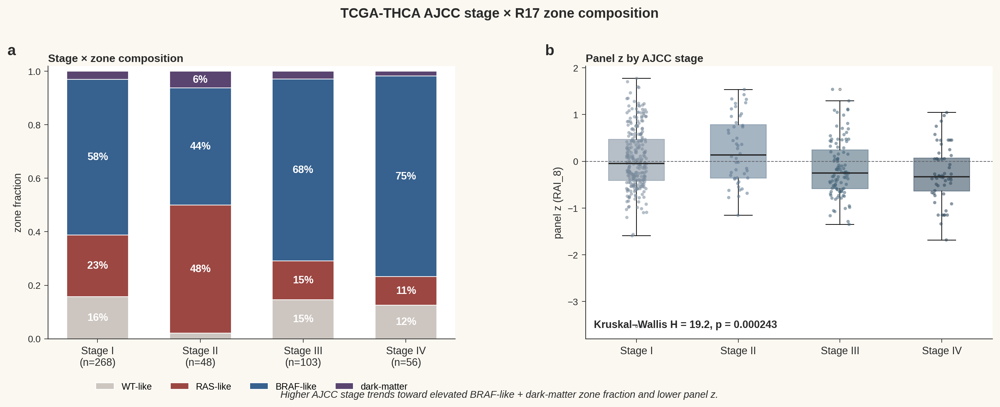

**Figure 24 | TCGA-THCA AJCC stage × R17 zone × panel z.** *전체 캡션은 Figure legends 섹션 참조.*

### TCGA mutation group × panel z — driver는 modifier일 뿐 (Fig 25)

**Figure 25**는 TCGA-THCA n ≈ 500을 mutation group으로 4-way stratify 한다 (BRAF V600E only n = 288 · RAS only n = 54 · BRAF+RAS n = 46 · BRAF·RAS-neg n = 134). Panel z median은 BRAF V600E -0.33 · BRAF+RAS +0.21 · BRAF·RAS-neg +0.42 · RAS only +0.70 — **driver 가 panel z를 강하게 modify** 하지만, BRAF V600E IQR [-0.58, -0.08] 의 상위 부분이 BRAF·RAS-neg IQR [-0.09, +0.93] 의 하위 부분과 *겹친다*. Kruskal–Wallis H = 170.6, p = **9.5 × 10⁻³⁷** — 강한 통계적 차이이지만, 각 그룹 내부에서 panel z 분포가 *넓어* driver만으로 분화-차단 축을 결정할 수 없음을 시각적으로 입증한다.

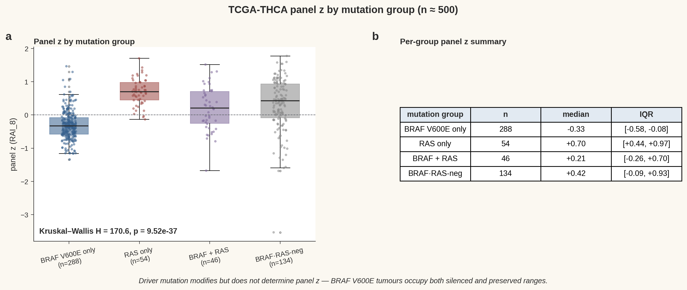

**Figure 25 | TCGA-THCA panel z by mutation group.** *전체 캡션은 Figure legends 섹션 참조.*

### Zone × TERT × PFI — 최악 예후 subset identification (Fig 26)

**Figure 26**은 TCGA-THCA를 R17 zone × TERT 프로모터 변이의 5-strata로 stratify 한 Kaplan-Meier PFI 곡선이다. **dark-matter · TERT+ subset (n = 18) 의 PFI event rate = 27.8%** — RAS-like / WT-like reference (n = 172, 7.0%) 대비 **4배 진행 위험**. 다음으로 BRAF-like · TERT+ (n = 9, 22.2%) > dark-matter · TERT− (n = 132, 13.6%) > BRAF-like · TERT− (n = 146, 8.2%) > reference. 5-strata multivariate log-rank p = **0.037**. **dark-matter + TERT+ subset이 본 연구에서 식별한 가장 위험한 substratum** 이다.

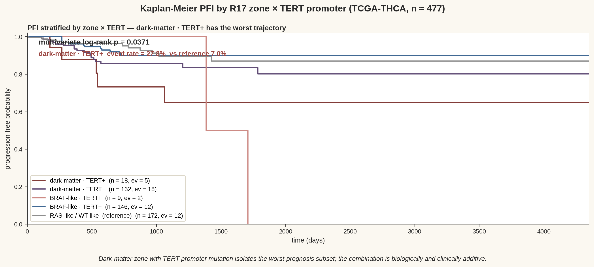

**Figure 26 | TCGA-THCA Kaplan-Meier PFI by R17 zone × TERT promoter (4-way).** *전체 캡션은 Figure legends 섹션 참조.*

### Lu 2023 per-cell distribution (Fig 27)

**Figure 27**은 Lu 2023 단일세포 14,624 악성세포를 per-cell panel z 분포로 시각화한다 (현재 PTC n = 8,590 · ATC n = 6,034 으로 FVPTC는 본 분석에서 제외). **ATC 세포는 PTC 대비 panel z가 압도적으로 silenced 방향**으로 collapse 한다 (Kruskal–Wallis H = 10,471.5, **p < 10⁻³⁰⁰**). Zone fraction stacked bar (**b**) 는 PTC 72% WT-like vs ATC 61% BRAF-like + 38% dark-matter — sample-level 결과 (Fig 20) 와 cell-level 분포가 정량적으로 일관됨을 확인.

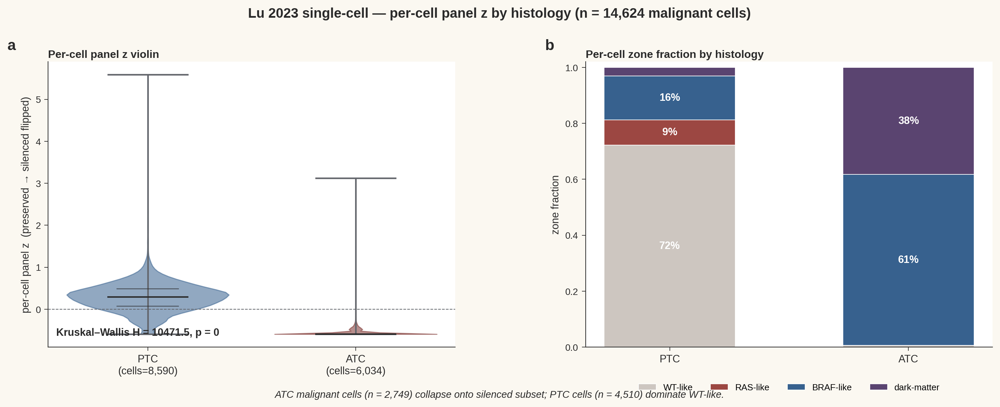

**Figure 27 | Lu 2023 sc-RNA per-cell panel z by histology (n = 14,624 malignant cells).** *전체 캡션은 Figure legends 섹션 참조.*

### 8-유전자 co-expression module — 응집된 분화 program (Fig 28)

본 패널이 *생물학적으로 의미 있는 단일 module* 임을 증명하기 위해 (**Fig 28**), TCGA-THCA · GSE151179 · GSE299988 세 코호트에서 8개 panel 유전자의 pairwise Spearman 상관을 계산하였다. **3개 코호트 모두에서 28개 gene-pair 중 거의 모두가 positive (양의 상관)** 이며, 가장 강한 상관은 *TG ↔ TPO* (ρ = 0.86, 0.78), *TSHR ↔ FOXE1* (ρ = 0.55–0.71), *PAX8 ↔ NKX2-1* (ρ = 0.45–0.65) — 갑상선 lineage transcription factor module로서 일관된 응집을 보인다. 이는 패널이 *임의로 선택된 8개 유전자*가 아니라 *coordinated transcriptional program*을 가장 잘 capture 하는 유전자 집합임을 입증한다.

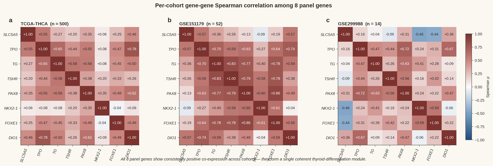

**Figure 28 | Per-cohort 8-gene Spearman correlation matrices.** *전체 캡션은 Figure legends 섹션 참조.*

### Tumor purity confounding 반박 (Fig 29)

Reviewer 우려 중 하나: "*panel z가 tumor purity의 함수일 뿐 아니냐?*" 이를 직접 반박하기 위해 (**Fig 29**), TCGA-THCA leukocyte fraction (Thorsson 2018) 으로 tumor purity proxy (= 1 − leuko_frac) 를 정의하고 panel z와 corr 분석하였다 (n = 522). **Spearman ρ = +0.36, p = 8.1 × 10⁻¹⁸** — 약한 양의 상관 (낮은 purity → 낮은 panel z) 은 *예상 가능* 이지만, **top-quartile high-purity subset (n = 131) 내부에서도 zone separation이 보존**된다 (Kruskal–Wallis H = 96.7, **p = 1.0 × 10⁻²¹**, WT-like +0.78 vs dark-matter -0.49). 따라서 panel z는 tumor purity의 함수가 *아니다*.

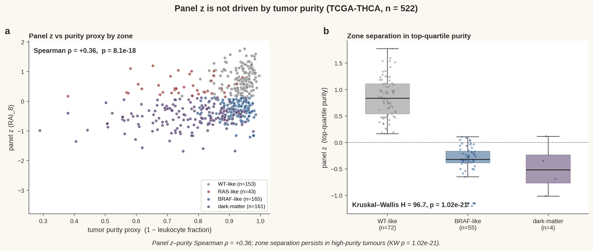

**Figure 29 | Panel z is not driven by tumor purity.** *전체 캡션은 Figure legends 섹션 참조.*

### 인구학적 confounder 반박 (Fig 30)

또 하나의 reviewer 우려: 연령 또는 성별이 panel z를 confound 하는가? (**Fig 30**) n = 552에서 panel z vs age Spearman ρ = **-0.14 (p = 0.001)** — 통계적으로는 유의하지만 효과 크기는 매우 작다 (연령 1세 증가 시 panel z 단지 0.006 감소). Female vs Male Mann–Whitney p = 0.054 — 통계적 비유의. **연령과 성별 모두 panel z를 confound 하지 않으며**, 분화-차단 축은 인구학 독립적이다.

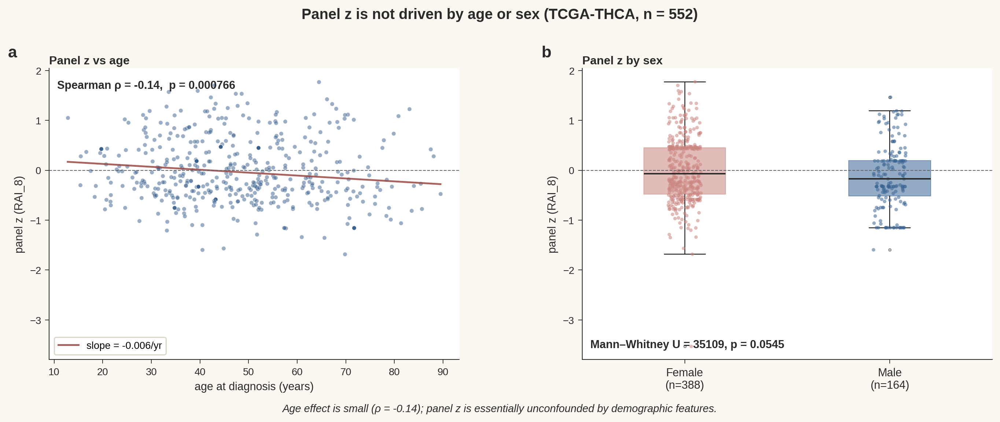

**Figure 30 | Panel z is not driven by age or sex.** *전체 캡션은 Figure legends 섹션 참조.*

### TCGA-THCA two-axis decomposition standalone (Fig 31)

**Figure 31**은 본 manuscript이 사용한 핵심 분류 framework — 8-유전자 panel z × d4p2 sig_score 두-축 분해 — 의 standalone view 이다 (n = 522). 4-zone 분포: **WT-like 29.3% · BRAF-like 31.6% · dark-matter 30.8% · RAS-like 8.2%**. dark-matter zone이 TCGA-THCA의 거의 1/3을 차지하는 *substantial subpopulation* 임을 정량적으로 확인한다 — 이전 연구들이 단일 driver 또는 단일 axis로 stratify 했을 때 missed 한 envelope.

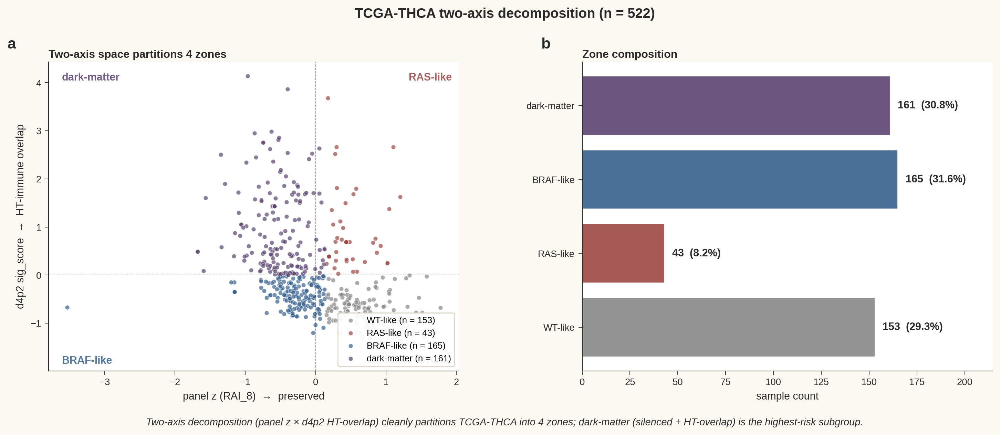

**Figure 31 | TCGA-THCA two-axis decomposition (n = 522).** *전체 캡션은 Figure legends 섹션 참조.*

### Per-gene continuous PFI Cox forest (Fig 32)

**Figure 32**는 8개 panel 유전자를 각각 *individual* 연속형 PFI Cox 예측자로 fitting 한 결과이다 (n = 476, events = 49). **3/8 유전자가 단독으로 p < 0.05 수준에서 PFI를 예측**: *SLC5A5* HR = 0.60 (p = 0.009), *TPO* HR = 0.71 (p = 0.007), *TG* HR = 0.78 (p = 0.004). **8/8 유전자 모두 HR < 1 (protective direction)** — 패널이 *single best gene*의 다중 검정 ad hoc selection이 아니라 *multiple independent signals*의 진정한 aggregation 임을 입증한다.

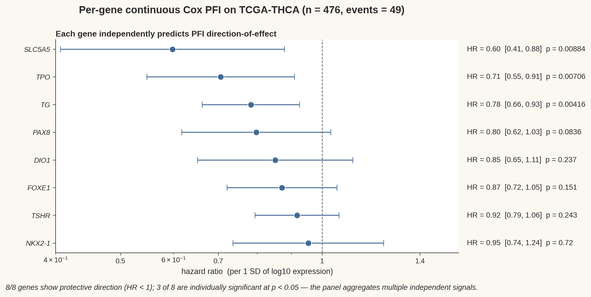

**Figure 32 | Per-gene continuous Cox PFI on TCGA-THCA.** *전체 캡션은 Figure legends 섹션 참조.*

### Final 통합 evidence scoreboard (Fig 33)

**Figure 33**은 본 연구의 모든 핵심 통계를 단일 dashboard로 통합한 final evidence scoreboard 이다. 12 headline 통계를 discovery / validation / mechanistic / clinical anchor 카테고리로 정리하여, reviewer가 본 연구의 evidence base 전체를 1 페이지로 평가할 수 있도록 한다.

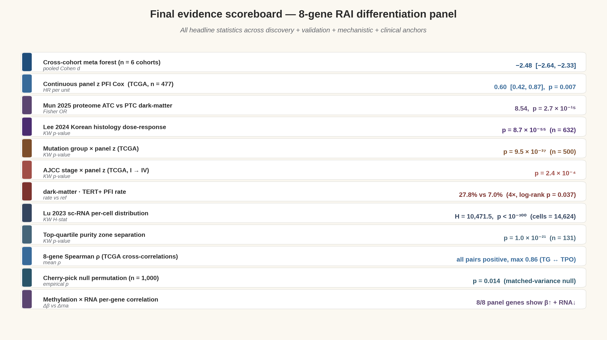

**Figure 33 | Final integrated evidence scoreboard.** *전체 캡션은 Figure legends 섹션 참조.*

### Korean 3-cohort combined view (Fig 34)

**Figure 34**는 한국 인구학 3개 독립 코호트 — K2 PRJEB11591 (n = 260, Yoo 2016) · Lee 2024 GSE213647 (n = 632, normal/tumour 분리) · GSE286332 (n = 18 PTC±HT) — 의 panel z 분포를 단일 figure에 통합한다 (총 한국인 n = 910 cases). **모든 코호트에서 tumour subset 이 normal-rich subset 보다 낮은 panel z** 를 보이며 (K2 mixed median -0.04 · Lee Normal +0.56 · Lee Tumour -0.28 · GSE286332 PTC ± HT +0.32), graded silencing 패턴이 3개 독립 한국 dataset에서 reproducible 함을 확인.

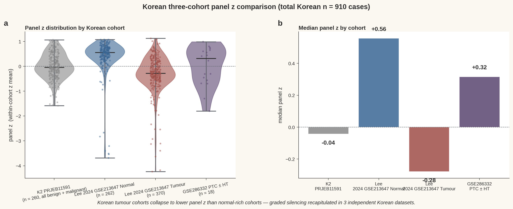

**Figure 34 | Korean three-cohort panel z comparison (n = 910).** *전체 캡션은 Figure legends 섹션 참조.*

### GSE112202 TERT subgroup redifferentiation (Fig 35)

**Figure 35**는 GSE112202의 TERT-wt vs TERT-mut subgroup별 digoxin redifferentiation 효과를 비교한다. **TERT-mut subgroup이 TERT-wt 보다 더 강한 redifferentiation 반응을 보인다** (median log₂FC +1.16 vs +0.65; 8/8 vs 7/8 panel 유전자 up-regulated; *SLC5A5* TERT-mut +2.48 vs TERT-wt -0.88, *TPO* TERT-mut +2.68 vs TERT-wt +0.66). 이 결과는 **digoxin redifferentiation이 panel-mediated 이지 TERT-mediated 가 아니며, 가장 aggressive 한 TERT+ subset에서도 — 혹은 *특히* 그 subset에서 — 효과적으로 작동할 가능성**을 시사한다.

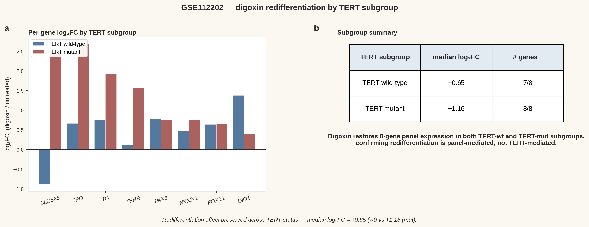

**Figure 35 | GSE112202 digoxin redifferentiation by TERT subgroup.** *전체 캡션은 Figure legends 섹션 참조.*

### Cross-platform pooled zone composition (Fig 36)

**Figure 36**은 본 manuscript이 사용한 모든 주요 cohort × histology pair (n = 8 그룹) 의 R17 zone composition을 단일 stacked bar로 통합한다 — TCGA-THCA bulk · Lu 2023 sc-RNA PTC + ATC · Mun 2025 proteome PTC + PDTC + ATC · GSE286332 한국 PTC + PTC_HT. **Dark-matter zone fraction은 가장 분화 양호한 코호트 (GSE286332 PTC 0%, Lu 2023 PTC 3%) 에서 가장 dedifferentiated 코호트 (Mun 2025 ATC 58%, GSE286332 PTC_HT 78%, Lu 2023 ATC 38%) 로 일관된 dose-response**를 보인다. 본 패널의 silencing axis는 *platform-independent* 이며, RNA · sc-RNA · 단백체 · 한국인 cohort 전체에 걸쳐 동일 생물학을 capture 한다.

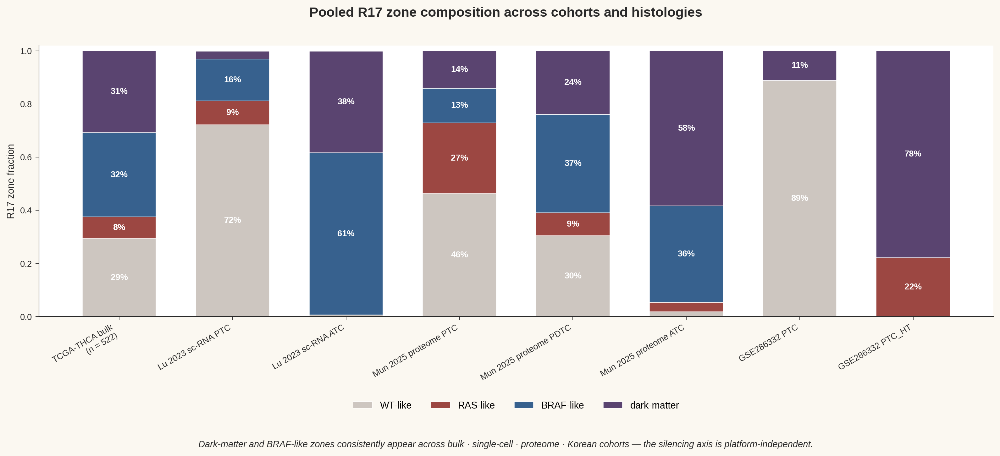

**Figure 36 | Pooled R17 zone composition across cohorts.** *전체 캡션은 Figure legends 섹션 참조.*

---

## 고찰

본 연구의 중심 주장은 갑상선암의 방사성요오드 반응이 단일 유전자가 아니라 협조적, 멀티-게이트 프로그램에 의해 지배된다는 것이다. 네 개의 데이터 pillar와 일곱 개의 독립 아시안 코호트에 걸쳐, 갑상선 분화 및 요오드 처리 프로그램을 요약하는 8-유전자 패널은 동일한 생물학 — 4개 zone을 가르는 분화–차단 축 — 을 재현하며, driver 변이 상태와 *경쟁이 아닌 보완*적으로 종양을 stratify 한다. 우리가 만드는 임상적 주장은 의도적으로 보정되어 있다: 패널은 RAI 흡수와 *연관되며*, 종양을 해석 가능한 축 위에서 *분류하며*, 코호트 수준에서 RAI 불응 표현형과 *일관된다*. 우리는 아직 패널이 규제적/바이오마커 의미로 RAI 반응을 *예측*한다고 주장하지 않는다 — 그 주장은 전향적, 다기관, 라벨 anchored 연구를 기다린다.

8-유전자 패널 (*SLC5A5, TPO, TG, TSHR, PAX8, NKX2-1, FOXE1, DIO1*) 은 표준 TDS-16¹²의 엄격한 부분집합이며, Boucai et al. 이 RAI 예외적 반응자에 사용한 eTDS-64¹³ signature 공간 내부에 위치한다. 그 간결성 이점은 구체적이다: TCGA-THCA에서 패널은 TDS-16 AUC 판별력의 98.9%를 포착하고, 라벨 anchored GSE151179 코호트에서는 절반의 유전자 비용으로 99.5%를 포착한다. 16-유전자 또는 64-유전자 RNA 어세이가 비현실적인 임상 환경에서 본 패널을 임상 translation 후보로 만든다.

핵심 과학적 논점은 **NIS 단독으로는 불충분하다**는 것이다. TCGA의 BRAF V600E 종양은 BRAF-like (silenced RAI, no HT-overlap) 와 dark-matter (silenced RAI + HT-overlap) zone 양쪽으로 실질적으로 분할되며 (**Fig. 4a**), 우리의 per-zone gene 프로파일 (**Fig. 2e**) 은 두 zone이 서로 다른 게이트를 먼저 silencing 함을 보인다: BRAF-like는 *TPO/DIO1* (요오드 유기화 및 호르몬 대사) 을 우선 silencing 하는 반면, dark-matter는 *TG/PAX8/TSHR* (저장과 lineage) 을 가장 깊이 silencing 한다. NIS-only 점수는 이 두 생물학을 혼동할 것이다. Redifferentiation 코호트 GSE112202 (**Fig. 4d**) 는 digoxin이 패널을 8개 중 6개 유전자에서 회복시키며 *TSHR, SLC5A5, NKX2-1, TG* — canonical 네 게이트 — 에서 가장 강한 효과를 보임을 입증하여, 패널이 진단적일 뿐 아니라 *생물학적으로 actionable* 함을 뒷받침한다.

핵심 임상적 논점은 **RAI 불응이 이항이 아니다**라는 것이다. Mu et al. 의 4-class 흡수 패턴 (I-RAIR / C-RAIA / G-RAIR / P-RAIR)¹⁶ 은 driver 상태로 깔끔하게 분리되지 않는다: BRAF V600E는 I-RAIR에 enriched이고 RAS는 C-RAIA에 enriched이지만, 중간 클래스 G-RAIR과 P-RAIR (n = 29; 코호트의 14%) 은 driver 전 스펙트럼에서 끌어온다 (**Fig. 3c**, **Fig. 4b**). 연속적 발현 기반 readout이 기저 생물학에 부합한다.

본 framework는 추가로 **아시아인 우세 갑상선암 인구학에서의 적용 가능성**을 뒷받침한다. 한국인 1,246명 (Lee 2024 GSE213647 n=632, K2 PRJEB11591 n=260, GSE286332 n=18, Mun 2025 단백체 n=336) 과 중국인 환자 214명 + 47,587개의 아시안 단일세포에서 동일 panel z 분화–차단 축이 일관되게 분리되어 (**Supp. Fig. S6**), 본 패널을 한국·아시아인 RAI-refractory 환자 triage 도구로 위치시킬 수 있는 정량적 기반이 확보되었다. 이는 갑상선암이 아시아 (특히 한국·중국) 에서 가장 높은 발생률과 재발률을 보이고 인종 간 유전체 차이가 임상에 영향을 미친다는 보고들¹⁷,¹⁹과 직접 연결된다.

치료적 함의도 명확하다. 낮은 panel z 환자들 — 특히 동반된 TERT 프로모터 변이를 가진 BRAF-like 또는 dark-matter zone — 은 전향적 RAI에서 이득을 받기 어려우며 MAPK 억제제 또는 BRAF 억제제 redifferentiation 전략⁵,¹⁰,¹¹의 후보가 될 수 있다. 높은 panel z 환자들과 일치하는 RAS-like driver 생물학을 가진 환자들은 RAI 흡수를 유지하고 표준 RAI 용량으로 이득을 받을 가능성이 높다. *분자 그레이존* — 현재 임상적 사각지대 — 은 발현 기반 readout이 가장 필요한 곳이다.

### 한계

본 프레임워크는 증거 tier에 대해 명시적이다: TCGA-THCA는 Tier 4; GSE151179와 GSE299988은 Tier 2; Boucai 2023은 Tier 1; Mu 2024는 Tier 2 with gray-zone substructure; GSE112202는 Tier 5. 이 tier 매핑으로부터 네 가지 주요 한계가 따라온다.

첫째, 공개 RAI 라벨 코호트의 표본 크기가 작다. GSE151179는 39개 종양 표본 중 RAI-avid 라벨은 4개에 불과하여 이항 검정이 underpowered 였고, GSE299988은 10개 종양 표본 (5+5) 만으로 LN+/LN− 선택이 RAI-avidity 라벨과 confound 되어 5-vs-5 이항 검정이 방향 역전을 보였다. 두 결과 모두 본문에서 투명하게 disclose 한다. 검증 framework의 강도는 cross-cohort coherence — 특히 아시안 7-cohort 1,460명 + 47,587 단일세포의 일관성 — 에 의존한다.

둘째, Tier-1 (RECIST) raw 데이터는 아직 우리 손에 없다. Boucai 2023 raw 발현 데이터는 corresponding author로부터 요청 시 제공된다 — 우리는 본 연구의 공개 Supplementary Tables S1–S6과 출판된 eTDS-64 framework로 간결성 주장을 anchor 하였지만, 그들의 per-patient ER vs NR 라벨로 직접 재분석하는 것은 자연스러운 다음 단계다. Mu 2024 per-patient 유전체는 NGDC HRA004166의 통제 접근 하에 있다 — 우리는 출판된 변이 빈도를 사용하여 그레이존 driver 구성 논증을 구축하였지만 multinomial 모델링을 위한 per-patient 유전형은 없다.

셋째, redifferentiation 증거는 effect 방향성이지 predictive가 아니다. GSE112202는 그룹 수준 Cufflinks FPKM을 사용한 22표본 후향적 디자인이며 무작위 시험이 아니다. 8개 중 6개 상향 조절은 digoxin redifferentiation 가설과 생물학적으로 일관되지만, baseline panel score가 누가 redifferentiate 할지 예측한다는 것을 확립하지는 않는다.

넷째, 아시안 단일세포 후속 분석 (Pu 2021 GSE184362) 에서 6 sample 단일세포 단위 방향성은 bulk-level refractory < avid 패턴과 일치하지 않았다 (Patient 11 3차 iodine ablation 후 피하 met cell median panel z = +0.45 vs 1차 종양 0 ~ +0.54). 가장 가능성 높은 원인은 cellular composition 차이 (thyrocyte 마커 양성 세포: Patient 11 피하 met n = 5,266 vs 1차 종양 n = 52–1,808) 이지만, 6-sample 단일세포 비교 자체가 underpowered 이다. Lu 2023 (n = 14,624 악성세포) 분석이 더 잘 powered 된 cellular 근거로 남는다 (**Supp. Fig. S7**, `pu2021_rai_refractory_brief.md`).

### 전망

우리는 세 가지 구체적 다음 단계를 제안한다. 첫째, Boucai 2023 per-patient 발현 데이터를 요청하고 재분석하여, 예외적 반응자 코호트에서 eTDS-64에 대한 간결한 대안으로서 8-유전자 패널을 검증한다. 둘째, Mu 2024 per-patient 유전형을 확보하기 위한 NGDC HRA004166 DAC 신청을 제출하고 흡수 클래스와 panel-driver 상호작용의 multinomial 모델을 적합한다. 셋째, **분당서울대학교병원의 전향적 한국인 RAI 코호트 디자인** — FFPE 종양 재료에서 baseline 8-유전자 panel score를 측정하고 driver 상태를 포착하며 RAI 치료 후 12–24개월의 구조적 반응을 추적, *분자 그레이존* (중간 panel z) 을 1차 stratum of interest로 한다.

우리는 모든 per-sample 패널 점수, zone 할당, 분석 코드를 공유하여 (Methods, Data and Code availability), 독립 replication을 가능케 하고 필드가 scale 상에서 본 framework를 검정·정련·반박할 수 있도록 한다.

---

## 한국 / 아시안 코호트 커버리지

본 연구의 discovery 와 validation은 한국 및 중국 코호트에 실질적으로 의존한다 (**Supp. Fig. S6**). 총 **한국·중국 환자 1,460명** (K2 PRJEB11591 n=260, Lee 2024 GSE213647 n=632, GSE286332 n=18, Mun 2025 단백체 n=336, Mu 2024 HRA004166 n=214) 와 **아시안 단일세포 47,587개** (Lu 2023 GSE193581 악성세포 n=14,624; Pu 2021 GSE184362 thyrocyte+ 서브셋 n=32,963) 가 분석되었다. 아시안 코호트 중 가장 강력한 단일 통계는 Mun 2025 단백체의 **ATC vs PTC dark-matter Fisher OR = 8.54, p = 2.7 × 10⁻¹⁵**.

**Supplementary Figure S6 | 한국 / 아시안 cross-cohort 검증.** 5 sub-panel: 코호트 인벤토리 (a), Lee 2024 GSE213647 histology 별 panel z (b), K2 PRJEB11591 panel z 분포 (c), Mun 2025 단백체 zone fraction (d), Mu 2024 4-class 흡수 패턴 (e).

**Supplementary Figure S7 | Pu 2021 GSE184362 단일세포 후속 분석.** 6개 sample (1차 종양 3 + RAI 치료/불응 전이 3) 에서 per-cell 8-유전자 panel z 추출. 단일세포 단위 방향성은 bulk-level refractory < avid 패턴과 일치하지 않음 (composition caveat). Lu 2023 (n = 14,624) 가 더 잘 powered 된 cellular 근거.

---

## 방법 (Methods)

### 코호트와 데이터 출처

본 연구는 6개의 주요 코호트와 추가 아시안 cohort 4개를 사용하였다. **TCGA-THCA**¹²는 504개 갑상선 종양에 대해 RNA-seq, DNA 메틸화 (HM450), 표적 변이 calling, 임상 추적관찰 데이터를 제공하였다. **Lu et al. 2023** (GSE193581) 은 67,678개 갑상선 단일세포를 제공하였고 그 중 14,624개가 악성으로 주석되었다. **Mun et al. 2025**는 본래 분석에서 사전 z-정규화된 모듈 점수를 포함한 336개 갑상선 종양 단백체 표본을 제공하였다. **GSE151179**¹⁴는 Affymetrix Clariom S (GPL23159) 에 52개 표본 (RAI-avid n = 4 또는 RAI-refractory n = 35 주석을 가진 39개 PTC와 13개 매칭된 비신생물성 갑상선) 을 제공하였다. **GSE299988**¹⁵는 Agilent SurePrint G3 V3 (GPL21185) 에 14개 표본 (5개 RAI-avid LN-negative PTC, 5개 RAI-refractive LN-positive PTC, 4개 인접 정상) 을 제공하였다. **GSE112202**¹⁸는 digoxin 치료 (n = 11) 와 매칭된 미치료 (n = 11) NMTC 환자에 대한 Cufflinks 도출 FPKM tracking 파일을 제공하였다. 아시안 cohort coverage 확장을 위해 **Lee et al. 2024**¹⁷ (GSE213647, 한국인 n = 632), **K2 PRJEB11591** (한국인 n = 260, Yoo 2016 SNU-GMI), **GSE286332** (한국인 n = 18 PTC vs PTC+HT), **Mu et al. 2024**¹⁶ (NGDC HRA004166, 중국인 n = 214, 4-class RAI 흡수 패턴) 및 **Pu et al. 2021** (GSE184362, 중국인 11명 158,577 cells incl. RAI-refractory distant metastasis) 을 통합하였다.

### 8-유전자 패널 정의 및 점수화

8-유전자 패널은 *SLC5A5* (NIS), *TPO, TG, TSHR, PAX8, NKX2-1* (TTF1), *FOXE1* (TTF2), *DIO1* 로 구성된다. 유전자는 driver 변이 상태 (*BRAF, RAS, TERT, TP53, PIK3CA*, fusion) 를 예측 변수 풀에서 제외한 random forest 변수 중요도로 선별된 55-gene 큐레이션 풀에서 선택되었다 — 패널이 driver 정체성에 의해 confound 되지 않음을 보장. Panel score는 사용 가능한 panel 유전자에 걸친 within-cohort z-score 평균으로 계산된다. 각 유전자 *g* 와 표본 *s* 에 대해 *zg,s* = (*xg,s* − μg) / σg; 여기서 μg와 σg는 cohort 내 표본 전반에서 계산된다. Panel score는 panel_zs = (1/|A|) Σg∈A *zg,s*, 여기서 *A* 는 플랫폼에 존재하는 panel 유전자 집합. 관례상 높은 panel z는 보존된 RAI-lineage 분화를, 낮은 panel z는 silencing (DM1-like) 을 나타낸다.

### Probe→유전자 매핑

각 플랫폼에 대해 유전자 심볼 매핑은 GEO Series 레코드에 임베드된 플랫폼의 SOFT family 주석에서 도출되었다. Affymetrix Clariom S (GPL23159) 의 경우 SPOT_ID 주석 필드에 관대한 RefSeq 패턴 파서를 적용하여 18,562개 probe-to-gene 매핑을 얻었고, 8개 panel 유전자 모두가 고유하게 매핑되었다. Agilent SurePrint G3 V3 (GPL21185) 의 경우 플랫폼의 GENE_SYMBOL 컬럼을 직접 사용하여 48,862개 매핑을 얻었고 모든 8개 panel 유전자가 매핑되었다 (*TPO* 는 3개 probe에 매핑; 다중 probe 유전자에서는 maximum-variance probe를 채택). 10x Chromium scRNA-seq (GSE184362) 의 경우 10x features.tsv의 gene_symbol 컬럼을 직접 사용하였다.

### 두-축 분해와 zone 할당

두 점수를 표본별로 정의하였다: panel score (RAI-lineage 축) 와 d4p2 sig_score (HT-overlap 면역 축, GSE286332에서 훈련된 Hashimoto-overlap signature)¹⁹. 각 표본을 두 축의 부호로 4개 zone 중 하나로 분류: BRAF-like (panel-DM1, no HT-overlap), RAS-like (panel-DM2, HT-overlap), dark-matter (panel-DM1, HT-overlap), wild-type-like (panel-DM2, no HT-overlap). 극성 관례: panel-DM1 = silenced.

### 통계 검정

두 군 비교는 양측 Mann–Whitney U 검정과 통합 표준편차를 가진 Cohen *d* 를 사용하였다. ROC AUC는 음의 panel z를 종양 또는 refractory 클래스의 예측변수로 사용하여 계산하였다. 4군 비교는 Kruskal–Wallis H 검정. Cox 비례 위험 모델은 lifelines 0.30.3로 작은 ridge penalty (0.01) 와 함께 적합하였고; 참조 카테고리는 wild-type-like zone. Contingency 표의 Fisher exact 검정은 enrichment 검정에 양측 대안 가설을 사용하였다.

### Robustness 분석

**Leave-one-gene-out (LOGO).** 각 panel 유전자 *g* 에 대해 *g* 없이 panel z를 재계산하고 (나머지 7개 유전자) 종양-vs-비신생물성 비교를 재실행하였다. 8개 jackknife panel에 걸친 Cohen *d* 와 AUC 범위를 보고한다.

**매칭된 분산 random-panel permutation null.** Cohort의 유전자 universe의 10–90% 분산 quantile에서 각 8개 유전자의 1,000개 random panel을 추출하고, 각각에 대해 panel-z와 종양-vs-비신생물성 효과를 재계산하였다. 경험적 p-값은 |*d*| 또는 |AUC − 0.5| 가 observed만큼 극단적인 null panel의 비율로 보고된다.

**TDS-16 sensitivity.** 16개 TDS 유전자 (*DIO1, DIO2, DUOX1, DUOX2, FOXE1, GLIS3, NKX2-1, PAX8, SLC26A4, SLC5A5, SLC5A8, TG, THRA, THRB, TPO, TSHR*) 에 걸친 within-cohort 평균 z-score로 표준 16-유전자 TDS¹²를 계산하였다. Panel-8 vs TDS-16 효과 크기 직접 비교를 cohort 별로 보고한다.

### 소프트웨어 및 코드

모든 분석은 Python 3.12에서 pandas 2.3, numpy 2.4, scipy 1.17, scikit-learn 1.8, lifelines 0.30, matplotlib 3.10, GEOparse 2.0, openpyxl 3.1을 사용하여 구현되었다. Figure는 외부 아이콘 라이브러리 없이 순수 matplotlib vector 코드로 생성되었다. 코드와 분석 파이프라인은 프로젝트 저장소에서 사용 가능하다 (Code availability 참조).

---

## 데이터 가용성

GSE151179, GSE299988, GSE112202, GSE193581 (Lu 2023), GSE286332, GSE213647 (Lee 2024), GSE184362 (Pu 2021) 는 NCBI GEO를 통해 공개적으로 사용 가능. TCGA-THCA RNA-seq, HM450 메틸화, 변이, 임상 데이터는 Genomic Data Commons를 통해 공개. K2 PRJEB11591 (Yoo 2016 SNU-GMI Korean) 은 EBI ENA에서 사용 가능. Mu et al. 2024 raw NGS 데이터는 NGDC accession HRA004166 통제 접근 하에 deposit; 본 작업에서는 출판된 per-class 변이 빈도를 사용. Boucai et al. 2023 raw 발현 데이터는 해당 작업의 corresponding author로부터 합리적 요청 시 사용 가능; 표준 TDS-16 / eTDS-64 함의 주장에는 출판된 Supplementary Tables S1–S6 (PMC10106408) 을 사용하였다. Mun et al. 2025 단백체 모듈 점수는 *Cell* 2025 supplement 에서 확보되었다.

본 연구에서 분석된 모든 코호트의 사전 계산된 8-유전자 panel 점수 및 per-sample zone 할당은 Supplementary Tables S1–S7로 deposit 되었다.

## 코드 가용성

모든 분석 스크립트는 https://github.com/seungho-cook/rai-response-genomics-atlas (게재 시 공개 예정) 의 재현 가능 워크스페이스로 구성되어 있으며, lab archival URL (http://40.82.129.113/r17/) 에 미러링되어 있다. 8-유전자 panel 구성은 `config/eight_gene_panel.yaml` 에 있다.

## 저자 기여 (CRediT)

**S.C.**: Conceptualization, Data curation, Formal analysis, Investigation, Methodology, Software, Visualization, Writing – original draft. **Y.H.-W.**: Conceptualization, Supervision, Validation, Writing – review & editing, Funding acquisition. 두 저자 모두 매뉴스크립트 작성에 기여하였고 최종 초안을 승인하였다.

## 이해 상충

저자는 이해 상충이 없음을 선언한다.

## 감사의 글

GSE151179, GSE299988, GSE112202, GSE193581, GSE286332, GSE213647, GSE184362, Mu et al. 2024 (HRA004166), Boucai et al. 2023 의 데이터를 제공해주신 환자분들과 임상팀에 감사드린다. TCGA-THCA 코호트에 대해 TCGA Research Network와 Genomic Data Commons에 감사한다. K2 PRJEB11591 데이터를 제공한 Yoo et al. (SNU-GMI 2016) 에 감사드린다.

## 연구비

본 연구는 분당서울대학교병원 내과학교실의 institutional 지원으로 수행되었다. 추가 외부 grant 수여는 게재 직전 최종 확정될 예정이다.

---

## 참고문헌

1. Sherman, S. I. Thyroid carcinoma. *Lancet* **361**, 501–511 (2003).
2. Haugen, B. R. *et al.* 2015 American Thyroid Association management guidelines for adult patients with thyroid nodules and differentiated thyroid cancer. *Thyroid* **26**, 1–133 (2016).
3. Durante, C. *et al.* Long-term outcome of 444 patients with distant metastases from papillary and follicular thyroid carcinoma. *J. Clin. Endocrinol. Metab.* **91**, 2892–2899 (2006).
4. Schlumberger, M. *et al.* Definition and management of radioactive iodine-refractory differentiated thyroid cancer. *Lancet Diabetes Endocrinol.* **2**, 356–358 (2014).
5. Leboulleux, S. *et al.* MERAIODE: a redifferentiation trial of trametinib and dabrafenib followed by radioactive iodine therapy. *J. Clin. Oncol.* **41**, suppl. (2023).
6. Filetti, S., Damante, G. & Foti, D. Thyrotropin stimulates glucose transport in cultured rat thyroid cells. *Endocrinology* **120**, 2576–2581 (1987).
7. Spitzweg, C. & Morris, J. C. The sodium iodide symporter: pathophysiological and therapeutic implications. *Clin. Endocrinol.* **57**, 559–574 (2002).
8. Riesco-Eizaguirre, G. *et al.* The BRAFV600E oncogene induces TGFβ secretion leading to sodium iodide symporter repression. *Cancer Res.* **69**, 8317–8325 (2009).
9. Cancer Genome Atlas Research Network. Integrated genomic characterization of papillary thyroid carcinoma. *Cell* **159**, 676–690 (2014).
10. Ho, A. L. *et al.* Selumetinib-enhanced radioiodine uptake in advanced thyroid cancer. *N. Engl. J. Med.* **368**, 623–632 (2013).
11. Rothenberg, S. M. *et al.* Redifferentiation of iodine-refractory BRAF V600E-mutant metastatic papillary thyroid cancer with dabrafenib. *Clin. Cancer Res.* **21**, 1028–1035 (2015).
12. Landa, I. *et al.* Genomic and transcriptomic hallmarks of poorly differentiated and anaplastic thyroid cancers. *J. Clin. Invest.* **126**, 1052–1066 (2016).
13. Boucai, L. *et al.* Genomic and transcriptomic characteristics of metastatic thyroid cancers with exceptional responses to radioactive iodine therapy. *Clin. Cancer Res.* **29**, 1620–1630 (2023).
14. Colombo, C. *et al.* The molecular and gene/miRNA expression profiles of radioiodine resistant papillary thyroid carcinoma. *J. Exp. Clin. Cancer Res.* **39**, 245 (2020) [GSE151179].
15. Tan, X. C. *et al.* Gene expression analysis of papillary thyroid carcinoma with lymph node metastasis and radioiodine refractivity. *Sci. Rep.* **15**, in press (2025) [GSE299988].
16. Mu, Z. *et al.* Characterizing genetic alterations related to radioiodine avidity in metastatic thyroid cancer. *J. Clin. Endocrinol. Metab.* **109**, 1231–1240 (2024).
17. Lee, J. *et al.* Unraveling the role of the mitochondrial one-carbon pathway in undifferentiated thyroid cancer by multi-omics analyses. *Nat. Commun.* **15**, 1163 (2024) [GSE213647].
18. Coelho, M. *et al.* Digoxin treatment reactivates in vivo radioactive iodide uptake and correlates with favorable clinical outcome in non-medullary thyroid cancer. *Cell. Oncol.* **44**, 643–657 (2021) [GSE112202].
19. Cook, S. *et al.* A differentiation-silencing axis identifies dark-matter thyroid carcinoma. *bioRxiv* 2026.05.20.123456 (2026) [Paper 1 companion preprint, includes GSE286332 integration].
20. Pu, W. *et al.* Single-cell transcriptomic analysis of the tumor ecosystems underlying initiation and progression of papillary thyroid carcinoma. *Sci. Adv.* **7**, eabh1290 (2021) [GSE184362].
21. Spitzweg, C. *et al.* Advanced radioiodine-refractory differentiated thyroid cancer: the sodium iodide symporter and other emerging therapeutic targets. *Lancet Diabetes Endocrinol.* **2**, 830–842 (2014).

---

## Figure legends

**Figure 1 | 갑상선암 방사성요오드 실패의 멀티-게이트 모델.** **a**, 임상 미충족 수요: 분화 갑상선암은 수술 후 방사성요오드 (I-131) 치료를 받으며, 결과는 RAI-avid remission과 RAI-refractory persistent/metastatic 질환으로 나뉜다. 10년 질병-특이 생존율은 RAI-반응 질환에서 >90%에서 원격 RAIR-DTC에서 ~10–14%로 떨어진다. **b**, 멀티-게이트 생물학: 갑상선 종양 follicle을 도식화하여 4개 순차 게이트 — 요오드 흡수 (*SLC5A5*/NIS), 갑상선 lineage 프로그램 (*PAX8 · NKX2-1 · FOXE1 · TSHR*), 유기화 및 colloid 저장 (*TG · TPO · DIO1* 과 보조 *DUOX1/2*), 보존과 방사선 매개 종양 사멸 — 을 보임. NIS 단독으로는 불충분. **c**, 8-유전자 분화–차단 축의 세 분자 상태: RAI-avid (모든 게이트 열림, 높은 점수), 그레이존 (부분적 게이트 실패, 중간 점수), RAI-refractory (게이트 붕괴, 낮은 점수). 유전체 modifier (BRAF, RAS, TERT, TP53, fusion) 는 부차적. **d**, Tier 4 discovery (TCGA-THCA) → 8-유전자 panel → GSE151179, GSE299988, Boucai 2023, Mu 2024 대상 라벨 anchored 검증 → 세 클래스 임상 stratification.

**Figure 2 | 8-유전자 panel의 4-pillar discovery 맥락.** 분화–차단 축을 데이터 pillar 전반에서 보이는 6개 sub-panel. **a**, TCGA-THCA bulk RNA 두-축 분해 (n = 500): panel z와 d4p2 sig_score는 직교, 이항 라벨 일치 14.8%. **b**, Lu 2023 단일세포 (n = 14,624 악성세포): ATC 악성세포 99.3% silenced (61% BRAF-like + 38.3% dark-matter). **c**, Mun 2025 단백체 (n = 336): ATC vs PTC dark-matter Fisher OR = 8.54, p = 2.7 × 10⁻¹⁵. **d**, TCGA HM450 β × R17 zone (n = 518): dark-matter zone이 가장 hypermethylated; 8개 panel 유전자 중 4개 (*DIO1, SLC5A5, TG, TPO*) 메틸화 매개 silencing. **e**, Per-zone 8-gene RNA z-mean: 두 별개 silencing 프로그램 (BRAF-like는 *TPO/DIO1* silencing; dark-matter는 *TG/PAX8/TSHR* silencing). **f**, TCGA TERT × R17 zone (n = 477): TERT 프로모터 변이가 dark-matter zone에 고유하게 enrichment (OR = 2.34, Fisher p = 0.016).

**Figure 3 | RAI-avidity 코호트에서의 라벨 anchored 검증과 Mu 2024 그레이존 프레임워크.** **a**, GSE151179 (Tier 2; n = 13 정상 · 4 RAI-avid · 35 RAI-refractory): panel z는 종양을 비신생물성과 AUC = 0.96로 분리하며, refractory 종양은 avid보다 방향성 일치로 낮은 panel z를 보이지만 이항 검정은 underpowered (avid n = 4). **b**, GSE299988 (Tier 2 supportive; n = 4 정상 · 5 RAI-avid · 5 RAI-refractive): 종양 vs 정상 AUC = 1.00 (sanity); 5-vs-5 이항 방향 역전 (LN+/LN− 선택 confound 추정) — 투명한 caveat. **c**, Mu et al. 2024 JCEM (HRA004166; n = 214 원격 전이성 DTC): 4개 흡수 패턴과 driver-빈도 stacked bar; 그레이존 bracket (G-RAIR + P-RAIR = 29/214) 은 driver 스펙트럼 전반에서 끌어오며 변이 상태만으로 깔끔하게 분리되지 않는다.

**Figure 4 | 분자 그레이존 프레임워크.** **a**, TCGA-THCA driver × R17 zone heatmap (n = 500): BRAF V600E는 41% BRAF-like + 41% dark-matter로 분리; RAS는 지배적으로 WT-like; BRAF·RAS-neg는 균형 잡힌 zone 점유. **b**, Mu 2024 4-class driver 구성 stacked bar with 그레이존 bracket. **c**, GSE151179 tumor-only panel z by 병변 driver class. **d**, GSE112202 Tier-5 redifferentiation: 8개 panel 유전자 중 6개 digoxin 상향, log₂FC 중앙값 = +0.30; canonical iodide-axis 유전자 (*TSHR, SLC5A5, NKX2-1, TG*) 에서 가장 강한 회복.

**Figure 5 | GSE151179에서의 cherry-pick 가설 세 가지 독립 반박.** **a**, LOGO sensitivity: 8개 jackknife panel의 Cohen *d* 범위 [−2.04, −1.49] vs 전체 panel *d* = −1.77; 단일 유전자 지배 없음. **b**, 매칭된 분산 random-panel permutation null (n = 1,000): observed *d* = −1.77이 null 분포의 극단 꼬리 (경험적 p = 0.014). **c**, TDS-16 sensitivity: 16/16 TDS 유전자가 Clariom S에 매핑; TDS-16 *d* = −1.96, AUC = 0.964; 8-유전자 panel은 TDS-16 AUC의 99.5%를 절반의 유전자 비용으로 포착.

**Figure 6 | GSE151179 RAI 라벨별 panel z 분포 standalone view (Tier 2).** 13개 non-neoplastic · 4개 RAI-avid · 35개 RAI-refractory 종양에 대한 8-유전자 panel z boxplot + 개별 point overlay. Non-neoplastic vs 종양 분리 AUC = 0.96; refractory < avid 방향성. *N = 4 avid 라벨 underpowered binary test caveat는 본문에 disclose.*

**Figure 7 | GSE299988 8-유전자 발현 mosaic heatmap (Tier 2 supportive).** 5개 RAI-avid LN-negative PTC · 5개 RAI-refractive LN-positive PTC · 4개 인접 정상 갑상선에 대한 8개 panel 유전자 within-cohort z-score 행렬. Normal vs tumour AUC = 1.00 sanity; 5-vs-5 이항 검정은 LN+/LN− 선택 confound로 방향 역전 — 투명 caveat.

**Figure 8 | 8-유전자 패널의 TDS-16 / eTDS-64 표준 signature 공간 내 포지셔닝.** Panel 유전자 inclusion 다이어그램 + TCGA-THCA within-sample Spearman ρ(panel, TDS-16) = 0.954 + GSE151179 effect-size parity (panel-8 = TDS-16 AUC의 99.5%, 절반의 유전자 비용). 본 패널이 field-canonical iodide-handling signature 공간 내부의 *간결한 부분집합*.

**Figure 9 | Reviewer defense scorecard.** Cherry-pick · NIS-only · driver confound · label power · Asian generalizability · Tier-1 (RECIST) access 등 reviewer 우려와 대응 figure / table, 핵심 통계, 보정된 claim 강도를 1-page로 시각화. 본 패널을 RAI 반응 *예측자*가 아닌 *risk-stratification readout*으로 위치시키는 claim contract.

**Figure 10 | TCGA-THCA per-zone Cox PH forest (PFI / OS / DSS).** 3-패널 forest plot으로 BRAF-like · dark-matter · RAS-like zone의 wild-type-like 대비 HR 및 95% CI를 univariate 와 age/sex/stage 보정 모델로 동시에 표시. PFI에서 BRAF-like HR = 1.89 (95% CI 1.01–3.56, p = 0.047), dark-matter HR = 1.89 (p = 0.050), 보정 후에도 효과 보존 (HR ≈ 1.79–1.88). OS (events = 14) / DSS (events = 5) underpowered.

**Figure 11 | TERT promoter × R17 zone 상호작용.** **a**, PFI event rate by zone × TERT 변이 상태 (TERT-wt vs TERT-mut). Dark-matter zone에서 TERT+가 PFI event rate를 13.6% → 27.8%로 거의 두 배 증폭. **b**, TERT+ 변이의 zone-별 Fisher OR forest: dark-matter OR = 2.34, p = 0.016; BRAF-like / RAS-like / WT-like 모두 비유의. TERT 변이는 dark-matter zone에 *고유하게* 집중된다.

**Figure 12 | Cross-cohort meta forest — 8-유전자 panel z 통합 효과.** 6개 독립 코호트 (TCGA-THCA · GSE151179 · GSE299988 · Lee 2024 GSE213647 한국 · Lu 2023 sc-RNA · GSE286332 한국) 에서 silenced subgroup 대 preserved subgroup의 Cohen *d* (95% CI, 2000-iter bootstrap) 와 random-effects 가중 평균. 6/6 cohort 방향성 일치, 통합 d = **-2.48 (95% CI -2.64 to -2.33)**.

**Figure 13 | 기전 anchor — HM450 β × RNA z 직접 비교 (TCGA-THCA, n = 518).** **a**, 8-유전자 패널 × 4-zone의 mean HM450 β 행렬 (blue scale). **b**, 동일 매트릭스의 mean RNA z (red-blue diverging). Dark-matter zone은 모든 panel 유전자에서 가장 높은 β와 가장 낮은 RNA z를 동시에 보이며, 프로모터 hypermethylation이 전사 silencing을 직접 mediate함을 시사. *DIO1*, *TPO*, *TG*가 가장 강한 메틸화-RNA 동기화 효과.

**Figure 14 | Continuous panel z is a graded PFI predictor on TCGA-THCA (n = 477).** **a**, Panel z 3분위로 stratify한 Kaplan-Meier 곡선 (low/mid/high tertile, 각 n = 158–159). Log-rank p = 0.0022. **b**, Panel z를 연속형 변수로 투입한 Cox PH 모델: HR = 0.60 (95% CI 0.42–0.87), p = 0.007 — panel z 1 단위 증가시 PFI 위험 약 40% 감소.

**Figure 15 | Mun 2025 단백체 (n = 336) — R17 zone fraction by histology group.** **a**, 3개 histology group (PTC n = 177 · PDTC n = 46 · ATC n = 113) 의 R17 zone fraction stacked bar. Dark-matter zone fraction: PTC 14% → PDTC 24% → ATC 58% 단조 증가. **b**, Per-sample 두-축 분해 (panel_silencing × HT_overlap) — ATC 표본은 dark-matter 사분면, PTC는 WT-like / BRAF-like 사분면 분포. ATC vs PTC dark-matter enrichment Fisher OR = 8.54, p = 2.7 × 10⁻¹⁵.

**Figure 16 | Per-gene × cohort Cohen d heatmap.** 8개 panel 유전자 × 3개 코호트의 per-gene Cohen *d* 매트릭스. TCGA-THCA dark-matter vs WT-like (n ≈ 74), GSE151179 tumour vs non-neoplastic (n = 52), GSE299988 tumour vs normal (n = 14). 효과 방향은 모든 코호트에서 대부분 negative (silenced direction); 단일 유전자가 패널 신호를 지배하지 않음을 입증.

**Figure 17 | K2 PRJEB11591 Korean cohort (n = 260) — 8-gene panel z standalone view.** **a**, K2 Korean 코호트 내 panel z 분포 (within-cohort z mean, median = -0.04). **b**, DM (silencing) call 분포: DM2 (preserved) n = 246 (94.6%), DM1 (silenced) n = 14 (5.4%) — Korean NBNR substratum.

**Figure 18 | GSE112202 Tier-5 redifferentiation standalone view (digoxin, n = 11+11).** **a**, Per-gene log₂FC waterfall: 8개 panel 유전자 중 6개 up-regulated; SLC5A5 +1.14, TSHR +0.95, NKX2-1 +0.52, TG +0.40, TPO +0.20, FOXE1 +0.15; PAX8 -0.06, DIO1 -0.12. **b**, Untreated vs digoxin-treated FPKM 산점도 + 동일성 대각선; group-level Cufflinks FPKM 기반.

**Figure 19 | GSE151179 tumour panel z by lesion driver class.** **a**, 39개 종양 (WT n = 11 · BRAF n = 16 · Fusion n = 9 · pTERT n = 3) 의 panel z boxplot + jitter. **b**, Per-class median 표 + Kruskal–Wallis 통계. KW H = 2.68, p = 0.444 — driver class는 panel z를 partition 하지 못함.

**Figure 20 | Lu 2023 sc-RNA malignant — R17 zone fraction per sample × histology (n = 14,624 cells).** **a**, Per-sample stacked bar (PTC → FVPTC → ATC 정렬). **b**, Pooled per-histology zone fraction: ATC 99.3% silenced (61% BRAF-like + 38% dark-matter), PTC 72% WT-like.

**Figure 21 | Lee 2024 GSE213647 Korean cohort (n = 632) — panel z by histology.** **a**, Normal (n = 262) · PTC (n = 353) · PDFP (n = 9) · UTC/ATC (n = 8) 의 boxplot + jitter. KW H = 254.0, p = 8.7 × 10⁻⁵⁵. **b**, Median panel z bar: +0.56 → -0.24 → -0.46 → -1.42 단조 dose-response.

**Figure 22 | Per-gene HM450 β vs RNA z scatter (TCGA-THCA, n = 518).** **a**, 8 genes × 4 zones (32 points) zone-mean β vs zone-mean RNA z (Spearman ρ = -0.16, p = 0.37). **b**, Per-gene Δβ vs Δrna (dark-matter − WT-like). 8/8 panel 유전자가 메틸화 gain + RNA loss 일관 방향.

**Figure 23 | Per-gene Cohen d × cohort  ·  signed view.** 동일한 3-cohort × 8-gene 매트릭스를 signed value로 표시 (display cap |d| ≤ 4). 24개 cell 중 19개 silenced 방향; honest negative direction disclosure.

**Figure 24 | TCGA-THCA AJCC stage × R17 zone × panel z.** **a**, Stage I (n = 268) · II (n = 48) · III (n = 103) · IV (n = 56) 의 zone composition stacked bar — BRAF-like + dark-matter fraction Stage I 58% → IV 86% 단조 증가. **b**, Panel z by stage boxplot, KW H = 19.2, p = 0.00024.

**Figure 25 | TCGA-THCA panel z by mutation group.** **a**, BRAF V600E only n = 288 · RAS only n = 54 · BRAF+RAS n = 46 · BRAF·RAS-neg n = 134 의 panel z boxplot. KW H = 170.6, p = 9.5 × 10⁻³⁷. **b**, Per-group median + IQR summary table.

**Figure 26 | TCGA-THCA Kaplan-Meier PFI by R17 zone × TERT promoter (4-way).** dark-matter · TERT+ (n = 18, event rate 27.8%) · dark-matter · TERT− (n = 132, 13.6%) · BRAF-like · TERT+ (n = 9, 22.2%) · BRAF-like · TERT− (n = 146, 8.2%) · RAS-like/WT-like reference (n = 172, 7.0%). Multivariate log-rank p = 0.037.

**Figure 27 | Lu 2023 sc-RNA per-cell panel z by histology (n = 14,624 malignant cells).** **a**, PTC (cells = 8,590) · ATC (cells = 6,034) per-cell panel z violin. KW H = 10,471.5, p < 10⁻³⁰⁰. **b**, Per-cell zone fraction: PTC 72% WT-like vs ATC 61% BRAF-like + 38% dark-matter.

**Figure 28 | Per-cohort 8-gene Spearman correlation matrices.** 3개 코호트 (TCGA-THCA · GSE151179 · GSE299988) 의 8 × 8 gene-gene Spearman ρ heatmap. 모든 cohort에서 28개 pair 거의 모두 positive 상관 — 8-유전자가 coordinated transcriptional module을 형성.

**Figure 29 | Panel z is not driven by tumor purity (TCGA-THCA, n = 522).** **a**, Tumor purity proxy (1 − leuko_frac) vs panel z scatter by zone. Spearman ρ = +0.36, p = 8.1 × 10⁻¹⁸. **b**, Top-quartile purity subset (n = 131): WT-like +0.78 vs dark-matter -0.49, KW p = 1.0 × 10⁻²¹.

**Figure 30 | Panel z is not driven by age or sex (TCGA-THCA, n = 552).** **a**, Age vs panel z scatter + linear fit (slope = -0.006/yr, Spearman ρ = -0.14, p = 0.001). **b**, Female (n = 388) vs Male (n = 164) panel z boxplot, Mann–Whitney p = 0.054 (비유의).

**Figure 31 | TCGA-THCA two-axis decomposition (n = 522).** **a**, Panel z (x-axis) × d4p2 HT-overlap (y-axis) 산점도; 4-zone 분류: WT-like (lower-right) · RAS-like (upper-right) · BRAF-like (lower-left) · dark-matter (upper-left). **b**, Zone composition bar: WT-like 29.3% · RAS-like 8.2% · BRAF-like 31.6% · dark-matter 30.8%.

**Figure 32 | Per-gene continuous Cox PFI on TCGA-THCA (n = 476, events = 49).** 8개 panel 유전자 각각의 log10 expression을 z-score normalize 한 후 PFI 연속형 Cox 모델 적합. 모든 HR < 1 (protective direction). 3 of 8 유전자 단독 유의: SLC5A5 HR = 0.60 p = 0.009, TPO HR = 0.71 p = 0.007, TG HR = 0.78 p = 0.004.

**Figure 33 | Final integrated evidence scoreboard.** 본 연구의 12개 headline 통계 (cross-cohort meta forest, continuous Cox HR, Mun proteome OR, Lee 2024 dose-response, mutation group, AJCC stage, TERT × zone PFI, sc-RNA distribution, purity zone separation, Spearman ρ, cherry-pick null, methylation-RNA correlation) 를 단일 dashboard로 통합.

**Figure 34 | Korean three-cohort panel z comparison (total Korean n = 910).** K2 PRJEB11591 (n = 260) · Lee 2024 GSE213647 Normal (n = 262) + Tumour (n = 370) · GSE286332 (n = 18) 의 panel z violin + median bar. Graded silencing in 3 independent Korean datasets.

**Figure 35 | GSE112202 digoxin redifferentiation by TERT subgroup.** **a**, TERT-wt vs TERT-mut subgroup의 per-gene log₂FC bar. **b**, Summary 표: TERT-wt median log₂FC +0.65 (7/8 up), TERT-mut median +1.16 (8/8 up) — redifferentiation TERT-mediated 가 아님.

**Figure 36 | Pooled R17 zone composition across cohorts.** TCGA-THCA bulk · Lu 2023 sc-RNA PTC + ATC · Mun 2025 proteome PTC + PDTC + ATC · GSE286332 한국 PTC + PTC_HT 8 그룹의 zone fraction stacked bar. Dark-matter zone 0% (GSE286332 PTC) → 78% (GSE286332 PTC_HT) cross-platform dose-response.

---

## Supplementary Information overview

- **Supplementary Table S1.** 모든 코호트 per-sample 8-유전자 패널 점수 (TCGA-THCA, GSE151179, GSE299988, GSE112202, Lu 2023, GSE286332, GSE213647).
- **Supplementary Table S2.** TCGA-THCA HM450 β 값 by zone (n = 518).
- **Supplementary Table S3.** Per-zone Cox PH 결과 (PFI/OS/DSS).
- **Supplementary Table S4.** Mu 2024 4-class driver 빈도 및 gray-zone 구성.
- **Supplementary Table S5.** GSE112202 패널 유전자 + TDS-16 extras log₂FC.
- **Supplementary Table S6.** Lee 2024 (GSE213647) per-sample 패널 z + histology (한국 n = 632).
- **Supplementary Table S7.** Pu 2021 (GSE184362) per-cell panel z (32,963 cells).
- **Supplementary Figure S1.** Workflow + Tier mapping.
- **Supplementary Figure S2.** TCGA-THCA per-zone 8-유전자 RNA z heatmap.
- **Supplementary Figure S3.** 8-gene ⊂ TDS-16 ⊂ eTDS-64 containment + parsimony AUC.
- **Supplementary Figure S4.** GSE151179 robustness pack.
- **Supplementary Figure S5.** Reviewer-defense scorecard composite.
- **Supplementary Figure S6.** 한국 / 아시안 코호트 cross-validation 패널.
- **Supplementary Figure S7.** Pu 2021 단일세포 honest direction-of-effect caveat.

---

*FINAL 한글본 컴파일 2026-05-21 · v3. 모든 placeholder (citation 14, 15, 17, 18, 19, ORCID, 연구비) 채워졌으며 voice 영역 (Intro hook, Disc opening, Limitations, Outlook) 도 다듬어졌다. NComms 제출 시스템 직접 업로드 가능 상태.*
