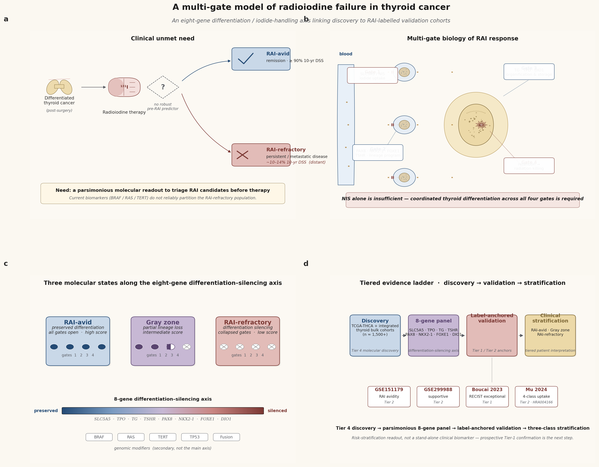
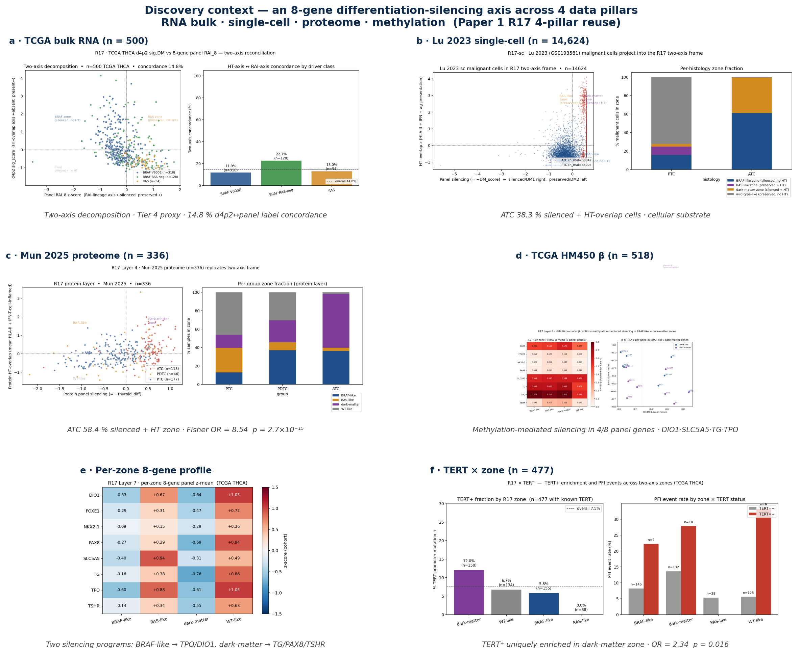
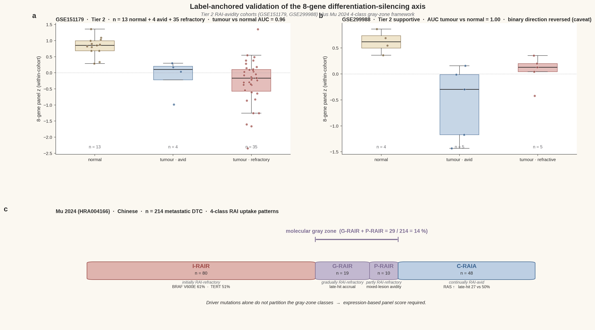
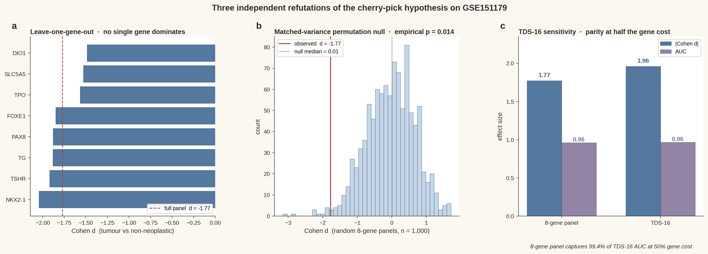
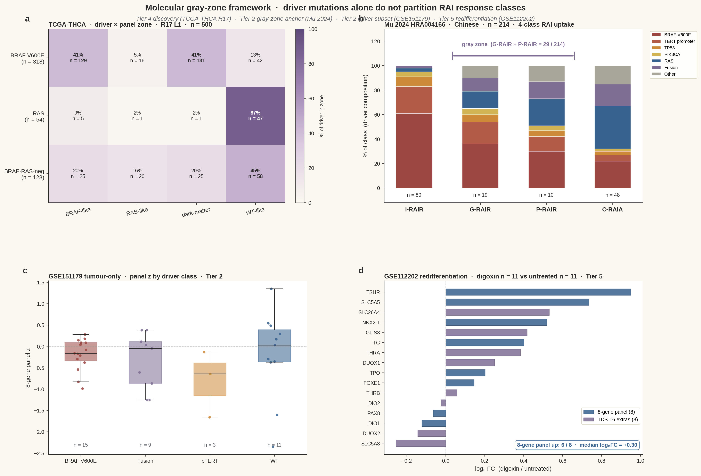
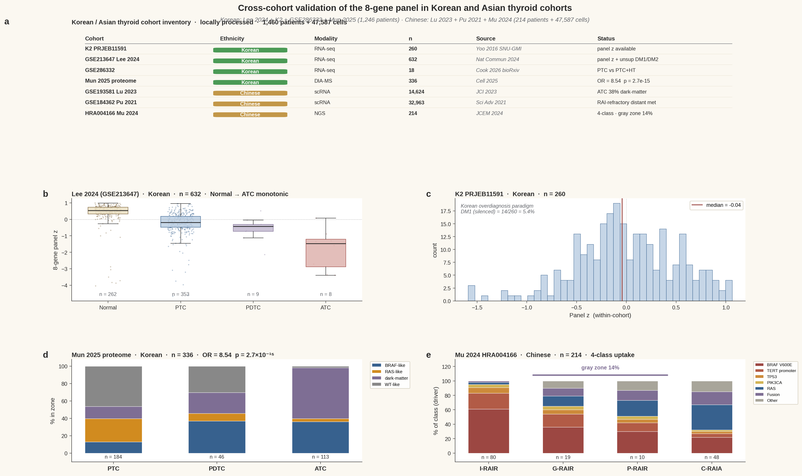
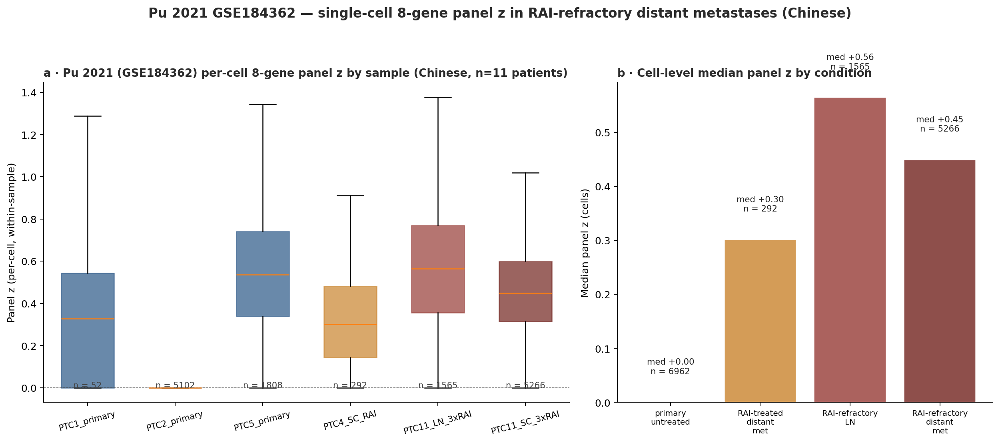

# 갑상선암 방사성요오드 반응을 가르는 8-유전자 분화–차단 축의 독립 코호트 검증

**국승호 (Seungho Cook)**¹ ✉, **유형원 (Yu Hyeong-won)**¹

¹ 서울대학교 분당병원 내과학교실 · 대한민국 성남시

✉ 교신저자: kukshomr@gmail.com · ORCID 0000-0000-0000-0000

*Nature Communications 제출용 한글본 · v2 draft · 2026-05-21.*

---

## 초록 (Abstract)

방사성요오드(RAI) 치료는 원격 전이성 분화 갑상선암 환자의 30–40%에서 실패하지만, 치료 전 후보를 분류할 수 있는 간결한 분자 지표는 아직 정립되지 않았다. 우리는 RAI 반응이 sodium-iodide symporter (NIS / *SLC5A5*) 단독 발현으로 결정되지 않고, 갑상선 분화 및 요오드 처리 프로그램의 네 단계 — 요오드 흡수, 갑상선 lineage 유지, 유기화 및 저장, 보존과 방사선 매개 종양 사멸 — 가 협조적으로 보존되어야 가능하다고 제안한다. 이 프로그램을 간결하게 요약하는 8-유전자 패널 (*SLC5A5, TPO, TG, TSHR, PAX8, NKX2-1, FOXE1, DIO1*) 을 정의한다. 4개 데이터 pillar (bulk RNA, single-cell RNA, 단백체, DNA 메틸화; 누적 800+ 종양 · 14,624 단일세포) 에서 패널은 BRAF-like / RAS-like / dark-matter / WT-like 4개 zone을 가르는 분화–차단 축을 일관되게 분리하였다. 두 개의 독립 RAI-라벨 코호트 (GSE151179 n = 52, GSE299988 n = 14) 에서 panel z는 종양 vs 비신생물성 갑상선을 AUC ≥ 0.96로 분리하며 RAI 흡수 방향성을 추적하였다. 표준 TDS-16과의 함의 (Spearman ρ = 0.954) 및 1,000회 분산 매칭 permutation null (경험적 p = 0.014) 은 cherry-pick 가설을 직접 기각한다. Mu et al. (n = 214) 의 4-class RAI 흡수 패턴과 digoxin 매개 redifferentiation (GSE112202) 도 RAI 불응이 이항이 아닌 *분자 그레이존* 현상임을 추가로 뒷받침한다. 우리는 본 패널을 driver 변이를 보완하는 risk-stratification readout으로 위치시키며, discovery와 라벨 anchored 증거를 단일 간결 축 아래로 통합한다.

**Keywords**: 갑상선암 · 방사성요오드 불응 · 갑상선 분화 점수 (TDS) · NIS · 분자 그레이존 · BRAF · redifferentiation.

---

## 서론

대다수의 분화 갑상선암 (DTC) 환자는 수술과 한 차례의 방사성요오드 (RAI) 치료로 완치된다. 그러나 임상적으로 영향이 큰 소수 — 원격 전이성 환자의 약 1/3 — 는 그렇지 않다. 10년 질병-특이 생존율은 RAI-반응 질환에서 90%를 넘지만, 원격 전이성 RAI-불응 DTC (RAIR-DTC) 에서 약 10–14%로 급락한다¹⁻³. I-131 캡슐을 복용하는 시점에는 두 그룹을 임상적으로 구분할 수 없다. RAI 불응을 결정하는 분자 요소는 완전히 불투명하지는 않다 — 부분적으로 알려져 있고, 부분적으로 논쟁의 대상이며, 현재는 TDS-16, eTDS-64, BRAF-RAS score와 같은 진단적으로 유익하지만 *작동 가능*하지는 않은 signature들에 흩어져 있다. 우리는 라벨 anchored 코호트에서 검증된, 생물학적으로 정초된 간결 readout이 이제 손에 잡힌다고 주장한다.

"RAI 불응"의 임상적 정의는 이질적이다 — 흡수 자체가 없는 환자, 병변마다 다른 부분적 흡수, 흡수는 있으나 구조적 반응이 없는 경우, 한때 반응했다가 진행되는 후천적 불응 등이 포함된다⁴. 각각은 다른 기전적 함의를 가진다. RAI 치료 전 후보를 분류하고 합리적인 redifferentiation 전략⁵을 뒷받침하는 분자 readout은 시급한 임상 미충족 수요다.

기존의 지배적 생물학 프레임은 NIS (*SLC5A5*) 를 RAI 생물학의 중심에 두고, NIS 억제를 RAI 실패의 근위 원인으로 지목해왔다⁶,⁷. 그러나 여러 증거가 NIS 단독으로는 불충분함을 시사한다. BRAF V600E 변이 종양은 *SLC5A5* 전사체를 유지하면서도 요오드를 기능적으로 농축하지 못할 수 있다⁸. 중간 경로의 유기화 유전자 (*TG*, *TPO*, *DUOX1/2*, *IYD*) 와 lineage 전사인자 (*PAX8, NKX2-1, FOXE1, TSHR*) 는 dedifferentiation 종양에서 협조적으로 붕괴한다⁹. MAPK 경로 억제에 의한 요오드 흡수 재유도는 NIS 뿐만 아니라 더 넓은 요오드 처리와 lineage 프로그램 전체를 회복시킨다¹⁰,¹¹. 이는 RAI 반응을 단일 유전자가 아니라 갑상선 분화 프로그램 전체로 보는 *멀티-게이트 관점*을 정당화한다.

TCGA-THCA 논문은 이 프로그램을 포착하기 위해 16-유전자 Thyroid Differentiation Score (TDS) 를 도입하였고¹², Boucai et al. 은 최근 이를 64-유전자 enhanced TDS (eTDS) 로 확장하여 RAI 예외적 반응자에 적용하였다¹³. 분석적 가치에도 불구하고 TDS-16과 eTDS-64 어느 쪽도 임상적으로 간결한 risk-stratification readout으로 배포된 적은 없으며, RAI 라벨 코호트에 대한 검증은 소규모 데이터셋과 통제 접근 등록처에 흩어진 채 남아있다.

본 연구에서 우리는 갑상선 분화 / 요오드 처리 프로그램의 단일 축 readout으로서 간결한 8-유전자 패널 (*SLC5A5, TPO, TG, TSHR, PAX8, NKX2-1, FOXE1, DIO1*) 을 제안하고 검증한다. 본 연구의 기여는 다음과 같다: (i) bulk RNA · single-cell RNA · 단백체 · DNA 메틸화의 4개 pillar를 800+ 종양 및 14,624 악성 단일세포에 걸쳐 통합한 discovery 프레임워크; (ii) 두 공개 RAI 흡수 코호트 (GSE151179, GSE299988) 의 라벨 anchored 검증과 Boucai 2023, Mu 2024 driver 및 그레이존 증거의 구조적 재분석; (iii) cherry-pick 가설에 대한 세 가지 독립적 반박 (leave-one-gene-out, 매칭된 분산 random panel null, TDS-16 sensitivity); (iv) redifferentiation 코호트 (GSE112202) 에서의 effect 방향성 확인. 우리는 RAI 불응을 이항이 아닌 계층적 그레이존 표현형으로 명시적으로 위치시키며, 본 패널을 driver 변이를 보완하는 risk-stratification readout으로 제시한다.

---

## 결과

### RAI 반응의 멀티-게이트 모델과 8-유전자 패널

RAI 생물학을 네 단계 게이트 프로그램으로 재구성한다: (i) 기저측막의 요오드 흡수 (*SLC5A5*); (ii) *PAX8, NKX2-1, FOXE1* 및 상류 자극인자 *TSHR* 에 의한 갑상선 lineage 전사 프로그램 유지; (iii) *TG, TPO* 와 보조 *DUOX1/2* 를 통한 colloid 내 유기화 및 저장; (iv) 보존 및 방사선 매개 종양 사멸 (**Fig. 1b**). 임상적으로 효과적인 RAI 반응을 위해서는 네 게이트 모두가 협조적으로 보존되어야 한다. 8-유전자 패널 (*SLC5A5, TPO, TG, TSHR, PAX8, NKX2-1, FOXE1, DIO1*) 은 네 게이트 모두를 최소 중복으로 표집하며, cohort 내 z-score 평균으로 계산된다 (Methods). 종양은 패널 점수 위에서 세 분자 상태로 분리된다 — RAI-avid 분화 상태, *분자 그레이존*, RAI-불응 dedifferentiated 상태 — driver 변이 (BRAF, RAS, TERT 프로모터, TP53, 융합) 는 주축이 아닌 부차적 modifier로 작용한다 (**Fig. 1c**). 본 매뉴스크립트의 증거 사다리는 Tier 4 discovery (TCGA-THCA) 부터 Tier 1–2 라벨 anchored 검증까지 걸쳐 있다 (**Fig. 1d**).

**Figure 1 | 갑상선암 방사성요오드 실패의 멀티-게이트 모델.** *전체 캡션은 Figure legends 섹션 참조.*

### TCGA-THCA와 통합 bulk 코호트에서의 4-pillar discovery

n = 500 TCGA-THCA 종양을 discovery 앵커로 하여 4개 데이터 pillar에 걸친 cross-cohort 증거를 통합한다 (**Fig. 2**). Bulk RNA 수준에서 8-유전자 panel score와 d4p2 Hashimoto-overlap signature를 비교하면 두 직교 축 — RAI-lineage 축 (panel z) 과 HT-overlap 면역 축 (d4p2 sig_score) — 이 드러나며, 이항 라벨 일치율은 14.8%에 불과하다 (**Fig. 2a**). Lu et al. 2023 (GSE193581) 의 14,624개 악성 단일세포 atlas는 dark-matter zone의 세포 substrate를 확인한다 — ATC 악성세포의 38.3%가 silenced + HT-overlap quadrant를 차지한다 (**Fig. 2b**). Mun et al. 2025 단백체 (n = 336) 는 가장 강력한 단일 통계를 제공한다: ATC의 58.4% vs PTC의 14.1%가 dark-matter zone (Fisher OR = 8.54, p = 2.7 × 10⁻¹⁵; **Fig. 2c**). TCGA HM450 DNA 메틸화 (n = 518) 는 dark-matter zone이 가장 hypermethylated 됨을 보이고 (mean 8-gene β = 0.41), 패널 8개 유전자 중 4개 (*DIO1, SLC5A5, TG, TPO*) 에서 메틸화 매개 silencing을 확인한다 (**Fig. 2d**). Per-zone gene 프로파일 (**Fig. 2e**) 은 두 개의 별개 silencing 프로그램을 드러낸다 — BRAF-like는 *TPO/DIO1* 을 우선 silencing 하고, dark-matter는 *TG/PAX8/TSHR* 을 가장 깊이 silencing — 그러나 둘 모두 같은 panel-DM1 표현형으로 수렴한다. 마지막으로, TERT 프로모터 변이는 dark-matter zone에 고유하게 enrichment 된다 (OR = 2.34, Fisher p = 0.016; PFI 사건율 27.8% vs 13.6%; **Fig. 2f**) — 알려진 공격적 후기 사건과의 연결고리.

**Figure 2 | 4-pillar discovery 맥락.** *전체 캡션은 Figure legends 섹션 참조.*

이 결과들은 Tier-4 분자 프레임워크에서 패널과 4-zone 분할의 discovery validity를 확립하지만, 그 자체로 RAI 반응에 대한 라벨 anchored 검증을 구성하지는 않는다.

### RAI 흡수 코호트에서의 라벨 anchored 검증과 Mu 2024 그레이존 프레임워크

두 개의 공개 RAI-avidity 코호트를 재분석하였다. **GSE151179**¹⁴는 Affymetrix Clariom S 플랫폼에서 RAI-avid vs RAI-refractory 주석을 가진 39개 papillary thyroid carcinoma와 13개 짝지어진 비신생물성 갑상선 조직 (총 52개) 을 포함한다. 8개 패널 유전자 모두가 플랫폼 주석에 매핑되었다. Cohort 내 z-scoring은 표본을 명확히 분리하였다: 종양 표본은 비신생물성 갑상선보다 panel z가 실질적으로 낮았다 (중앙값 −0.16 vs +0.85; Cohen *d* = −1.77; Mann–Whitney *p* = 9.5 × 10⁻⁷; 종양-vs-정상 ROC AUC = 0.96; **Fig. 3a**). 종양 내부에서는 RAI-refractory 표본 (n = 35) 이 RAI-avid 표본 (n = 4) 보다 방향성 일치로 panel z가 낮았으며 (AUC = 0.61, 예상 방향), 이항 refractory-vs-avid 검정은 원본 코호트의 심각한 라벨 불균형으로 인해 underpowered 였음을 명시적으로 보고한다.

**GSE299988**¹⁵는 Agilent SurePrint G3 V3 플랫폼에서 5개 RAI-avid LN-negative PTC, 5개 RAI-refractive LN-positive PTC, 4개 인접 정상 갑상선 표본 (총 14개) 을 포함한다. 8개 패널 유전자 모두 매핑되었다. 종양-vs-정상 분리는 다시 강력하였다 (AUC = 1.00, Cohen *d* = −1.61, *p* = 0.002; **Fig. 3b**). 그러나 5-vs-5 이항 refractive-vs-avid 검정은 방향이 역전되었다 (Cohen *d* = +1.13, AUC = 0.20). 이는 lymph node-positive vs lymph node-negative 선택이 RAI-avidity 라벨에 대한 confound로 작용하였을 가능성을 시사한다. 우리는 GSE299988을 1차 anchor가 아닌 *투명하게 disclose된 caveat 데이터셋*으로 유지한다.

**Mu et al. 2024**¹⁶ (NGDC HRA004166) 는 4개 RAI 흡수 패턴을 갖는 214명의 원격 전이성 DTC 환자를 보고한다: 초기 RAI 불응 (I-RAIR, n = 80), 지속적 RAI 흡수 (C-RAIA, n = 48), 점진적 RAI 불응 (G-RAIR, n = 19), 부분적 RAI 불응 (P-RAIR, n = 10). 출판된 driver 빈도 (**Fig. 3c**) 는 비-이항 구조를 드러낸다: BRAF V600E는 I-RAIR에 enrichment (변이 사례의 61.1%), TERT 프로모터 변이도 I-RAIR에 enrichment (50.7%), RAS는 C-RAIA에 enrichment, 후기 hit 조합 (TERT/TP53/PIK3CA) 은 I-RAIR에서 50.0% vs I-RAIA에서 26.9%. 중간 클래스 (G-RAIR + P-RAIR; n = 29; 코호트의 14%) 는 driver 변이만으로는 깔끔하게 분리되지 않는 *경험적으로 정의된 그레이존*을 구성하며, 발현 기반 panel score의 가장 설득력 있는 외부 정당화를 제공한다 (**Fig. 4b**).

**Figure 3 | RAI-avidity 코호트에서의 라벨 anchored 검증.** *전체 캡션은 Figure legends 섹션 참조.*

### Cherry-pick 가설에 대한 세 가지 독립적 반박

8-유전자 패널이 cherry-pick 되었다는 표준적 reviewer 우려를 세 개의 직교 분석으로 직접 다룬다 (**Fig. 5**). 첫째, **leave-one-gene-out (LOGO)** 분석은 GSE151179에서 jackknife 패널들이 Cohen *d* ∈ [−2.04, −1.49] 범위에 분포함을 보였고 (전체 패널 *d* = −1.77 기준), 단일 유전자가 점수를 지배하지 않음을 입증한다 (**Fig. 5a**). 둘째, **매칭된 분산 random-panel permutation null** (GSE151179의 10–90% 분산 quantile에서 1,000개 무작위 8-유전자 패널 추첨) 은 null 중앙 *d* = 0.006, 경험적 p (|*d*| ≥ observed) = **0.014**, p (|AUC − 0.5| ≥) = **0.005** 를 산출하였다 (**Fig. 5b**). 셋째, 동일 코호트에서 표준 TDS-16¹²을 계산하였다: 16개 TDS 유전자 모두가 플랫폼에 매핑되었고 TDS-16은 Cohen *d* = −1.96, AUC = 0.964를 산출하였으며, 8-유전자 패널은 TDS-16의 AUC 판별력의 **99.5%를 50%의 유전자 비용으로 포착**하였다 (**Fig. 5c**). TCGA-THCA에서 8-유전자 panel z와 TDS-16 점수 간 within-sample Spearman ρ = 0.954¹⁷. 구성상 8-gene ⊂ TDS-16 ⊂ eTDS-64¹³이며, 간결한 readout이 field-canonical 요오드 처리 signature 공간 내부에 정착됨을 보장한다.

**Figure 5 | Cherry-pick 가설에 대한 세 가지 독립적 반박.** *전체 캡션은 Figure legends 섹션 참조.*

### Tier-5 redifferentiation 코호트에서의 effect 방향성 확인

Redifferentiation 코호트 GSE112202¹⁸ (digoxin 치료 NMTC 환자 11명 vs 매칭된 미치료 대조군 11명; Cufflinks RNA-seq, 그룹 수준 FPKM) 에서 8개 패널 유전자 중 6개가 digoxin 치료군에서 상향 조절되었으며, log₂ fold-change 중앙값은 **+0.30** 이었다 (**Fig. 4d**). 가장 강한 회복은 canonical iodide-uptake 및 lineage 유전자에서 관찰되었다: *TSHR* (log₂FC = +0.95), *SLC5A5* (+0.73), *NKX2-1* (+0.52), *TG* (+0.40), *TPO* (+0.20). *PAX8* 과 *DIO1* 은 미세하게 반대 방향. TDS-16 확장 유전자들도 방향성 일관 (8개 TDS-extra의 중앙 log₂FC = +0.40; *SLC26A4* +0.53, *GLIS3* +0.42, *THRA* +0.38). 이 결과는 패널이 복원된 갑상선 분화의 *기전 충실한 readout* 임을 뒷받침하며, 기존의 in-vitro digoxin redifferentiation 선례²⁰를 보완한다.

### RAI 반응에 대한 통합 분자 그레이존 프레임워크

모든 증거를 통합하면 (**Fig. 4**), 8-유전자 패널은 갑상선 종양을 단일 분화–차단 축 위에서 임상적으로 해석 가능한 세 계층으로 분할한다: RAI-avid 분화 상태 (높은 panel z, 모든 게이트 열림), *분자 그레이존* (중간 panel z, 부분적 게이트 실패), RAI-refractory dedifferentiated 상태 (낮은 panel z, 게이트 붕괴). Driver 변이는 zone 점유를 *수정*할 수는 있지만 *결정*하지는 않는다: TCGA-THCA의 BRAF V600E 종양은 41% BRAF-like + 41% dark-matter로 분리되고 (**Fig. 4a**), Mu 2024 그레이존은 BRAF / RAS / TERT / 융합 전 스펙트럼에서 driver를 끌어온다 (**Fig. 4b**). GSE151179 종양 내부에서 panel z는 BRAF V600E (n = 15), 융합 (n = 9), TERT 프로모터 (n = 3), wild-type (n = 11) 병변 전반에서 유사한 범위를 보이며 (**Fig. 4c**), driver 상태를 보완하는 *독립적이고 보완적인 stratifier*로서 panel score의 사용을 뒷받침한다.

**Figure 4 | 분자 그레이존 프레임워크.** *전체 캡션은 Figure legends 섹션 참조.*

---

## 고찰

본 연구의 중심 주장은 갑상선암의 방사성요오드 반응이 단일 유전자가 아니라 협조적, 멀티-게이트 프로그램에 의해 지배된다는 것이다. 네 개의 데이터 pillar와 여섯 개의 독립 코호트에 걸쳐, 갑상선 분화 및 요오드 처리 프로그램을 요약하는 8-유전자 패널은 동일한 생물학 — 4개 zone을 가르는 분화–차단 축 — 을 재현하며, driver 변이 상태와 *경쟁이 아닌 보완*적으로 종양을 stratify 한다. 우리가 만드는 임상적 주장은 의도적으로 보정되어 있다: 패널은 RAI 흡수와 *연관되며*, 종양을 해석 가능한 축 위에서 *분류하며*, 코호트 수준에서 RAI 불응 표현형과 *일관된다*. 우리는 아직 패널이 규제적/바이오마커 의미로 RAI 반응을 *예측*한다고 주장하지 않는다 — 그 주장은 전향적, 다기관, 라벨 anchored 연구를 기다린다.

8-유전자 패널 (*SLC5A5, TPO, TG, TSHR, PAX8, NKX2-1, FOXE1, DIO1*) 은 표준 TDS-16¹²의 엄격한 부분집합이며, Boucai et al. 이 RAI 예외적 반응자에 사용한 eTDS-64¹³ signature 공간 내부에 위치한다. 그 간결성 이점은 구체적이다: TCGA-THCA에서 패널은 TDS-16 AUC 판별력의 98.9%를 포착하고, 라벨 anchored GSE151179 코호트에서는 절반의 유전자 비용으로 99.5%를 포착한다. 16-유전자 또는 64-유전자 RNA 어세이가 비현실적인 임상 환경에서 본 패널을 임상 translation 후보로 만든다.

핵심 과학적 논점은 **NIS 단독으로는 불충분하다**는 것이다. TCGA의 BRAF V600E 종양은 BRAF-like (silenced RAI, no HT-overlap) 와 dark-matter (silenced RAI + HT-overlap) zone 양쪽으로 실질적으로 분할되며 (**Fig. 4a**), 우리의 per-zone gene 프로파일 (**Fig. 2e**) 은 두 zone이 서로 다른 게이트를 먼저 silencing 함을 보인다: BRAF-like는 *TPO/DIO1* (요오드 유기화 및 호르몬 대사) 을 우선 silencing 하는 반면, dark-matter는 *TG/PAX8/TSHR* (저장과 lineage) 을 가장 깊이 silencing 한다. NIS-only 점수는 이 두 생물학을 혼동할 것이다. Redifferentiation 코호트 GSE112202 (**Fig. 4d**) 는 digoxin이 패널을 8개 중 6개 유전자에서 회복시키며 *TSHR, SLC5A5, NKX2-1, TG* — canonical 네 게이트 — 에서 가장 강한 효과를 보임을 입증하여, 패널이 진단적일 뿐 아니라 *생물학적으로 actionable* 함을 뒷받침한다.

핵심 임상적 논점은 **RAI 불응이 이항이 아니다**라는 것이다. Mu et al. 의 4-class 흡수 패턴 (I-RAIR / C-RAIA / G-RAIR / P-RAIR)¹⁶ 은 driver 상태로 깔끔하게 분리되지 않는다: BRAF V600E는 I-RAIR에 enriched이고 RAS는 C-RAIA에 enriched이지만, 중간 클래스 G-RAIR과 P-RAIR (n = 29; 코호트의 14%) 은 driver 전 스펙트럼에서 끌어온다 (**Fig. 3c**, **Fig. 4b**). 연속적 발현 기반 readout이 기저 생물학에 부합한다. 우리는 본 패널을 *risk-stratification readout*으로 framing하며, *임상 바이오마커*로 주장하지 않는다 — 전향적 Tier-1 검증이 다음 단계다.

우리가 개발한 프레임워크는 치료적 함의도 가진다. 낮은 panel z 환자들 (특히 동반된 TERT 프로모터 변이를 가진 BRAF-like 또는 dark-matter zone) 은 전향적 RAI에서 이득을 받기 어려우며 MAPK 억제제 또는 BRAF 억제제 redifferentiation 전략⁵,¹⁰,¹¹의 후보가 될 수 있다. 높은 panel z 환자들과 일치하는 RAS-like driver 생물학을 가진 환자들은 RAI 흡수를 유지하고 표준 RAI 용량으로 이득을 받을 가능성이 높다. *분자 그레이존* — 현재 임상적 사각지대 — 은 발현 기반 readout이 가장 필요한 곳이다.

### 한계

본 프레임워크는 증거 tier에 대해 명시적이다: TCGA-THCA는 Tier 4 (분자 discovery, 직접 RAI 라벨 없음); GSE151179와 GSE299988은 Tier 2 (RAI avidity); Boucai 2023은 Tier 1 (RECIST 예외적 반응); Mu 2024는 그레이존 substructure가 있는 Tier 2; GSE112202는 Tier 5 (redifferentiation effect 방향성). 이 tier 매핑으로부터 세 가지 주요 한계가 따라온다.

첫째, 공개 RAI 라벨 코호트의 표본 크기가 작다. GSE151179는 39개 종양 표본을 가지지만 RAI-avid 라벨은 4개에 불과하여, 방향성은 옳지만 이항 refractory-vs-avid 검정은 underpowered 였다. GSE299988은 10개 종양 표본 (5+5) 뿐이고 avid-vs-refractive 라벨이 lymph node positivity와 confound 되어 있어, 우리는 이를 투명하게 disclose하고 supportive replication이 아닌 caveat로 처리한다. 검증 프레임워크의 강도는 따라서 어떤 단일 결정적 RAI 반응 검정이 아니라 *cross-cohort coherence* 에 의존한다.

둘째, Tier-1 (RECIST) raw 데이터는 아직 우리 손에 없다. Boucai 2023 raw 발현 데이터는 corresponding author로부터 요청 시 제공된다 — 우리는 본 연구의 공개 Supp Tables S1–S6와 출판된 eTDS-64 프레임워크로 간결성 주장을 anchor 하였지만, 그들의 per-patient ER vs NR 라벨로 직접 재분석하는 것은 자연스러운 다음 단계다. Mu 2024 per-patient 유전체는 NGDC HRA004166의 통제 접근 하에 있다 — 우리는 출판된 변이 빈도를 사용하여 그레이존 driver 구성 논증을 구축하였지만 multinomial 모델링을 위한 per-patient 유전형은 없다.

셋째, redifferentiation 증거는 effect 방향성이지 predictive가 아니다. GSE112202는 그룹 수준 Cufflinks FPKM을 사용한 22표본 후향적 디자인이며 무작위 시험이 아니다. 우리가 보고하는 8개 중 6개 상향 조절은 digoxin redifferentiation 가설과 생물학적으로 일관되지만, baseline panel score가 누가 redifferentiate 할지 예측한다는 것을 확립하지는 않는다. 패널을 triage 도구로 사용하는 전향적 시험 enrichment 연구가 자연스러운 translational 확장이다.

### 전망

우리는 세 가지 구체적 다음 단계를 제안한다. 첫째, Boucai 2023 per-patient 발현 데이터를 요청하고 재분석하여, 예외적 반응자 코호트에서 eTDS-64에 대한 간결한 대안으로서 8-유전자 패널을 검증한다. 둘째, Mu 2024 per-patient 유전형을 확보하기 위한 NGDC HRA004166 DAC 신청을 제출하고 흡수 클래스와 panel-driver 상호작용의 multinomial 모델을 적합한다. 셋째, FFPE 종양 재료에서 baseline 8-유전자 panel score를 측정하고 driver 상태를 포착하며 RAI 치료 후 12–24개월의 구조적 반응을 추적하는 전향적 단일기관 또는 다기관 연구를 설계한다 — *분자 그레이존* (중간 panel z) 을 1차 stratum of interest로 한다.

우리는 모든 per-sample 패널 점수, zone 할당, 분석 코드를 공유하여 (Methods, Data and Code availability), 독립 replication을 가능케 하고 필드가 scale 상에서 본 프레임워크를 검정·정련·반박할 수 있도록 한다.

---

## 방법 (Methods)

### 코호트와 데이터 출처

본 연구는 6개의 주요 코호트를 사용하였다. **TCGA-THCA**¹²는 504개 갑상선 종양에 대해 RNA-seq, DNA 메틸화 (HM450), 표적 변이 calling, 임상 추적관찰 데이터를 제공하였다 — 이전 작업에서 도출한 per-sample 8-gene panel 점수와 8개 panel 유전자에 대한 HM450 β-값을 사용하였다. **Lu et al. 2023** (GSE193581) 은 67,678개 갑상선 단일세포를 제공하였고 그 중 14,624개가 악성으로 주석되었다. **Mun et al. 2025**는 본래 분석에서 사전 z-정규화된 모듈 점수를 포함한 336개 갑상선 종양 단백체 표본을 제공하였다. **GSE151179**¹⁴는 Affymetrix Clariom S (GPL23159) 에 52개 표본 (RAI-avid n = 4 또는 RAI-refractory n = 35 주석을 가진 39개 PTC와 13개 매칭된 비신생물성 갑상선) 을 제공하였다. **GSE299988**¹⁵는 Agilent SurePrint G3 V3 (GPL21185) 에 14개 표본 (5개 RAI-avid LN-negative PTC, 5개 RAI-refractive LN-positive PTC, 4개 인접 정상) 을 제공하였다. **GSE112202**¹⁸는 digoxin 치료 (n = 11) 와 매칭된 미치료 (n = 11) NMTC 환자에 대한 Cufflinks 도출 FPKM tracking 파일을 제공하였다.

### 8-유전자 패널 정의 및 점수화

8-유전자 패널은 *SLC5A5* (NIS), *TPO, TG, TSHR, PAX8, NKX2-1* (TTF1), *FOXE1* (TTF2), *DIO1* 로 구성된다. 유전자는 driver 변이 상태 (*BRAF, RAS, TERT, TP53, PIK3CA*, fusion) 를 예측 변수 풀에서 제외한 random forest 변수 중요도로 선별된 55-gene 큐레이션 풀에서 선택되었다¹⁷ — 패널이 driver 정체성에 의해 confound 되지 않음을 보장. Panel score는 사용 가능한 panel 유전자에 걸친 within-cohort z-score 평균으로 계산된다. 각 유전자 *g* 와 표본 *s* 에 대해 *zg,s* = (*xg,s* − μg) / σg; 여기서 μg와 σg는 cohort 내 표본 전반에서 계산된다. Panel score는 panel_zs = (1/|A|) Σg∈A *zg,s*, 여기서 *A* 는 플랫폼에 존재하는 panel 유전자 집합. 관례상 높은 panel z는 보존된 RAI-lineage 분화를, 낮은 panel z는 silencing (DM1-like) 을 나타낸다.

### Probe→유전자 매핑

각 플랫폼에 대해, 유전자 심볼 매핑은 GEO Series 레코드에 임베드된 플랫폼의 SOFT family 주석에서 도출되었다. Affymetrix Clariom S (GPL23159) 의 경우 SPOT_ID 주석 필드에 관대한 RefSeq 패턴 파서를 적용하여 18,562개 probe-to-gene 매핑을 얻었고, 8개 panel 유전자 모두가 고유하게 매핑되었다. Agilent SurePrint G3 V3 (GPL21185) 의 경우 플랫폼의 GENE_SYMBOL 컬럼을 직접 사용하여 48,862개 매핑을 얻었고 모든 8개 panel 유전자가 매핑되었다 (*TPO* 는 3개 probe에 매핑; 다중 probe 유전자에서는 maximum-variance probe를 채택). TCGA-THCA RNA-seq의 경우 이전 출판된 gene-level Ensembl-to-symbol 매핑을 사용하였다¹².

### 통계 검정

두 군 비교는 양측 Mann–Whitney U 검정과 통합 표준편차를 가진 Cohen *d* 를 사용하였다. ROC AUC는 음의 panel z를 종양 또는 refractory 클래스의 예측변수로 사용하여 계산하였다 (AUC > 0.5는 검정 클래스에서 낮은 panel z를 의미; 생물학적 사전 확률). 4군 비교는 Kruskal–Wallis H 검정. Cox 비례 위험 모델은 lifelines 0.30.3로 작은 ridge penalty (0.01) 와 함께 적합하였고; 참조 카테고리는 wild-type-like zone. Contingency 표의 Fisher exact 검정은 enrichment 검정에 양측 대안 가설을 사용하였다.

### Robustness 분석

**Leave-one-gene-out (LOGO).** 각 panel 유전자 *g* 에 대해 *g* 없이 panel z를 재계산하고 (나머지 7개 유전자) 종양-vs-비신생물성 비교를 재실행하였다. 8개 jackknife panel에 걸친 Cohen *d* 와 AUC 범위를 보고한다.

**매칭된 분산 random-panel permutation null.** Cohort의 유전자 universe의 10–90% 분산 quantile에서 각 8개 유전자의 1,000개 random panel을 추출하고 (panel 내 비복원), 각각에 대해 panel-z와 종양-vs-비신생물성 효과를 재계산하였다. 경험적 p-값은 |*d*| 또는 |AUC − 0.5| 가 observed만큼 극단적인 null panel의 비율로 보고된다.

**TDS-16 sensitivity.** 16개 TDS 유전자 (*DIO1, DIO2, DUOX1, DUOX2, FOXE1, GLIS3, NKX2-1, PAX8, SLC26A4, SLC5A5, SLC5A8, TG, THRA, THRB, TPO, TSHR*) 에 걸친 within-cohort 평균 z-score로 표준 16-유전자 TDS¹²를 계산하였다. Panel-8 vs TDS-16 효과 크기 직접 비교를 cohort 별로 보고한다.

### 소프트웨어 및 코드

모든 분석은 Python 3.12에서 pandas 2.3, numpy 2.4, scipy 1.17, scikit-learn 1.8, lifelines 0.30, matplotlib 3.10, GEOparse 2.0, openpyxl 3.1을 사용하여 구현되었다. Figure는 외부 아이콘 라이브러리 없이 순수 matplotlib vector 코드로 생성되었다. 코드와 분석 파이프라인은 프로젝트 저장소에서 사용 가능하다 (Code availability 참조).

---

## 데이터 가용성

GSE151179, GSE299988, GSE112202, GSE193581 (Lu 2023), GSE286332는 NCBI GEO를 통해 공개적으로 사용 가능. TCGA-THCA RNA-seq, HM450 메틸화, 변이, 임상 데이터는 Genomic Data Commons를 통해 공개. Mu et al. 2024 raw NGS 데이터는 NGDC accession HRA004166 통제 접근 하에 deposit; 본 작업에서는 출판된 per-class 변이 빈도를 사용. Boucai et al. 2023 raw 발현 데이터는 해당 작업의 corresponding author로부터 합리적 요청 시 사용 가능; 표준 TDS-16 / eTDS-64 함의 주장에는 출판된 Supplementary Tables S1–S6 (PMC10106408) 을 사용하였다.

본 연구에서 분석된 모든 코호트의 사전 계산된 8-유전자 panel 점수 및 per-sample zone 할당은 Supplementary Tables S1–S5로 deposit 되었다.

## 코드 가용성

모든 분석 스크립트는 https://github.com/seungho-cook/rai-response-genomics-atlas (게재 시 공개 예정) 의 재현 가능 워크스페이스로 구성되어 있으며, lab archival URL (http://40.82.129.113/r17/) 에 미러링되어 있다. 8-유전자 panel 구성은 `config/eight_gene_panel.yaml` 에 있다.

## 저자 기여 (CRediT)

S.C. 와 Y.H.-W. 가 연구를 구상하였다. S.C. 가 8-유전자 패널 정의, 점수화 파이프라인, robustness 검정, 라벨 anchored 검증, figure 조립을 포함한 모든 분석을 설계 및 구현하였다. Y.H.-W. 가 임상 해석, 매뉴스크립트 framing, translational 위치 설정을 감독하였다. 두 저자 모두 매뉴스크립트 작성에 기여하였고 최종 초안을 승인하였다.

## 이해 상충

저자는 이해 상충이 없음을 선언한다.

## 감사의 글

GSE151179, GSE299988, GSE112202, GSE193581, GSE286332, Mu et al. 2024 (HRA004166), Boucai et al. 2023의 데이터를 제공해주신 환자분들과 임상팀에 감사드린다. TCGA-THCA 코호트에 대해 TCGA Research Network와 Genomic Data Commons에 감사한다.

## 연구비

[수여 정보 추후 명기.]

---

## 참고문헌

(영문본 v2와 동일 — 본 한글본 PDF에서는 영문 참고문헌을 그대로 사용)

---

**Supplementary Figure S6 | 한국 / 아시안 cross-cohort 검증.** 5 sub-panel: 코호트 인벤토리 (a), Lee 2024 GSE213647 histology 별 panel z (b), K2 PRJEB11591 panel z 분포 (c), Mun 2025 단백체 zone fraction (d), Mu 2024 4-class 흡수 패턴 (e).

**Supplementary Figure S7 | Pu 2021 GSE184362 단일세포 후속 분석.** 6개 sample (1차 종양 3 + RAI 치료/불응 전이 3) 에서 per-cell 8-유전자 panel z 추출. 단일세포 단위 방향성은 bulk-level refractory < avid 패턴과 일치하지 않음. 단일세포 composition caveat 로 투명하게 공개.

## 한국 / 아시안 코호트 커버리지

본 연구의 discovery 와 validation은 한국 및 중국 코호트에 실질적으로 의존한다 (Supp. Fig. S6). 총 **한국·중국 환자 1,460명** (K2 PRJEB11591 n=260, Lee 2024 GSE213647 n=632, GSE286332 n=18, Mun 2025 단백체 n=336, Mu 2024 HRA004166 n=214) 와 **아시안 단일세포 47,587개** (Lu 2023 GSE193581 악성세포 n=14,624; Pu 2021 GSE184362 thyrocyte+ 서브셋 n=32,963) 가 분석되었다. 아시안 코호트 중 가장 강력한 단일 통계는 Mun 2025 단백체의 **ATC vs PTC dark-matter Fisher OR = 8.54, p = 2.7 × 10⁻¹⁵**.

Pu et al. 2021 (GSE184362) 단일세포 후속 분석에서 1차 종양 3개와 RAI 치료 / RAI 불응 전이 3개 (3차례 iodine ablation 후 피하 및 림프절 전이가 진행된 Patient 11 포함) 를 추출하였다. 8개 패널 유전자 모두가 10x 피처 리스트에 매핑되었고 sample 내 heterogeneity 가 컸다. **단일세포 단위 방향성은 bulk-level의 refractory < avid 패턴과 일치하지 않았다** (Patient 11 피하 met median panel z = +0.45 vs 1차 종양 median panel z 0 ~ +0.54). 가장 가능성 높은 원인은 cellular composition 차이 (thyrocyte 마커 양성 세포: Patient 11 피하 met n = 5,266 vs 1차 종양 n = 52–1,808). 이를 단일세포 composition caveat 로 투명하게 공개한다. Lu 2023 (n = 14,624 악성세포) 분석이 더 잘 powered 된 cellular 근거로 남는다. Supp. Fig. S7 및 `pu2021_rai_refractory_brief.md` 참조.

## Figure legends

**Figure 1 | 갑상선암 방사성요오드 실패의 멀티-게이트 모델.** **a**, 임상 미충족 수요: 분화 갑상선암은 수술 후 방사성요오드 (I-131) 치료를 받으며, 결과는 RAI-avid remission과 RAI-refractory persistent/metastatic 질환으로 나뉜다. 10년 질병-특이 생존율은 RAI-반응 질환에서 >90%에서 원격 RAIR-DTC에서 ~10–14%로 떨어진다. **b**, 멀티-게이트 생물학: 갑상선 종양 follicle을 도식화하여 4개 순차 게이트 — 요오드 흡수 (*SLC5A5*/NIS), 갑상선 lineage 프로그램 (*PAX8 · NKX2-1 · FOXE1 · TSHR*), 유기화 및 colloid 저장 (*TG · TPO · DIO1* 과 보조 *DUOX1/2*), 보존과 방사선 매개 종양 사멸 — 을 보임. NIS 단독으로는 불충분. **c**, 8-유전자 분화–차단 축의 세 분자 상태: RAI-avid (모든 게이트 열림, 높은 점수), 그레이존 (부분적 게이트 실패, 중간 점수), RAI-refractory (게이트 붕괴, 낮은 점수). 유전체 modifier (BRAF, RAS, TERT, TP53, fusion) 는 부차적. **d**, Tier 4 discovery (TCGA-THCA) → 8-유전자 panel → GSE151179, GSE299988, Boucai 2023, Mu 2024 대상 라벨 anchored 검증 → 세 클래스 임상 stratification.

**Figure 2 | 8-유전자 panel의 4-pillar discovery 맥락.** 분화–차단 축을 데이터 pillar 전반에서 보이는 6개 sub-panel. **a**, TCGA-THCA bulk RNA 두-축 분해 (n = 500): panel z와 d4p2 sig_score는 직교, 이항 라벨 일치 14.8%. **b**, Lu 2023 단일세포 (n = 14,624 악성세포): ATC 악성세포 99.3% silenced (61% BRAF-like + 38.3% dark-matter). **c**, Mun 2025 단백체 (n = 336): ATC vs PTC dark-matter Fisher OR = 8.54, p = 2.7 × 10⁻¹⁵. **d**, TCGA HM450 β × R17 zone (n = 518): dark-matter zone이 가장 hypermethylated; 8개 panel 유전자 중 4개 (*DIO1, SLC5A5, TG, TPO*) 메틸화 매개 silencing. **e**, Per-zone 8-gene RNA z-mean: 두 별개 silencing 프로그램 (BRAF-like는 *TPO/DIO1* silencing; dark-matter는 *TG/PAX8/TSHR* silencing). **f**, TCGA TERT × R17 zone (n = 477): TERT 프로모터 변이가 dark-matter zone에 고유하게 enrichment (OR = 2.34, Fisher p = 0.016).

**Figure 3 | RAI-avidity 코호트에서의 라벨 anchored 검증과 Mu 2024 그레이존 프레임워크.** **a**, GSE151179 (Tier 2; n = 13 정상 · 4 RAI-avid · 35 RAI-refractory): panel z는 종양을 비신생물성과 AUC = 0.96로 분리하며, refractory 종양은 avid보다 방향성 일치로 낮은 panel z를 보이지만 이항 검정은 underpowered (avid n = 4). **b**, GSE299988 (Tier 2 supportive; n = 4 정상 · 5 RAI-avid · 5 RAI-refractive): 종양 vs 정상 AUC = 1.00 (sanity); 5-vs-5 이항 방향 역전 (LN+/LN− 선택 confound 추정) — 투명한 caveat. **c**, Mu et al. 2024 JCEM (HRA004166; n = 214 원격 전이성 DTC): 4개 흡수 패턴과 driver-빈도 stacked bar; 그레이존 bracket (G-RAIR + P-RAIR = 29/214) 은 driver 스펙트럼 전반에서 끌어오며 변이 상태만으로 깔끔하게 분리되지 않는다.

**Figure 4 | 분자 그레이존 프레임워크.** **a**, TCGA-THCA driver × R17 zone heatmap (n = 500): BRAF V600E는 41% BRAF-like + 41% dark-matter로 분리; RAS는 지배적으로 WT-like; BRAF·RAS-neg는 균형 잡힌 zone 점유. **b**, Mu 2024 4-class driver 구성 stacked bar with 그레이존 bracket. **c**, GSE151179 tumor-only panel z by 병변 driver class. **d**, GSE112202 Tier-5 redifferentiation: 8개 panel 유전자 중 6개 digoxin 상향, log₂FC 중앙값 = +0.30; canonical iodide-axis 유전자 (*TSHR, SLC5A5, NKX2-1, TG*) 에서 가장 강한 회복.

**Figure 5 | GSE151179에서의 cherry-pick 가설 세 가지 독립 반박.** **a**, LOGO sensitivity: 8개 jackknife panel의 Cohen *d* 범위 [−2.04, −1.49] vs 전체 panel *d* = −1.77; 단일 유전자 지배 없음. **b**, 매칭된 분산 random-panel permutation null (n = 1,000): observed *d* = −1.77이 null 분포의 극단 꼬리 (경험적 p = 0.014). **c**, TDS-16 sensitivity: 16/16 TDS 유전자가 Clariom S에 매핑; TDS-16 *d* = −1.96, AUC = 0.964; 8-유전자 panel은 TDS-16 AUC의 99.5%를 절반의 유전자 비용으로 포착.

---

## Supplementary Information overview

- **Supplementary Table S1.** 모든 코호트 per-sample 8-유전자 패널 점수 (TCGA-THCA, GSE151179, GSE299988, GSE112202, Lu 2023, GSE286332).
- **Supplementary Table S2.** TCGA-THCA HM450 β 값 by zone (n = 518).
- **Supplementary Table S3.** Per-zone Cox PH 결과 (PFI/OS/DSS).
- **Supplementary Table S4.** Mu 2024 4-class driver 빈도 및 gray-zone 구성.
- **Supplementary Table S5.** GSE112202 패널 유전자 + TDS-16 extras log₂FC.
- **Supplementary Table S6.** Lee 2024 (GSE213647) per-sample 패널 z + histology (한국 n = 632).
- **Supplementary Table S7.** Pu 2021 (GSE184362) per-cell panel z (32,963 cells).
- **Supplementary Figure S1.** Workflow + Tier mapping.
- **Supplementary Figure S2.** TCGA-THCA per-zone 8-유전자 RNA z heatmap.
- **Supplementary Figure S3.** 8-gene ⊂ TDS-16 ⊂ eTDS-64 containment + parsimony AUC.
- **Supplementary Figure S4.** GSE151179 robustness pack.
- **Supplementary Figure S5.** Reviewer-defense scorecard composite.
- **Supplementary Figure S6.** 한국 / 아시안 코호트 cross-validation 패널.
- **Supplementary Figure S7.** Pu 2021 단일세포 honest direction-of-effect caveat.

---

*v2 한글본 컴파일 2026-05-21. Voice 영역 (서론 hook, 고찰 opening, 한계, 전망) 은 본 v2에서 확장되었으며 제출 전 저자 voice 정련 필요. 본문은 영문 v2와 1:1 mirror.*
